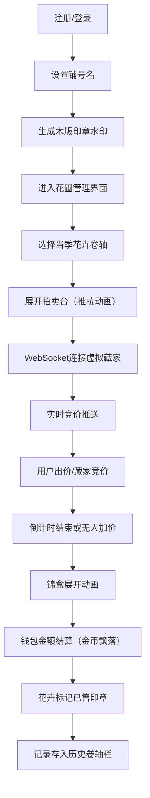

## 1. 产品概述
宋代花市拍卖模拟平台，让用户以宋代花市掌柜身份，经营四季花卉种植与在线拍卖，体验古代文人雅事的沉浸式全栈Web应用。

- 核心目标：打造宋代美学风格的虚拟花卉种植与拍卖体验
- 目标用户：对传统文化、国风美学、轻度模拟经营感兴趣的用户
- 市场价值：以独特的国风美学设计和沉浸式拍卖体验，打造差异化的文化娱乐产品

## 2. 核心功能

### 2.1 功能模块
1. **登录/注册界面**：水墨山水背景、Canvas梅枝、仿古卷轴输入框、朱砂印鉴按钮、木版印章水印
2. **主花圃管理界面**：四季花卉长卷画轴、生长阶段写意国画、墨水进度条、当季主拍选择
3. **推拉式拍卖台**：紫檀木底色、青瓷花盆3D透视、竞价信息展示、金色倒计时、虚拟藏家竞价面板
4. **虚拟藏家系统**：3-5名AI藏家（红脸关公/白脸曹操/黑脸张飞）、各有竞价风格、WebSocket实时推送
5. **竞价记录列表**：历史出价滚动展示、迷你脸谱头像、行书字体、时间褪色效果
6. **成交结算系统**：木制锦盒展开动画、钱包古铜钱串、金额增减动画、已售印章
7. **拍卖历史回溯**：底部横向卷轴栏、缩略画记录、竞价回放与墨迹扩散动画

### 2.2 页面详情
| 页面名称 | 模块名称 | 功能描述 |
|-----------|-------------|---------------------|
| 登录/注册页 | 水墨背景 | 全屏淡水墨山水渐变背景 |
| 登录/注册页 | Canvas梅枝 | 左侧紫砂花盆中含苞待放梅枝绘制 |
| 登录/注册页 | 卷轴输入框 | 仿古卷轴样式表单，朦胧淡棕底、深褐描边 |
| 登录/注册页 | 朱砂印鉴按钮 | 右侧圆形朱砂印章登录按钮 |
| 主花圃页 | 四季画轴 | 横向四幅长卷（180x280px），春夏秋冬对应四种花 |
| 主花圃页 | 生长进度条 | 石绿到枯黄渐变墨水进度条 |
| 主花圃页 | 已售印章 | 朱砂红底白字"已售"倾斜印章 |
| 主花圃页 | 钱包显示 | 右上角古铜钱串样式，金币飘落动画 |
| 主花圃页 | 历史卷轴栏 | 底部横向展示最近5次拍卖记录 |
| 拍卖台 | 推拉展开动画 | 从卷轴轴心向左右拉开0.5秒动画 |
| 拍卖台 | 青瓷花盆 | Canvas模拟透视3D效果，冰裂纹纹理 |
| 拍卖台 | 竞价信息 | 起拍价、当前价、加价步长、金色倒计时（每5秒跳动） |
| 拍卖台 | 虚拟藏家 | 脸谱头像、不同竞价风格、实时出价推送 |
| 拍卖台 | 出价历史 | 顶部最新、向下滚动、1分钟后褪色为浅灰 |
| 成交弹窗 | 锦盒动画 | 底部升起、盒盖打开0.6秒动画 |
| 成交弹窗 | 成交信息 | 拍品名称、成交价、竞得者展示 |
| 历史详情 | 墨迹扩散动画 | 每条记录从中心向四周晕开0.3秒 |
| 历史详情 | 竞价回放 | 按时间顺序重放竞价过程 |

## 3. 核心流程
用户注册并设置铺号名后登录，进入花圃管理界面选择当季花卉。点击花卉卷轴展开拍卖台，系统通过WebSocket实时推送虚拟藏家出价。用户可参与竞价，倒计时结束或无人加价后弹出成交锦盒，钱包金额相应增减，已售出花卉标记已售印章。用户可在底部历史卷轴栏查看并回放过往拍卖记录。

## 4. 用户界面设计

### 4.1 设计风格
- **主色调**：仿古宣纸色#F5F0E1为背景，深木色#4A2C1A或暗红#8B0000为按钮边框
- **辅助色**：朦胧淡棕#E8D5B7、米白#F5E6C8、石绿#2E8B57、枯黄#B8860B、朱砂红#CC3333、金色#D4AF37、青瓷#8FBC8F、浅灰#999
- **字体**：楷体（KaiTi）、行书（Xingkai SC），fallback到serif
- **按钮风格**：仿古卷轴、圆形印章、木刻质感
- **动画**：水墨晕开、卷轴展开（0.3-0.6秒）、墨迹扩散、金币飘落
- **整体风格**：宋代极简美学、写意国画、古朴雅致

### 4.2 页面设计概述
| 页面名称 | 模块名称 | UI元素 |
|-----------|-------------|-------------|
| 登录/注册页 | 全屏布局 | 左右分栏、水墨山水渐变背景、左侧Canvas梅枝、右侧卷轴表单 |
| 主花圃页 | 卷轴排列 | 横向四幅画轴（180x280px）、深木色轴柄、米白绢布、写意国画 |
| 主花圃页 | 进度指示 | 石绿到枯黄渐变墨水条、已售倾斜印章 |
| 主花圃页 | 钱包组件 | 右上角古铜钱串、金色#D4AF37圆形钱币飘落动画（0.8秒10枚） |
| 拍卖台 | 推拉展开 | 从中心向左右展开0.5秒、紫檀木#4A2C1A底色 |
| 拍卖台 | 花盆展示 | Canvas透视3D青瓷花盆、冰裂纹纹理 |
| 拍卖台 | 倒计时 | 金色#D4AF37数字、每5秒跳动+轻响 |
| 拍卖台 | 出价记录 | 圆形迷你脸谱（32x32px，金边晕染）、行书字体、1分钟褪色 |
| 成交弹窗 | 锦盒动画 | 底部升起、盒盖打开0.6秒、成交信息展示 |
| 历史详情 | 回放效果 | 墨迹从中心扩散0.3秒、按时间顺序逐条呈现 |

### 4.3 响应式设计
- **桌面端**：横向卷轴排列（每行4个）、拍卖台居中展开
- **手机竖屏**：卷轴竖向排列（每行2个）、拍卖台全屏展示、文字自适应缩放
- **性能要求**：倒计时刷新≥60FPS，WebSocket渲染响应≤100ms
- **FPS监测**：右下角绿色小字显示实时帧率

## 5. 技术实现要点
- **Canvas绘制**：梅枝、花卉写意国画、青瓷花盆3D透视、虚拟藏家脸谱
- **WebSocket**：实时推送竞价状态、自动重连、消息分发
- **动画系统**：CSS过渡/关键帧、Canvas动画、requestAnimationFrame
- **状态管理**：全局花卉/钱包/用户状态、WebSocket消息状态
