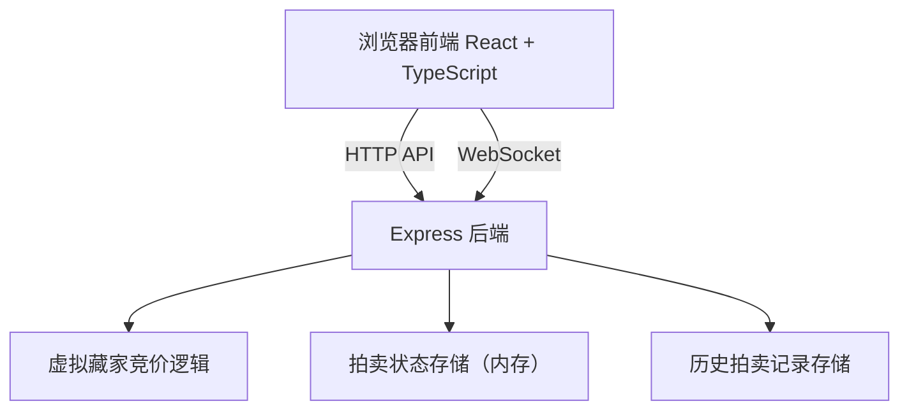
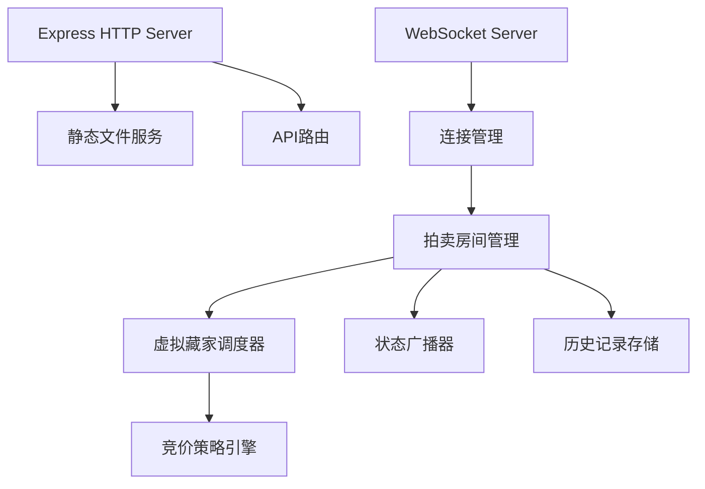

## 1. 架构设计



## 2. 技术说明
- **前端**：React@18 + TypeScript + Vite
- **样式**：纯CSS，CSS变量定义设计令牌，响应式布局
- **状态管理**：React Context + useReducer
- **实时通信**：WebSocket（ws库）+ 自定义useWebSocket Hook
- **后端**：Express@4 + TypeScript + ws
- **数据存储**：内存存储（无数据库，服务端重启重置）
- **Canvas绘图**：原生Canvas 2D API，用于绘制梅枝、花卉、花盆、脸谱
- **性能监测**：requestAnimationFrame实现FPS计数器

## 3. 路由定义
| 路由 | 用途 |
|-------|---------|
| / | 登录/注册页面 |
| /garden | 主花圃管理界面（含拍卖台） |

## 4. WebSocket消息协议

### 客户端 -> 服务端消息类型
```typescript
type ClientMessage =
  | { type: 'JOIN_AUCTION'; flowerId: string }
  | { type: 'PLACE_BID'; flowerId: string; price: number }
  | { type: 'LEAVE_AUCTION'; flowerId: string };
```

### 服务端 -> 客户端消息类型
```typescript
type ServerMessage =
  | { type: 'AUCTION_STATE'; state: AuctionState }
  | { type: 'NEW_BID'; bid: BidRecord }
  | { type: 'AUCTION_ENDED'; result: AuctionResult }
  | { type: 'BIDDER_JOIN'; bidder: VirtualBidder }
  | { type: 'ERROR'; message: string };
```

### 数据类型定义
```typescript
type FlowerType = 'peony' | 'lotus' | 'chrysanthemum' | 'plum';
type GrowthStage = 'seed' | 'sprout' | 'blooming' | 'prime' | 'withered';
type BidderPersonality = 'aggressive' | 'cautious' | 'late_bloomer';

interface Flower {
  id: string;
  type: FlowerType;
  name: string;
  season: string;
  stage: GrowthStage;
  stageProgress: number;
  startingPrice: number;
  sold: boolean;
}

interface VirtualBidder {
  id: string;
  name: string;
  personality: BidderPersonality;
  faceColor: string;
  avatarSeed: number;
}

interface BidRecord {
  id: string;
  bidderId: string;
  bidderName: string;
  bidderType: 'user' | 'virtual';
  price: number;
  timestamp: number;
  avatarSeed: number;
  faceColor: string;
}

interface AuctionState {
  flowerId: string;
  currentPrice: number;
  bidStep: number;
  remainingTime: number;
  bids: BidRecord[];
  bidders: VirtualBidder[];
  status: 'waiting' | 'active' | 'ended';
}

interface AuctionResult {
  flowerId: string;
  flowerName: string;
  finalPrice: number;
  winnerId: string;
  winnerName: string;
  winnerType: 'user' | 'virtual';
}

interface HistoryRecord {
  id: string;
  flowerId: string;
  flowerType: FlowerType;
  flowerName: string;
  finalPrice: number;
  winnerName: string;
  bids: BidRecord[];
  timestamp: number;
}
```

## 5. 服务端架构图



## 6. 项目文件结构
```
auto276/
├── package.json              # 项目依赖与脚本
├── index.html                # HTML入口，加载Google Fonts楷体
├── vite.config.js            # Vite配置，代理到3000端口
├── tsconfig.json             # TypeScript严格模式配置
├── src/
│   ├── main.tsx              # React挂载入口，全局Provider
│   ├── App.tsx               # 主组件，路由/全局状态/FPS监测
│   ├── components/
│   │   ├── LoginPage.tsx     # 登录注册页（含Canvas梅枝、卷轴表单）
│   │   ├── GardenPage.tsx    # 花圃主页（卷轴、钱包、历史栏）
│   │   ├── FlowerScroll.tsx  # 花卉卷轴组件
│   │   ├── AuctionHall.tsx   # 拍卖台组件
│   │   ├── Wallet.tsx        # 钱包铜钱串组件
│   │   ├── HistoryBar.tsx    # 底部历史卷轴栏
│   │   ├── BidHistory.tsx    # 竞价历史列表
│   │   ├── ResultModal.tsx   # 成交锦盒弹窗
│   │   └── SealWatermark.tsx # 木版印章水印
│   ├── hooks/
│   │   └── useWebSocket.ts   # WebSocket连接管理Hook
│   ├── context/
│   │   └── AppContext.tsx    # 全局状态Context
│   ├── canvas/
│   │   ├── plumBranch.ts     # 梅枝绘制
│   │   ├── flowerPaintings.ts# 四季花卉写意绘制
│   │   ├── celadonPot.ts     # 青瓷花盆3D透视绘制
│   │   └── bidderFaces.ts    # 虚拟藏家脸谱绘制
│   ├── types/
│   │   └── index.ts          # 类型定义
│   ├── utils/
│   │   ├── animations.ts     # 动画工具函数
│   │   └── audio.ts          # 轻响音效
│   └── styles/
│       └── global.css        # 全局样式
└── server/
    ├── index.ts              # Express + WebSocket服务入口
    ├── auctionManager.ts     # 拍卖管理逻辑
    ├── virtualBidders.ts     # 虚拟藏家竞价策略
    └── store.ts              # 内存数据存储
```

## 7. 性能优化要点
- 倒计时使用requestAnimationFrame确保≥60FPS
- WebSocket消息采用批量更新策略，单次渲染≤100ms
- Canvas绘制采用离屏缓存，避免重复计算
- 动画优先使用CSS transform/opacity触发GPU加速
- 竞价历史列表使用虚拟滚动（当条目过多时）
- FPS监测显示在右下角绿色小字
