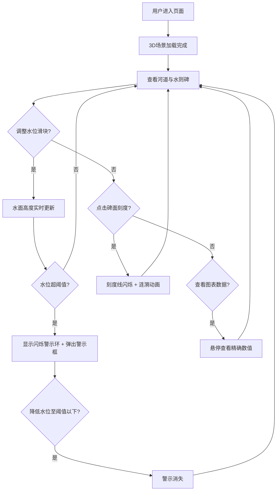

## 1. 产品概述
古代水文观测3D可视化应用——基于"水则碑"的实时河道水位监测与防洪预警系统，解决传统水文观测中数据分散、水位趋势难以直观理解，以及无法在数字空间里叠加历史同期水位进行对比分析的问题。目标用户为水文研究人员、水利工程师及历史文化爱好者。

## 2. 核心功能

### 2.1 用户角色
| 角色 | 使用方式 | 核心权限 |
|------|----------|----------|
| 观测者 | 直接访问 | 调整水位滑块、查看3D场景、交互点击刻度、查看图表 |
| 分析者 | 直接访问 | 同上 + 查看历史对比数据与柱状图 |

### 2.2 功能模块
1. **主页面（唯一页面）**：3D河道场景、水则碑交互、水位控制面板、防洪预警系统、水位对比图表

### 2.3 页面详情
| 页面名称 | 模块名称 | 功能描述 |
|----------|----------|----------|
| 主页面 | 3D河道场景 | 蜿蜒河道、河床卵石、堤岸植被、半透明水面（正弦波叠加波纹） |
| 主页面 | 水则碑 | 中央竖立花岗岩碑体，红色刻度线与数字标注，可点击交互产生涟漪 |
| 主页面 | 水位控制面板 | 左侧深木色面板，上/中/下游三段水位滑块，实时控制3D水面高度 |
| 主页面 | 防洪预警系统 | 超阈值时堤岸红色闪烁警示环 + 右上角桃木色滑入警示框 |
| 主页面 | 水位图表面板 | 右侧宣纸色浮动面板，折线图+柱状图，tooltip悬停显示精确数据 |
| 主页面 | 相机控制 | 左键旋转、右键平移、滚轮缩放，缓动效果，帧率≥45FPS |

## 3. 核心流程

用户进入页面后看到3D河道场景与水则碑，通过左侧面板滑块调整上/中/下游水位，3D场景中水面高度实时响应变化，碑面红色游标同步移动。当水位超过预设阈值时，堤岸出现红色闪烁警示环并弹出警示框。用户可点击碑面刻度线产生涟漪动画，也可在右侧图表面板查看水位趋势与历史对比数据。

## 4. 用户界面设计

### 4.1 设计风格
- 主色调：灰蓝#A9BFC8、土黄#C2B280、木色#5C4033
- 辅助色：朱砂红#CC3333、桃木色#CD853F、宣纸色#F5F0E1
- 字体：楷体（面板标题）、宋体（警示文字）、篆体风格（"水则"标题）
- 布局：全屏3D场景覆盖，UI面板浮动叠加
- 材质感：纸张纹理（线性渐变+阴影叠加）、木质纹理
- 动画：所有交互0.1-0.5秒过渡（缓入缓出、淡入淡出、滑入）

### 4.2 页面设计概览
| 页面名称 | 模块名称 | UI元素 |
|----------|----------|--------|
| 主页面 | 3D场景 | 全屏Three.js画布，背景灰蓝色，地面土黄色，河床青灰色 |
| 主页面 | 水位控制面板 | 左侧深木色面板220×180px，篆体白字标题，三个滑块+数值显示 |
| 主页面 | 防洪警示框 | 右上角桃木色圆形80px，白字宋体，滑入动画0.5s ease-out |
| 主页面 | 图表面板 | 右侧宣纸色浮动面板280×400px，Canvas折线图+柱状图，tooltip |
| 主页面 | 碑面游标 | 红色发光圆环半径5，径向渐变，0.2秒淡入 |
| 主页面 | 警示环 | 红色闪烁环半径15，1Hz闪烁 |

### 4.3 响应式适配
- 桌面优先设计，全屏3D场景
- 窗口宽高比<1.4时，FOV从45°增至55°
- UI面板宽度按视口宽度25%等比缩放
- 面板可拖拽重定位

### 4.4 3D场景指导
- 环境：灰蓝色天空，土黄色河漫滩地面
- 灯光：环境光+方向光模拟自然日光
- 相机：透视相机，FOV 45°-55°，旋转0-360°/俯仰-30°-60°，缩放200-800单位
- 构图：河道蜿蜒居中，水则碑竖立中央
- 交互：射线检测点击刻度线，滑块驱动水面更新
- 动画：水面正弦波0.5Hz/3单位振幅，涟漪径向扩散，警示环1Hz闪烁
- 性能预算：≥45FPS，水位更新≤2ms/次
