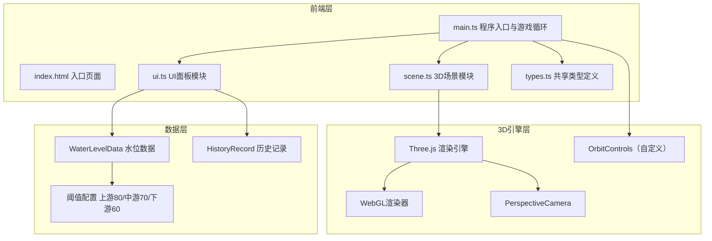

## 1. 架构设计



## 2. 技术说明
- 前端：TypeScript + Three.js + Vite（原生JS，不使用React/Vue框架）
- 初始化工具：Vite
- 后端：无
- 数据库：无（纯前端模拟数据）

## 3. 文件结构与模块职责

| 文件 | 职责 |
|------|------|
| package.json | 依赖：three, typescript, vite, @types/three；脚本：npm run dev |
| index.html | 入口页面，背景浅江雾色#D4E6F1，全屏居中，行楷标题 |
| vite.config.js | 构建配置，入口index.html，端口3000 |
| tsconfig.json | 严格模式，target ES2020 |
| src/main.ts | 程序入口，初始化场景/相机/渲染器，管理游戏循环 |
| src/scene.ts | 3D场景构建：河道、堤岸、水则碑、植被、水面、警示环、涟漪 |
| src/ui.ts | UI元素：水位面板、图表面板、警示框，内联样式 |
| src/types.ts | 共享类型：WaterLevelData、HistoryRecord、回调类型 |

## 4. 核心API定义

### TypeScript 类型定义（types.ts）

```typescript
interface WaterLevelData {
  upstream: number;
  midstream: number;
  downstream: number;
}

interface HistoryRecord {
  time: string;
  values: WaterLevelData;
}

type WaterLevelChangeCallback = (location: string, newLevel: number) => void;
type AlertCallback = (location: string, active: boolean) => void;
```

### 场景模块API（scene.ts）

| 方法 | 参数 | 返回值 | 说明 |
|------|------|--------|------|
| updateWaterLevel | location: string, newLevel: number | void | 更新指定河段水位 |
| setAlert | location: string, active: boolean | void | 开关警示环 |
| createRipple | position: Vector3 | void | 在指定位置创建涟漪动画 |

## 5. 性能策略
- 水面网格使用BufferGeometry，顶点更新通过attribute.needsUpdate标记
- 植被使用InstancedMesh减少drawcall
- 涟漪动画使用对象池复用
- 警示环使用uniform驱动闪烁而非JS定时器
- requestAnimationFrame游戏循环，deltaTime插值保证帧率独立
- 相机缓动使用线性插值（lerp），时长0.3秒ease-out
