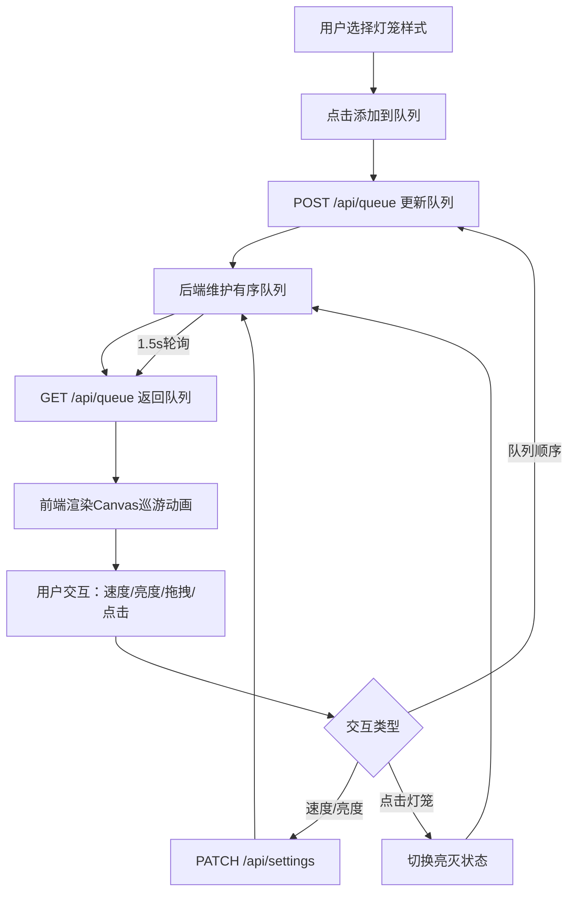

## 1. 产品概述

古代花灯巡游交互式设计与模拟系统——一位掌灯人在浏览器中设计并模拟一场虚拟花灯巡游，游客从观众视角实时观看不同形状、颜色和图案的灯笼在夜空中游走，并通过互动调整巡游队列的节奏和灯笼亮灭效果。

- 目标用户：对中国古代灯会文化感兴趣的普通用户、文化体验爱好者
- 产品价值：以沉浸式交互体验再现古代宫廷灯会盛景，让用户亲自设计和操控花灯巡游

## 2. 核心功能

### 2.1 功能模块

1. **灯笼巡游主页面**：Canvas巡游动画区 + 左侧灯笼配置面板 + 顶部状态栏 + 模拟控制面板

### 2.2 页面详情

| 页面名称 | 模块名称 | 功能描述 |
|---------|---------|---------|
| 灯笼巡游主页面 | 顶部状态栏 | 显示巡游队列数量、当前速度和亮度值，白色行书字体 |
| 灯笼巡游主页面 | 灯笼配置面板 | 灯笼形状/颜色/图案下拉选择器、"添加到队列"按钮，半透明黑底，宽280px |
| 灯笼巡游主页面 | Canvas巡游动画 | 800×600画布，S形路径灯笼移动，烛火闪烁+金色光点粒子拖尾+光晕效果 |
| 灯笼巡游主页面 | 模拟控制面板 | 巡游速度滑块(0.5x-3x)、亮度滑块(0%-100%)、队列顺序拖拽调整 |
| 灯笼巡游主页面 | 灯笼列表 | 当前巡游队列灯笼卡片，支持增删改、拖拽排序 |

## 3. 核心流程

用户在左侧面板选择灯笼形状、颜色、图案 → 点击"添加到队列"→ 灯笼加入后端维护的有序队列(最多20个) → Canvas画布实时渲染灯笼沿S形路径巡游 → 用户通过滑块调节速度/亮度、拖拽调整队列顺序 → 点击灯笼切换亮灭状态 → 所有变更通过API同步至后端 → 每1.5s轮询确保多人视角同步

## 4. 用户界面设计

### 4.1 设计风格

- 主色调：深蓝夜空(#0B0C10) + 金色(#D4AF37)点缀 + 朱砂红(#CC3333)按钮
- 辅色：暗色远山(#1A1A2E)、半透明黑底(#00000066)
- 按钮风格：朱砂红圆角按钮，悬浮变亮#EE5555，0.2s变色动画
- 字体：行书风格标题，正文清晰易读字体
- 布局：左侧配置面板(280px) + 右侧Canvas画布(800×600)居中
- 图标/装饰：仿古灯架金色描边，灯笼剪影，远山轮廓

### 4.2 页面设计概述

| 页面名称 | 模块名称 | UI元素 |
|---------|---------|--------|
| 灯笼巡游主页面 | 顶部状态栏 | 深蓝底、金色装饰线、白色行书字体、队列数/速度/亮度数值 |
| 灯笼巡游主页面 | 灯笼配置面板 | 半透明黑底#00000066、圆角8px、三个下拉选择器(形状/颜色/图案)、朱砂红添加按钮 |
| 灯笼巡游主页面 | Canvas画布 | 800×600、金色#D4AF37描边灯架装饰、S形路径、远山轮廓背景 |
| 灯笼巡游主页面 | 模拟控制面板 | 速度滑块、亮度滑块、灯笼列表卡片(可拖拽排序) |

### 4.3 响应式设计

- 桌面优先设计，最小宽度支持1280px
- Canvas画布固定800×600尺寸
- 配置面板固定280px宽度

### 4.4 Canvas动画细节

- **灯笼形状**：圆形、方形、鱼形、莲花形等10种，用Canvas 2D路径绘制
- **烛火闪烁**：1Hz频率，亮度[80%,100%]波动，幅度随亮度滑块变化
- **粒子拖尾**：每灯笼2-3颗金色光点(#FFE55C)，半径1.5px，0.5s淡出
- **队列间距**：灯笼之间保持15px间距
- **平滑过渡**：队列顺序改变时0.4s插值过渡
- **光晕效果**：亮灯灯笼外围径向渐变光晕(中心透明→边缘40px淡出)
- **灭灯效果**：透明度降至30%，灰色剪影，光晕消失，0.2s切换动画
- **性能要求**：50FPS以上，每帧计算≤8ms
