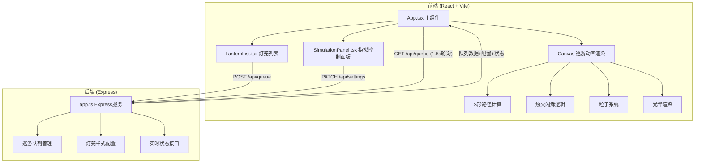
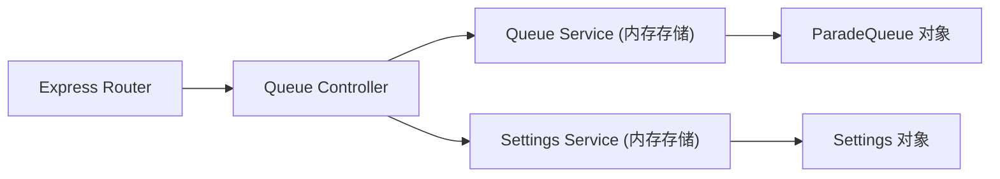
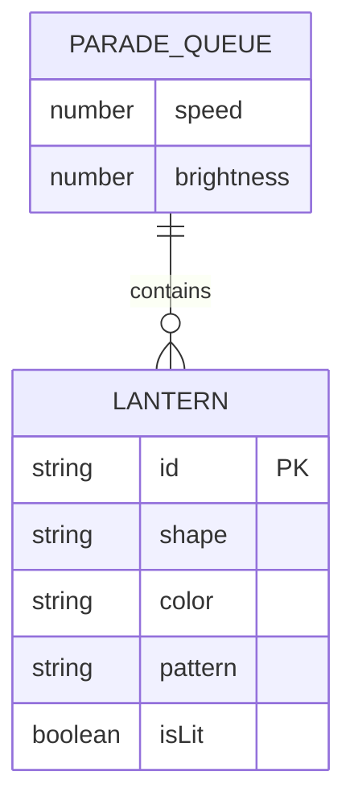

## 1. 架构设计



## 2. 技术说明

- 前端：React@18 + TypeScript + Vite + Tailwind CSS
- 初始化工具：vite-init (react-express-ts 模板)
- 后端：Express@4 + TypeScript
- 数据库：无（内存数据存储，模拟巡游队列）
- 状态管理：Zustand
- 图标库：lucide-react

## 3. 路由定义

| 路由 | 用途 |
|------|------|
| / | 花灯巡游主页面（唯一页面） |

## 4. API定义

### 4.1 数据类型

```typescript
type LanternShape = 'circle' | 'square' | 'fish' | 'lotus' | 'hexagon' | 'diamond' | 'rabbit' | 'star' | 'palace' | 'barrel';

type LanternColor = '#FF4444' | '#FFD700' | '#44FF44' | '#4444FF' | '#AA44FF' | '#FF69B4';

type LanternPattern = 'auspicious_cloud' | 'auspicious_beast' | 'floral';

interface Lantern {
  id: string;
  shape: LanternShape;
  color: LanternColor;
  pattern: LanternPattern;
  isLit: boolean;
}

interface ParadeQueue {
  lanterns: Lantern[];
  speed: number;
  brightness: number;
}

interface SettingsPayload {
  speed?: number;
  brightness?: number;
}
```

### 4.2 接口定义

| 方法 | 路径 | 请求体 | 响应 | 用途 |
|------|------|--------|------|------|
| GET | /api/queue | - | `{ lanterns: Lantern[], speed: number, brightness: number }` | 获取当前队列和配置 |
| POST | /api/queue | `{ lanternIds: string[] }` 或 `{ lantern: Lantern }` | `{ lanterns: Lantern[], speed: number, brightness: number }` | 更新队列（重排/添加） |
| DELETE | /api/queue/:id | - | `{ lanterns: Lantern[], speed: number, brightness: number }` | 从队列移除灯笼 |
| PATCH | /api/queue/:id/toggle | - | `{ lanterns: Lantern[] }` | 切换灯笼亮灭 |
| PATCH | /api/settings | `{ speed?: number, brightness?: number }` | `{ speed: number, brightness: number }` | 更新速度或亮度 |

## 5. 服务端架构图



## 6. 数据模型

### 6.1 数据模型定义



### 6.2 初始数据

后端启动时初始化一个空队列，speed=1.0，brightness=80%，等待前端添加灯笼。
