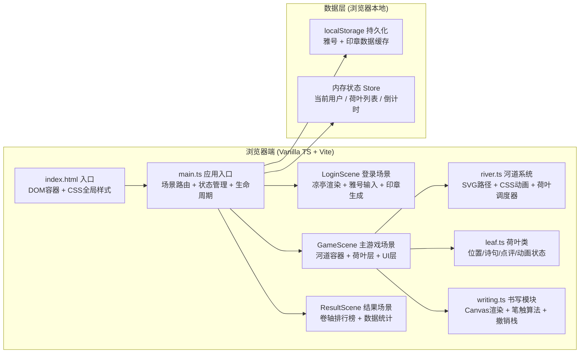

## 1. 架构设计



---

## 2. 技术选型说明

| 模块 | 技术方案 | 说明 |
|------|---------|------|
| 构建工具 | Vite 5.x | 轻量快速，原生ESM支持，符合用户要求端口3000 |
| 语言 | TypeScript 5.x | 严格模式 strict:true，target ES2020，类型安全 |
| 渲染技术 | SVG + Canvas 2D + CSS3 | SVG绘制静态场景（凉亭/河道/叶脉），Canvas实现动态书写，CSS3实现水波/飘动动画 |
| 状态管理 | 原生单例 Store 类 | 无框架依赖，使用类+EventEmitter模式管理全局状态 |
| 动画循环 | requestAnimationFrame | 荷叶飘动逻辑用RAF循环，CSS @keyframes 负责水波循环 |
| 数据持久化 | localStorage API | 存储用户雅号、印章图案、历史成绩 |

---

## 3. 路由与场景定义

| 场景标识 | 对应类/函数 | 触发条件 |
|---------|-------------|----------|
| `login` | `initLoginScene()` | 首次进入 / 登出后返回 |
| `game` | `initGameScene()` | 提交雅号后跳转 |
| `result` | `initResultScene()` | 5分钟倒计时结束 |

**场景切换方式**：单页面应用模式，通过 `main.ts` 中的 `switchScene(name)` 函数操作 `#app` 容器的 innerHTML，切换时销毁旧场景的事件监听与RAF循环。

---

## 4. 核心数据模型

### 4.1 TypeScript 类型定义

```typescript
// 用户信息
interface User {
  id: string;              // UUID
  nickname: string;        // 雅号
  sealDataUrl: string;     // 印章SVG/base64
  joinedAt: number;        // 加入时间戳
}

// 荷叶状态
interface LeafData {
  id: string;
  x: number;               // 当前X坐标（沿河道投影）
  y: number;               // 当前Y坐标
  rotation: number;        // 当前倾斜角度 -5~5度
  progress: number;        // 沿河道的进度 0~1
  speed: number;           // 飘动速度 px/frame
  bobPhase: number;        // 上下浮动相位
  poemChars: PoemChar[];   // 诗句字符数组（最多7字）
  reviews: Review[];       // 点评列表
  author: User | null;     // 作者信息
  state: 'floating' | 'writing' | 'released' | 'reviewed';
  hasReviewed: boolean;    // 是否已被点评
}

// 单个字符（含墨迹路径）
interface PoemChar {
  char: string;            // 识别出的汉字（可选，用于楷体对照）
  strokes: Stroke[];       // 笔画数据
}

// 单笔画（墨迹点序列）
interface Stroke {
  points: { x: number; y: number; width: number }[];
  timestamp: number;
}

// 点评
interface Review {
  id: string;
  author: User;
  content: string;         // 限20字
  createdAt: number;
}

// 排行榜数据
interface Leaderboard {
  topPoets: { user: User; count: number }[];   // 写诗句最多
  topReviewers: { user: User; count: number }[]; // 点评最多
}

// 全局状态
interface AppState {
  scene: 'login' | 'game' | 'result';
  currentUser: User | null;
  leaves: LeafData[];
  timerRemaining: number;    // 剩余秒数
  selectedLeafId: string | null;
}
```

---

## 5. 核心模块职责

### 5.1 src/river.ts —— 河道与动画管理

```
export class RiverManager
  ├─ constructor(container: HTMLElement)
  ├─ init(): void              // 绘制SVG蜿蜒河道，注入CSS keyframes
  ├─ getPathPoint(progress: number): {x, y}  // 取河道曲线上某点坐标
  ├─ registerLeaf(leaf: Leaf): void
  ├─ unregisterLeaf(leafId: string): void
  ├─ startAnimationLoop(): void   // 启动RAF循环
  ├─ stopAnimationLoop(): void
  └─ spawnLeaf(): Leaf | null      // 生成新荷叶（受5片上限约束）
```

**河道曲线**：使用 SVG `<path>` 定义三次贝塞尔曲线，从左上(50, 100) → 中(400, 250) → 中下(700, 500) → 右下(1150, 700)。用 `getPointAtLength(progress * totalLength)` 计算荷叶位置。

### 5.2 src/leaf.ts —— 荷叶对象封装

```
export class Leaf
  ├─ constructor(data: LeafData, river: RiverManager)
  ├─ element: HTMLElement          // DOM元素
  ├─ render(): void                // 更新DOM位置/旋转/内容
  ├─ enterWritingMode(): void      // 放大居中动画
  ├─ exitWritingMode(speedBoost?: number): void  // 退出+可选加速
  ├─ addReview(review: Review): void
  ├─ flashReviewFeedback(): void   // 闪烁动画
  ├─ destroy(): void               // 飘出屏幕后销毁
  └─ static createEmpty(author: User, river: RiverManager): Leaf
```

**视觉实现**：
- 荷叶本体：div + `radial-gradient(circle at 40% 40%, #5CB85C, #2E8B57 60%, #1F6B40)`
- 叶脉：内嵌 SVG 放射状线条（从中心8条→16条渐变）
- 露珠：3~5个白色半透明圆点 + CSS `@keyframes twinkle`（1.5s闪烁）

### 5.3 src/writing.ts —— 书写面板与Canvas

```
export class WritingPanel
  ├─ constructor(container: HTMLElement)
  ├─ canvas: HTMLCanvasElement
  ├─ ctx: CanvasRenderingContext2D
  ├─ undoStack: Stroke[]           // 撤销栈（每笔画一项）
  ├─ currentStroke: Stroke | null
  ├─ charsCompleted: PoemChar[]    // 已识别字符
  ├─ open(leaf: Leaf): Promise<string | null>  // 返回诗句或null取消
  ├─ close(): void
  ├─ undoLast(): void              // Ctrl+Z / 右键
  ├─ calculateWidth(speed: number): number  // 速度→宽度映射(2~6px)
  ├─ emitSplash(x, y): void        // 墨点飞溅特效
  ├─ renderKaiTiReference(char: string): void  // 左侧楷体对照
  └─ extractPoemText(): string     // 提取已写字数供校验
```

**笔触算法**：
- 监听 `pointerdown/move/up`
- 计算相邻两点距离/时间 = 书写速度 `v = Δd / Δt`
- 宽度插值：`w = 6 - (v / vMax) * 4`，vMax阈值≈8px/ms
- `ctx.lineCap = 'round'`, `lineJoin = 'round'` 实现圆润墨迹

**墨点飞溅**：每次下笔时在笔尖周围生成5-8个随机方向小圆点，用 CSS animation 向外扩散20px + opacity从1→0，持续0.2s后移除DOM。

---

## 6. 文件结构总览

```
auto279/
├── .trae/documents/
│   ├── prd.md
│   └── architecture.md
├── index.html              # 入口HTML + 全局CSS + Google字体
├── package.json            # typescript + vite 依赖
├── vite.config.js          # 端口3000配置
├── tsconfig.json           # strict + ES2020
└── src/
    ├── main.ts             # 入口：场景调度 + Store
    ├── river.ts            # RiverManager 河道管理
    ├── leaf.ts             # Leaf 荷叶类
    └── writing.ts          # WritingPanel 书写面板
```

---

## 7. 性能优化策略

| 问题 | 优化方案 |
|-----|---------|
| 5片荷叶同时飘动卡顿 | RAF循环内仅做数学计算，DOM写操作合并到一次 `requestAnimationFrame` 回调，使用 `transform: translate3d(x,y,0) rotate(rdeg)` 触发GPU合成层 |
| Canvas书写延迟 | Canvas尺寸固定600×400 DPR适配，离屏缓冲避免重复重绘，pointer事件回调内仅累积数据，RAF统一批量绘制 |
| 墨点飞溅DOM频繁创建/销毁 | 对象池复用15个飞溅元素节点，超出自动回收 |
| 内存泄漏 | 场景切换时调用 `destroy()` 清理所有监听器，`removeChild` 所有动态DOM，RAF取消 `cancelAnimationFrame` |
| CSS动画性能 | 仅对 `transform` 和 `opacity` 属性做动画，避免触发 layout/paint |
