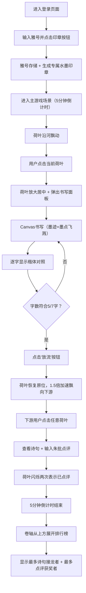

## 1. 产品概述

曲水流觞诗歌接龙游戏 —— 模拟古代文人雅士在曲水旁饮酒作诗的场景，用户以水墨风格界面进行书写、放流、点评互动，体验中国古典诗词文化之美。

- 核心目标：打造沉浸式古风文化互动体验，将书法、诗词、社交点评融为一体
- 目标用户：古典文化爱好者、书法练习者、创意社交用户
- 市场价值：寓教于乐的文化传播产品，可拓展至教育、文旅等领域

---

## 2. 核心功能

### 2.1 用户角色

| 角色 | 注册方式 | 核心权限 |
|------|----------|----------|
| 文人墨客 | 填写雅号登录 | 书写诗句、放流荷叶、点评他人诗句、查看排行榜 |

### 2.2 功能模块

1. **登录界面**：六角凉亭背景、竹简输入框、篆体印章按钮、雅号存储与印章生成
2. **主游戏场景**：曲水河道动画、荷叶随机飘动、点击放大书写、朱批点评系统
3. **书写面板**：Canvas墨迹书写、笔触宽度随速度变化、楷体字对照、撤销功能
4. **荷叶放流系统**：5/7字绝句限制、加速放流动画、新荷叶自动生成（最多5片）
5. **点评系统**：朱红小字批注、荷叶闪烁反馈
6. **排行榜**：5分钟雅集计时、卷轴展开动画、诗句/点评数据统计

### 2.3 页面详情

| 页面名称 | 模块名称 | 功能描述 |
|-----------|-----------|----------------|
| 登录页 | 六角凉亭 | SVG绘制古典凉亭，包含灰瓦、朱柱、石桌、米酒壶、竹简 |
| 登录页 | 竹简输入框 | 浅黄木色横向纹理，深褐描边，圆形篆体印章提交按钮 |
| 主场景 | 曲水河道 | 宽1200px高800px，蜿蜒河道，CSS波浪流动动画，淡蓝→中蓝渐变 |
| 主场景 | 荷叶系统 | 每60px一片荷叶，翠绿圆形+径向渐变叶脉，随机速度飘动，8px上下浮动 |
| 主场景 | 书写面板 | 1.5倍放大居中，半透明黑遮罩，宣纸色#F5F0E1+竖向红色界格，600×400px |
| 主场景 | 墨迹书写 | Canvas绘制，笔迹深黑#1A1A1A，慢写粗6px快写细2px，墨点飞溅0.2秒 |
| 主场景 | 放流系统 | 7字/5字限制，1.5倍加速飘走，1.5秒间隔新荷叶，最多5片同时存在 |
| 主场景 | 点评系统 | 朱红#CC3333小字显示在荷叶下方，闪烁两次反馈（0.6秒） |
| 结束页 | 卷轴排行榜 | 卷轴从上方展开（0.8秒），淡琥珀色#E8C482，深褐小楷字体 |

---

## 3. 核心流程

---

## 4. 用户界面设计

### 4.1 设计风格

- **主色调**：白纸色 #F5F0E1、墨黑 #1A1A1A、朱红 #CC3333、翠绿 #2E8B57、淡金 #D4AF37
- **辅助色**：淡蓝 #B0D4F1、中蓝 #6CB4EE、青灰 #7B8D6E、深褐 #4A2C1A、淡黄 #F5DEB3、浅黄木色 #D2B48C、淡琥珀 #E8C482、灰瓦 #808080
- **按钮样式**：仿古圆形玉佩，外圈深绿 #2E8B57，内圈白 #FFFFFF，中间小篆单字，悬停发光 #FFD700 缩放1.05倍（0.2秒）
- **字体**：楷体（KaiTi）/ 小楷用于正文，小篆用于印章按钮，深褐色 #4A2C1A
- **布局风格**：横向河道（桌面端）/ 纵向河道（移动端），水墨山水长卷为背景

### 4.2 页面设计概要

| 页面名称 | 模块名称 | UI 元素 |
|-----------|-----------|---------|
| 登录页 | 六角凉亭 | SVG绘制：六边形灰瓦攒尖顶、六根朱红立柱、青灰石桌、米酒壶（深褐+淡黄）、竹简卷轴 |
| 登录页 | 竹简输入框 | 宽400px高80px，横向木纹理（CSS渐变重复），深褐3px描边，圆角8px，内边距20px |
| 登录页 | 印章按钮 | 直径60px圆形，朱红背景，白色篆体"印"字，悬停浮起+阴影 |
| 主场景 | 曲水河道 | SVG蜿蜒河道曲线从左上到右下，宽60px的河水通道，两侧青灰河岸 |
| 主场景 | 荷叶 | 直径80px翠绿圆，径向渐变（#2E8B57中心→#5CB85C边缘），SVG放射状叶脉，淡金印章标记在左下角 |
| 主场景 | 羽毛笔光标 | 笔尖深褐#4A2C1A三角形，笔杆淡黄#F5DEB3矩形长条，跟随鼠标位置 |
| 主场景 | 书写面板 | 宣纸色背景#F5F0E1，竖向红色界格（每30px一条#E8C4C4细线），深褐3px边框，四角有祥云装饰 |
| 主场景 | 玉佩按钮 | "流"放流按钮 / "撤"撤销按钮 / "评"点评按钮 —— 均为玉佩样式 |
| 结束页 | 卷轴 | 上下卷轴杆（深褐木质），中间淡琥珀纸卷，从顶部滚动展开，两侧有挂绳装饰 |

### 4.3 响应式适配

| 断点 | 适配策略 |
|-------|----------|
| ≥1200px | 完整横向河道（1200×800），荷叶直径80px，凉亭+竹简登录界面 |
| 800px~1200px | 横向河道缩小至视口宽度，荷叶直径70px，书写面板保持600×400 |
| <800px | 河道改为纵向布局，荷叶直径缩至60px，登录界面改为上下排布 |
| <500px | 隐藏凉亭背景，纯色浅黄#F5DEB3，书写面板宽度90%自适应 |

---

## 5. 性能要求

| 指标 | 要求 |
|-----|------|
| 帧率 | 5片荷叶同时飘动时稳定 ≥50fps |
| 书写延迟 | 墨迹显示延迟 ≤50ms |
| 动画平滑度 | CSS关键帧帧率 ≥60fps，requestAnimationFrame无卡顿 |
| 内存占用 | Canvas绘制对象及时回收，无内存泄漏 |
