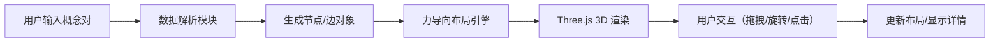

## 1. 产品概述
基于 Three.js 的三维力导向图语义知识图谱可视化系统，支持用户输入概念关系并自动生成可交互的 3D 网络图谱。

- 主要用途：将语义知识网络可视化展示，帮助用户直观理解概念间的关系结构
- 解决问题：传统 2D 图谱难以展示复杂网络结构，缺乏沉浸式交互体验
- 目标用户：知识图谱研究者、数据分析师、教育工作者

## 2. 核心功能

### 2.1 功能模块
1. **3D 图谱渲染**：节点（概念）和边（关系）的 Three.js 三维渲染
2. **力导向布局**：基于 Barnes-Hut 近似的弹簧力仿真自动布局
3. **交互系统**：节点拖拽、缩放旋转、右键查看详情
4. **数据解析**：从文本区域解析概念对列表并生成图谱
5. **统计面板**：右侧边栏展示节点和边的统计信息
6. **控制面板**：显示算法迭代状态，提供重置/清除功能

### 2.2 页面详情
| 页面名称 | 模块名称 | 功能描述 |
|-----------|-------------|---------------------|
| 主页面 | 3D 场景容器 | Three.js 渲染的力导向图谱，支持鼠标交互 |
| 主页面 | 左上角控制面板 | 显示迭代次数、能量值，提供重置和清除按钮 |
| 主页面 | 右侧边栏 | 数据输入区域、节点统计列表，支持折叠展开 |
| 主页面 | 节点信息面板 | CSS3D 渲染的悬浮面板，展示概念详情 |

## 3. 核心流程

用户输入概念关系文本 → 系统解析为节点和边数据 → 力导向算法开始迭代布局 → 3D 场景实时渲染节点位置 → 用户可交互操作（拖拽/旋转/查看详情）

## 4. 用户界面设计

### 4.1 设计风格
- **整体风格**：深色科技风，沉浸式 3D 体验
- **主色调**：背景 `#1a1a2e`，节点默认色 `#e94560`，边默认色 `#16213e`
- **关系颜色映射**：蓝色（子领域）、红色（相关）、绿色（对立）
- **毛玻璃效果**：半透明面板使用 `backdrop-filter: blur()`
- **按钮样式**：圆角高亮边框，悬浮时背景变亮

### 4.2 页面设计概述
| 页面名称 | 模块名称 | UI 元素 |
|-----------|-------------|-------------|
| 主页面 | 3D 场景 | 渐变光晕背景、发光节点、动态边 |
| 主页面 | 控制面板 | blur(5px) 半透明背景，圆角边框按钮 |
| 主页面 | 右侧边栏 | 0.3s 缓入缓出折叠动画，圆角放缩图标按钮 |
| 主页面 | 信息面板 | blur(10px) 毛玻璃效果，CSS3D 悬浮 |

### 4.3 响应性
- 桌面端优先，全屏 3D 场景
- 侧边栏折叠状态记忆
- 自适应窗口大小变化

### 4.4 3D 场景设计
- **环境**：深色背景，中心向外渐变光晕（透明度 0.3 → 0）
- **光照**：环境光 + 方向光，节点自发光效果
- **相机**：PerspectiveCamera，OrbitControls 支持缩放旋转
- **交互**：Raycaster 实现点击/悬停检测，拖拽时临时固定节点
- **后处理**：节点发光效果，增强视觉层次
- **性能**：100 节点 / 200 边时保持 30fps 以上
