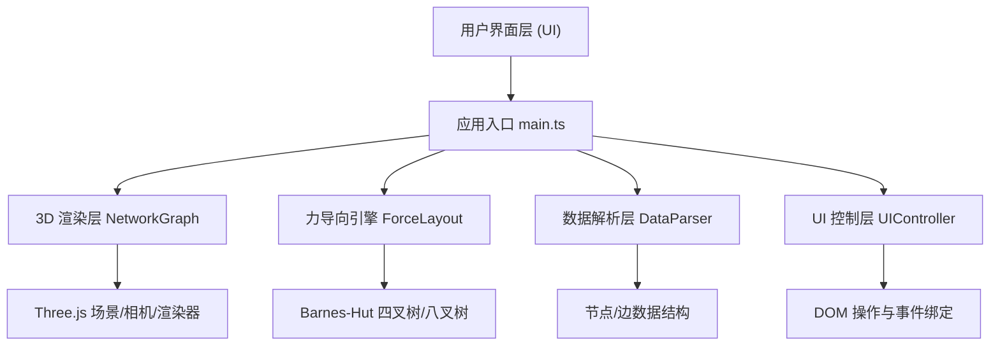
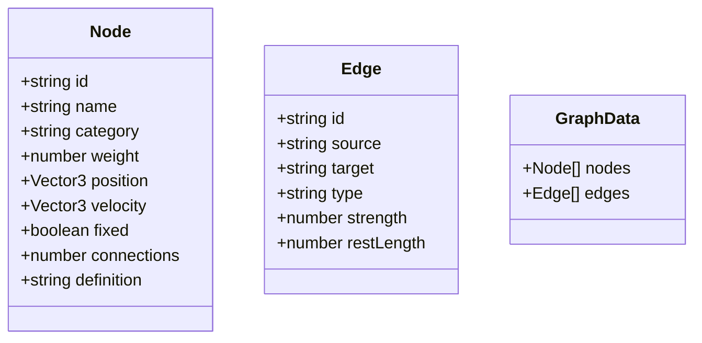

## 1. 架构设计

## 2. 技术描述

- **前端框架**：原生 TypeScript（不使用 React/Vue）
- **3D 引擎**：Three.js ^0.160.0
- **构建工具**：Vite ^5.0.0
- **类型支持**：@types/three ^0.160.0
- **初始化方式**：Vite vanilla-ts 模板

## 3. 数据模型

### 3.1 核心数据结构

### 3.2 关系类型定义
| 关系类型 | 颜色 | 说明 |
|---------|------|------|
| 子领域 | `#4a90d9` (蓝色) | 概念间的从属关系 |
| 相关 | `#e94560` (红色) | 概念间的关联关系 |
| 对立 | `#4ade80` (绿色) | 概念间的对立关系 |

## 4. 模块划分

| 文件 | 职责 | 核心导出 |
|------|------|----------|
| `src/main.ts` | 应用初始化，主循环 | 无（入口文件） |
| `src/force-layout.ts` | 力导向布局算法，Barnes-Hut 加速 | `ForceLayout` 类，`iterate()`, `reset()` |
| `src/network-graph.ts` | Three.js 渲染管理，交互处理 | `NetworkGraph` 类，`addNode()`, `addEdge()`, `updatePositions()` |
| `src/ui-controller.ts` | UI 元素管理，事件绑定 | `UIController` 类，`updateStats()`, `showInfoPanel()`, `hideInfoPanel()` |
| `src/data-parser.ts` | 文本数据解析 | `parseData()`, `generateDefaultData()` |

## 5. 力导向算法设计

### 5.1 力模型
- **节点斥力**：库仑定律，`F_rep = k * k / distance`
- **边弹簧力**：胡克定律，`F_spring = k * (distance - restLength)`
- **中心引力**：`F_gravity = -gravity * position`
- **阻尼系数**：`velocity *= damping`

### 5.2 Barnes-Hut 近似
- 八叉树空间划分
- 阈值 `theta = 0.5`
- 时间复杂度从 O(n²) 降至 O(n log n)

### 5.3 收敛条件
- 每帧节点最小移动 0.1 单位
- 系统能量低于阈值 `energy < 0.1` 时停止
- 最大迭代时间 5 秒

## 6. 性能优化策略

1. **几何体复用**：共享 SphereGeometry 和 CylinderGeometry
2. **材质复用**：关系类型对应固定材质实例
3. **InstancedMesh**：大规模节点时使用实例化渲染
4. **Raycaster 优化**：限制交互检测频率
5. **FPS 监控**：动态调整迭代步长
6. **内存管理**：及时 dispose 不再使用的几何体和材质
