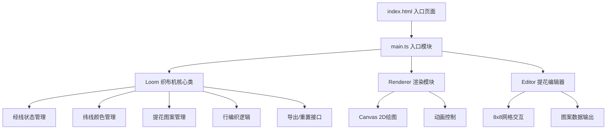
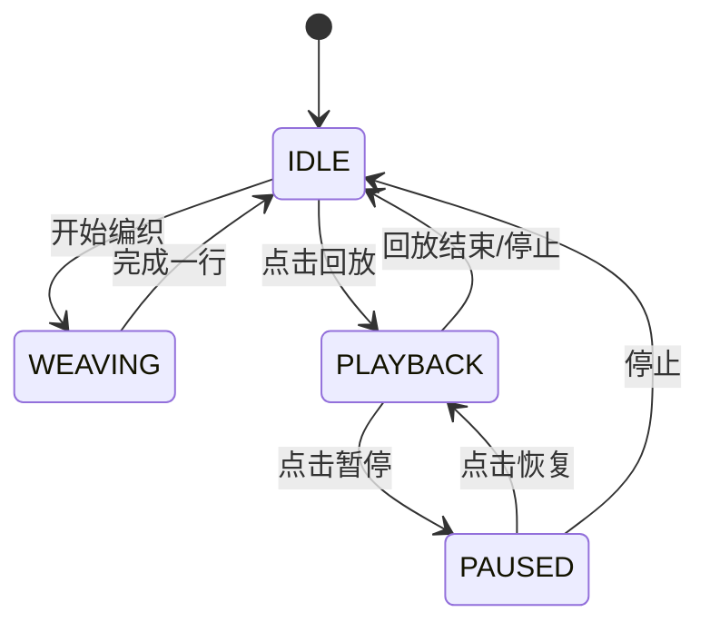

## 1. 架构设计

本项目为纯前端Canvas应用，采用模块化架构，分为数据层、逻辑层、渲染层和交互层。



## 2. 技术描述

- **前端框架**：原生 TypeScript + JavaScript（无UI框架）
- **构建工具**：Vite 5.x
- **渲染技术**：HTML5 Canvas 2D API
- **动画实现**：requestAnimationFrame + 状态机
- **样式方案**：原生CSS + CSS变量
- **数据管理**：Class-based 状态管理，无第三方状态库

## 3. 项目结构

```
auto280/
├── package.json          # 依赖配置：typescript, vite
├── index.html            # 入口页面，仿古风格全屏居中
├── vite.config.js        # 构建配置，端口3000
├── tsconfig.json         # TypeScript严格模式，ES2020
└── src/
    ├── main.ts           # 入口模块，DOM事件绑定，串联各模块
    ├── loom.ts           # 织布机核心类，经线/纬线/提花/编织逻辑
    ├── renderer.ts       # 渲染模块，Canvas绘制，动画控制
    └── editor.ts         # 提花图案网格编辑器逻辑
```

## 4. 核心模块设计

### 4.1 Loom 类 (src/loom.ts)

**职责**：管理织布机的所有状态和编织逻辑

```typescript
// 核心接口
interface LoomState {
  warpCount: number;           // 经线数量 32-128
  weftColor: string;           // 当前纬线颜色
  pattern: boolean[][];        // 8x8提花图案
  wovenRows: WovenRow[];       // 已编织的行历史
  currentRow: number;          // 当前编织行号
  isWeaving: boolean;          // 是否正在编织
  isPlaying: boolean;          // 是否在回放
}

interface WovenRow {
  weftColor: string;           // 该行纬线颜色
  pattern: boolean[][];        // 该行使用的图案
  timestamp: number;           // 编织时间戳
}

// 核心方法
- setWarpCount(count: number): void
- setWeftColor(color: string): void
- setPattern(pattern: boolean[][]): void
- weaveRow(): void             // 编织一行
- reset(): void                // 重置
- exportPNG(): Promise<string> // 导出PNG数据
- getWarpHeights(): number[]   // 获取经线高度数组（用于提花）
```

### 4.2 Renderer 类 (src/renderer.ts)

**职责**：Canvas绘制，动画控制

```typescript
// 核心接口
interface RendererOptions {
  loomCanvas: HTMLCanvasElement;
  previewCanvas: HTMLCanvasElement;
}

// 核心方法
- renderFrame(shuttleProgress: number): void  // 渲染单帧
- renderLoom(shuttleProgress: number): void   // 绘制织布机
- renderWarp(): void                          // 绘制经线
- renderWeft(progress: number): void          // 绘制纬线穿梭
- renderPreview(): void                       // 绘制预览区
- renderPlaybackOverlay(show: boolean): void  // 绘制回放遮罩
- startPlayback(speed: number): void          // 开始回放
- stopPlayback(): void                        // 停止回放
- togglePlayback(): void                      // 切换回放
```

### 4.3 Editor 类 (src/editor.ts)

**职责**：8x8提花图案网格编辑器

```typescript
// 核心接口
interface EditorOptions {
  container: HTMLElement;
  onPatternChange: (pattern: boolean[][]) => void;
}

// 核心方法
- setPattern(pattern: boolean[][]): void
- getPattern(): boolean[][]
- resetPattern(): void
- handleCellClick(row: number, col: number): void
- render(): void
```

### 4.4 main.ts (入口模块)

**职责**：DOM初始化，事件绑定，模块串联

- 创建Loom、Renderer、Editor实例
- 绑定滑块、色板、按钮的事件监听
- 处理参数变更时的状态更新和重绘
- 管理回放状态切换
- 处理导出对话框逻辑

## 5. 性能优化方案

### 5.1 渲染性能
- **分层Canvas**：经线层、纬线层、预览层分离，按需重绘
- **离屏渲染**：布料预览使用离屏Canvas缓存已编织行
- **脏矩形**：只重绘变化区域而非整屏
- **requestAnimationFrame**：确保60FPS，每帧<16ms

### 5.2 数据更新性能
- **经线密度调整**：预计算经线位置数组，避免重复计算
- **图案应用**：增量更新提花状态，O(n)复杂度
- **布料预览更新**：300ms内完成，使用requestIdleCallback处理非紧急更新

### 5.3 内存管理
- **历史记录**：限制最大记录行数，超过后FIFO淘汰
- **Canvas清理**：及时释放离屏Canvas资源
- **事件解绑**：组件销毁时移除所有事件监听

## 6. 动画状态机



## 7. 类型定义

```typescript
// src/types.ts
export type WeftColor = '#CC3333' | '#FFD700' | '#1E90FF' | '#2E8B57' | '#F0F8FF';

export interface CellPosition {
  row: number;
  col: number;
}

export interface WovenRow {
  weftColor: string;
  pattern: boolean[][];
  timestamp: number;
}

export interface LoomConfig {
  minWarpCount: 32;
  maxWarpCount: 128;
  warpStep: 8;
  defaultWarpCount: 64;
  previewWidth: 600;
  previewHeight: 200;
  playbackSpeed: 0.2; // seconds per row
}

export const COLOR_PALETTE: WeftColor[] = [
  '#CC3333', // 朱红
  '#FFD700', // 金黄
  '#1E90FF', // 宝蓝
  '#2E8B57', // 翠绿
  '#F0F8FF', // 月白
];
```
