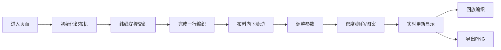

## 1. 产品概述

云锦织造交互式模拟器是一款在浏览器中模拟古代织工使用织布机编织云锦的教育类Web应用，解决传统云锦工艺教学中难以动态展示经纬交织过程与图案配色调整的问题。

- 面向对象：云锦工艺学习者、传统工艺爱好者、文化教育机构
- 核心价值：通过交互式可视化让用户直观理解云锦织造的经纬交织原理和提花工艺
- 市场价值：将非物质文化遗产的传统工艺数字化，降低学习门槛，提升教学效果

## 2. 核心功能

### 2.1 用户角色

| 角色 | 注册方式 | 核心权限 |
|------|----------|----------|
| 普通用户 | 无需注册 | 完整使用所有织造模拟、图案编辑、回放和导出功能 |

### 2.2 功能模块

1. **织布机主界面**：经线排布区、纬线穿梭动画、当前行编织区、布料预览区
2. **参数控制面板**：经线密度滑块、纬线颜色选择板
3. **提花图案编辑器**：8x8网格编辑器、图案应用功能
4. **编织回放系统**：历史回放、暂停/恢复控制
5. **导出功能**：PNG图片导出、仿古卷轴对话框

### 2.3 页面详情

| 页面名称 | 模块名称 | 功能描述 |
|----------|----------|----------|
| 主页面 | 仿古匾额标题 | 顶部"云锦织造坊"仿古匾额样式标题 |
| 主页面 | 经线排布区 | 左侧垂直排列经线，默认64根，间距可调 |
| 主页面 | 纬线穿梭区 | 右侧木梭形状图标，水平穿梭动画 |
| 主页面 | 当前行编织区 | 中央显示正在编织的行，经纬交织动画 |
| 主页面 | 布料预览区 | 底部600x200px已编织布料预览 |
| 主页面 | 经线密度滑块 | 32-128根可调，步长8 |
| 主页面 | 纬线颜色选择板 | 朱红、金黄、宝蓝、翠绿、月白五色圆形选择器 |
| 主页面 | 提花图案编辑器 | 8x8网格点击切换起花/不起花 |
| 主页面 | 回放控制 | 右下角回放按钮，0.2秒/行速度重播 |
| 主页面 | 导出功能 | 导出PNG，文件名"云锦_日期_时间" |

## 3. 核心流程

### 3.1 织造流程
用户进入页面 → 默认64根经线排布 → 纬线从左向右穿梭交织 → 每织完一行布料向下滚动 → 可随时调整经线密度/纬线颜色/提花图案 → 参数变更后实时更新显示 → 可回放编织过程 → 可导出为PNG图片

### 3.2 提花编辑流程
用户点击网格切换起花状态 → 亮色表示起花位 → 点击"应用图案"按钮 → 起花位经线升高形成浮长线 → 布料纹理按新图案重新生成

## 4. 用户界面设计

### 4.1 设计风格
- 主色调：仿古木色#8B5A2B、宣纸色#F5F0E1、深褐色#4A2C1A
- 主题色：深红色#800000（匾额底）、金色#D4AF37（描边/文字）
- 配色板：朱红#CC3333、金黄#FFD700、宝蓝#1E90FF、翠绿#2E8B57、月白#F0F8FF
- 字体：标题使用隶书字体，正文使用衬线字体
- 按钮风格：仿古木质感，木纹纹理，圆角过渡
- 滑块风格：CSS渐变色模拟木纹纹理
- 整体风格：古朴典雅，还原传统织布机房的氛围

### 4.2 页面设计概述

| 页面名称 | 模块名称 | UI元素 |
|----------|----------|--------|
| 主页面 | 仿古匾额 | 深红底#800000，金色描边#D4AF37，隶书"云锦织造坊" |
| 主页面 | 织布机框架 | 木色#8B5A2B边框，仿古结构 |
| 主页面 | 经线 | 竖直线条，起花位升高显示 |
| 主页面 | 纬线梭子 | 木梭形状SVG图标，穿梭动画 |
| 主页面 | 预览区 | 宣纸色#F5F0E1背景，600x200px |
| 主页面 | 色板按钮 | 圆形色块30px，阴影，悬停放大1.2倍，0.2秒过渡 |
| 主页面 | 滑块 | 木纹渐变纹理 |
| 主页面 | 回放遮罩 | 半透明木色#8B5A2B，淡金色"编织回放中" |
| 主页面 | 导出对话框 | 仿古卷轴样式，宣纸色#F5F0E1背景，深褐#4A2C1A边框 |

### 4.3 响应式设计
- 桌面优先设计，最小宽度768px，最大宽度1400px
- 居中布局，左右留白自适应
- 触摸设备优化滑块和按钮操作区域
- Canvas画布自适应缩放保持比例

### 4.4 交互动效
- 色板悬停：放大1.2倍，0.2秒平滑过渡
- 纬线穿梭：从左到右平移动画，模拟梭子运动
- 编织行：逐像素绘制，模拟真实织造过程
- 回放遮罩：淡入淡出过渡，0.3秒
- 布料滚动：平滑向下滚动一行，0.1秒过渡
