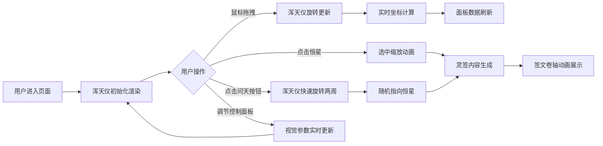

## 1. 产品概述

交互式浑天仪星象观测与占星Web应用 - 模拟古代星象官通过浑天仪观测星空、记录星宿位置并预测吉凶方位的工具。

- 核心目的：提供沉浸式的古代天文观测体验，通过动态Canvas渲染实现天球旋转、星宿定位和占星预测
- 目标用户：天文爱好者、历史文化爱好者、占星文化研究者
- 产品价值：将传统纸本星图转化为可交互的动态演示工具，实现天体相对运动可视化与实时坐标换算

## 2. 核心功能

### 2.1 用户角色
| 角色 | 注册方式 | 核心权限 |
|------|----------|----------|
| 访客用户 | 无需注册 | 完整使用所有观测和占星功能 |

### 2.2 功能模块
1. **浑天仪渲染模块**：Canvas绘制天球、经纬网格、恒星、星宿分区、地平圈和八卦符号
2. **交互控制模块**：鼠标拖拽旋转、弹性回弹动画、点击恒星选中、问天按钮
3. **天文计算模块**：赤经赤纬与地平坐标转换、吉凶方位计算
4. **占星灵签模块**：星宿签文抽取、吉凶等级判定、诗文解释展示
5. **控制面板模块**：亮度调节、赤纬网格密度、昼夜比例调节

### 2.3 页面详情
| 页面名称 | 模块名称 | 功能描述 |
|----------|----------|----------|
| 主观测页 | 浑天仪视图 | 500px圆形浑天仪，可拖拽旋转，显示80颗恒星和经纬网格 |
| 主观测页 | 星宿信息面板 | 显示选中星宿名称、赤经赤纬、地平高度、方位角、当前吉凶 |
| 主观测页 | 灵签展示区 | 展示四言律诗签文、吉凶解读、宜忌事项和朱砂方印 |
| 主观测页 | 控制面板 | 亮度滑块(10级)、赤纬网格密度(3档)、昼夜比例滑块 |
| 主观测页 | 问天按钮 | 触发浑天仪旋转动画和随机灵签抽取 |

## 3. 核心流程

用户进入页面后看到浑天仪和星空背景，可通过拖拽旋转观测不同天区，点击恒星查看星宿详情，或点击"问天"按钮获取随机占星灵签。

## 4. 用户界面设计

### 4.1 设计风格
- **主色调**：暗夜蓝 #0A1128 → 星空紫 #1A1A3A 渐变背景
- **强调色**：铜绿 #2E8B57（问天按钮）、深金色 #D4AF37（八卦符号、签文）、朱砂红（方印）
- **辅助色**：淡黄白 #FFF8DC（恒星）、白色 #E0E0E0（刻度、文字）、青铜色 #6B7B8D（底座）
- **字体**：标题篆体、签文楷体、正文宋体/系统字体
- **视觉风格**：古朴典雅的中国古代天文仪器风格，磨砂玻璃面板，微光晕效果

### 4.2 页面设计概述
| 页面名称 | 模块名称 | UI元素 |
|----------|----------|--------|
| 主观测页 | 浑天仪视图 | 圆形天球(500px)、经纬网格线、80颗恒星带辉光、地平圈刻度、八卦符号、青铜底座云雷纹 |
| 主观测页 | 星宿信息面板 | 半透明深蓝背景(240px宽)、白色字体、磨砂玻璃效果、悬停金色光晕 |
| 主观测页 | 灵签展示区 | 楷体四言律诗(深金色)、吉凶解读文字、宜忌列表、朱砂方印(30x30px)、卷轴动画 |
| 主观测页 | 控制面板 | 半透明背景(透明度0.6)、三个滑块控件、实时参数响应 |
| 主观测页 | 问天按钮 | 圆形铜绿按钮(50px)、白色"占"字、金色祥云纹边框 |

### 4.3 响应式
- **桌面端(>768px)**：浑天仪居中(500px)，信息面板在右侧(240px)，控制面板在左上角
- **移动端(≤768px)**：浑天仪缩小至300px，右方面板折叠到底部，所有文字缩小至12px，交互功能保持不变
- **触摸优化**：支持触摸拖拽旋转，触摸点选中恒星

### 4.4 Canvas场景指导
- **环境氛围**：暗夜星空，300颗随机闪烁星点(周期3-6秒)，星座连线辉光(#2A4A6A, 透明度0.3)
- **光照设置**：模拟月光/星光环境，恒星带细微辉光效果(半径8px, 透明度0.15)
- **浑天仪结构**：外层地平圈(白色带刻度)、内层可旋转天球(赤经赤纬网格)、底部青铜圆盘(云雷纹浮雕)
- **动画系统**：拖拽旋转(限幅-45°~+45°，弹性回弹0.3s ease-out)、选中缩放(0.5s)、问天旋转(1s 720° ease-in-out)、签文卷轴(0.4s ease-out)、参数渐变(亮度0.2s、网格0.5s、背景1s)
- **性能要求**：帧率≥55fps，数据更新≤100ms，重绘≤50ms
