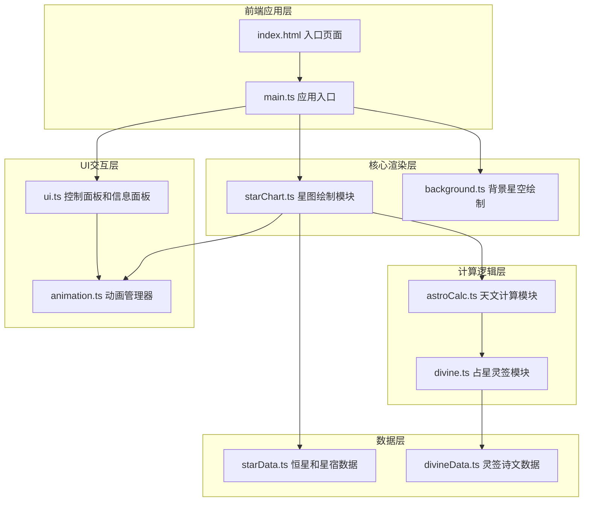

## 1. 架构设计



## 2. 技术描述

- **前端框架**：原生TypeScript + Vite（用户明确要求使用TypeScript和原生JavaScript）
- **构建工具**：Vite@5
- **渲染技术**：HTML5 Canvas 2D API
- **状态管理**：原生JavaScript模块级状态，无需额外状态管理库
- **动画系统**：requestAnimationFrame + 自定义缓动函数
- **样式方案**：原生CSS + CSS自定义属性（实现主题色和动画过渡）

## 3. 文件结构与调用关系

| 文件路径 | 职责 | 输入 | 输出 | 调用关系 |
|----------|------|------|------|----------|
| `index.html` | 页面入口，DOM结构 | - | Canvas容器、UI面板 | 加载main.ts |
| `src/main.ts` | 应用初始化，模块协调 | DOM事件 | 全局状态 | 调用starChart、ui、background |
| `src/starChart.ts` | 浑天仪核心绘制 | Canvas元素、鼠标输入、旋转角度 | Canvas画面 | 调用astroCalc、starData、animation |
| `src/astroCalc.ts` | 天文坐标计算 | 赤经(RA)、赤纬(Dec)、观测时间、地理位置 | 地平高度(Alt)、方位角(Az)、吉凶值 | 被starChart调用，输出给divine |
| `src/divine.ts` | 占星灵签逻辑 | 星宿编号、吉凶值 | 签文对象(诗文/吉凶/宜忌) | 从astroCalc接收吉凶值，读取divineData |
| `src/starData.ts` | 恒星与星宿数据 | - | 80颗恒星坐标、三垣二十八宿分区数据 | 被starChart和divine引用 |
| `src/divineData.ts` | 灵签诗文数据 | - | 签文诗文库、吉凶等级、宜忌事项 | 被divine引用 |
| `src/background.ts` | 背景星空绘制 | Canvas元素 | 满天繁星、星座连线 | 被main.ts调用 |
| `src/ui.ts` | UI面板交互 | DOM事件、计算结果 | 面板内容更新、参数变更事件 | 从starChart和divine接收数据，输出控制参数 |
| `src/animation.ts` | 动画管理 | 动画参数、目标值 | 帧回调、缓动计算 | 被starChart和ui调用 |

### 数据流向
```
鼠标拖拽 → starChart(更新旋转角度) → astroCalc(坐标换算) → ui(刷新面板)
点击恒星 → starChart(选中动画) → astroCalc(计算吉凶) → divine(生成签文) → ui(展示签文)
问天按钮 → starChart(旋转动画) → 随机选星 → divine(生成签文) → ui(卷轴动画)
控制面板 → ui(参数变更) → starChart/background(视觉更新)
```

## 4. 核心数据模型

### 4.1 恒星数据结构
```typescript
interface Star {
  id: number;
  ra: number;           // 赤经 (弧度 0~2π)
  dec: number;          // 赤纬 (弧度 -π/2~π/2)
  magnitude: 1 | 2 | 3; // 视星等等级: 1=亮(4px), 2=中(3px), 3=暗(2px)
  mansionId: number;    // 所属星宿ID 0~27 (二十八宿) 或垣ID
  name?: string;        // 恒星名称
}
```

### 4.2 星宿数据结构
```typescript
interface Mansion {
  id: number;
  name: string;         // 如 "角宿"
  type: 'yuan' | 'xiu'; // 垣 或 宿
  centralRa: number;    // 中心赤经
  centralDec: number;   // 中心赤纬
  boundaryRa: [number, number]; // 赤经范围
  boundaryDec: [number, number]; // 赤纬范围
}
```

### 4.3 灵签数据结构
```typescript
interface DivineSign {
  mansionId: number;
  level: '上吉' | '中吉' | '小吉' | '平' | '小凶' | '大凶';
  poem: string[];       // 四言律诗 4句
  interpretation: string; // 30-50字解读
  yi: string[];         // 宜事项 4项
  ji: string[];         // 忌事项 4项
}
```

### 4.4 观测状态
```typescript
interface ObservationState {
  rotationX: number;    // X轴旋转角度 (弧度)
  rotationY: number;    // Y轴旋转角度 (弧度)
  brightness: number;   // 亮度等级 1~10
  decGridDensity: 10 | 20 | 30; // 赤纬网格密度(度)
  dayNightRatio: number; // 昼夜比例 0~1 (0全黑, 1全亮)
  observationTime: { hour: number; minute: number }; // 观测时刻
  selectedStar: Star | null;
  currentLuck: string;  // 当前吉凶
}
```

## 5. 性能保障策略

1. **Canvas优化**：使用离屏Canvas预渲染静态元素（地平圈、八卦符号、青铜底座），避免每帧重复绘制
2. **脏矩形渲染**：仅重绘变化区域（旋转时重绘天球内容，静态背景缓存）
3. **requestAnimationFrame**：所有动画统一调度，确保帧率稳定
4. **对象池**：恒星和网格计算复用临时对象，减少GC压力
5. **防抖节流**：鼠标移动使用requestAnimationFrame节流，面板更新≤100ms
6. **预计算**：恒星球面投影坐标缓存，仅在旋转角度变化时重新计算
