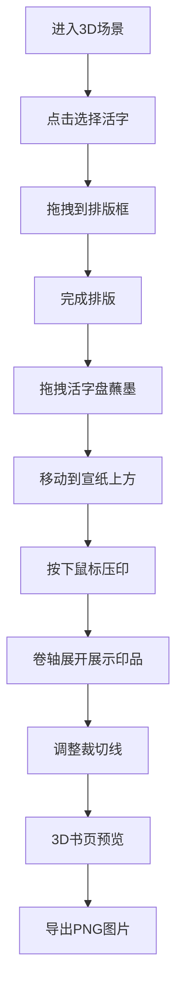

# 活字印韵 - 产品需求文档

## 1. 产品概述

本产品是一款基于Web的3D交互式活字印刷可视化教学应用，模拟古代活字印刷工匠使用泥活字或木活字排印书页的完整流程。用户可通过调整字模排列、蘸墨均匀度和压印力度，实时生成不同清晰度和墨色浓淡效果的雕版印刷品。

- **核心价值**：解决传统活字印刷教学中难以动态演示排字、上墨、覆纸、压印完整流程的问题，让用户通过交互式操作直观理解活字印刷原理，观察印品与字模的形态差异。

## 2. 核心功能

### 2.1 功能模块

1. **主场景页面：3D工作台场景，包含活字盘、排版框、蘸墨台、压印区
2. **活字排版模块：活字选择、拖拽、排列、撤销、清空
3. **蘸墨压印模块：蘸墨操作、压印动作、墨色效果模拟
4. **印品展示模块：卷轴展开、裁切线调整、3D书页预览
5. **导出模块：高清PNG图片导出

### 2.2 功能详情

| 模块名称 | 功能名称 | 功能描述 |
|---------|---------|---------|
| 主场景 | 3D工作台 | 仿古作坊场景，木纹深褐工作台面，旧纸泛黄背景 |
| 活字排版 | 活字盘 | 每盘16x12格，格子浅黄，每格一枚阴刻反体活字 |
| 活字排版 | 活字选择 | 鼠标点击活字，活字升起动画0.3秒带抛物曲线 |
| 活字排版 | 拖拽排版 | 拖拽活字到排版框中按行排列 |
| 活字排版 | 横竖切换 | 排版框支持横排/竖排切换 |
| 活字排版 | 撤销删除 | 选中活字按删除键移除，缩小淡出动画0.2秒 |
| 活字排版 | 清空整版 | 一键清空，字模飞回活字盘，队列动画0.5秒 |
| 蘸墨压印 | 蘸墨台 | 圆形石盘，深黑墨池，表面反光效果 |
| 蘸墨压印 | 蘸墨动作 | 拖拽活字盘在墨池中蘸墨，时间由拖拽速度决定 |
| 蘸墨反馈 | 涟漪动画 | 墨池涟漪扩散 + 活字表面墨色渐变 |
| 蘸墨压印 | 压印动作 | 鼠标点击压印，向下压并保持0.5秒 |
| 蘸墨压印 | 墨色效果 | 轻压浅灰清晰、中压深灰微羽化、重压全黑墨渍扩散 |
| 印品展示 | 卷轴展开 | 右侧仿古卷轴从顶部向下展开0.5秒 |
| 印品展示 | 裁切线 | 黄褐色虚线，可拖拽调整裁切范围 |
| 印品展示 | 3D书页 | 三维视角悬浮展示，木纹背景，可旋转放大 |
| 导出 | PNG导出 | 300dpi分辨率，1600x1200px，保留墨色细节和纸张纹理 |

## 3. 核心流程

用户进入页面后，看到3D古代作坊场景。首先从左侧活字盘中点击选择活字，拖拽到中间排版框中排列成句。排版完成后，将活字盘拖到右侧蘸墨台蘸墨，根据拖拽速度决定蘸墨量。蘸墨后移动到宣纸上，按下鼠标进行压印，根据按压时长决定压印力度。压印完成后，右侧卷轴展开显示印品，用户可调整裁切线裁切书页并3D预览，最后可导出为高清PNG图片。

## 4. 用户界面设计

### 4.1 设计风格

- **主色调**：旧纸泛黄 #EDE4D4，木纹深褐 #6B4226
- **辅助色**：浅黄格子 #D2B48C，浅灰边框 #AAAAAA，宣纸色 #F5F0E1
- **强调色**：琥珀色光晕 #FFBF00，金色边框 #D4AF37
- **字体**：标题楷体"活字印韵"36px 字重500
- **按钮**：方形木戳样式，深褐底 #5C4033，金色边框 #D4AF37，内填浅黄 #E8C897
- **整体风格**：木版年画质朴感，仿古配色

### 4.2 页面布局

| 区域 | 位置 | 内容 |
|-----|------|------|
| 标题区 | 顶部 | 应用标题"活字印韵" |
| 工作台 | 底部50% | 3D工作台场景 |
| 活字盘区 | 左1/3 | 活字盘（16x12格） |
| 排版框区 | 中央1/3 | 排版框（500x400px） |
| 操作区 | 右1/3 | 蘸墨台、宣纸、压印区 |
| 卷轴区 | 右侧弹出 | 印品卷轴、裁切线、3D书页 |

### 4.3 交互细节

- 所有可交互元素悬停时：琥珀色 #FFBF00 光晕圆环，半径20px，半透明0.3
- 活字拾取/拖拽/放置：缓动曲线 ease-out，时长0.25s
- 压印时宣纸：宣纸轻微抖动，水平位移3px，频率10Hz，持续0.2s
- 卷轴展开：从顶部向下展开，耗时0.5秒

### 4.4 响应式设计

- **桌面端**：左右三栏布局（活字盘左、排版框中、操作区右）
- **移动端**（<768px）：上下布局（活字盘在上、排版框在中、操作区在下）
- 移动端字体和按钮缩放至90%

### 4.5 3D场景设计

- **环境**：古代作坊氛围，暖色调，柔和光照
- **灯光**：环境光 + 平行光，模拟室内自然光
- **相机**：透视相机 fov45，远近裁剪面 0.1-10000
- **控制**：OrbitControls 支持旋转观察
- **工作台**：20x12单位平面，木纹地板纹理
- **活字**：BoxGeometry 0.5x0.5x0.5，顶面向内凹陷形成文字轮廓
- **材质**：根据蘸墨状态动态变化材质颜色
- **动画**：活字位置动画、墨迹扩散粒子、卷轴展开进度

### 4.6 性能要求

- 印品生成动画帧率不低于45fps
- 压印到卷轴完全展开耗时不超过1.2秒
- 导出图片响应时间在1.5秒以内
