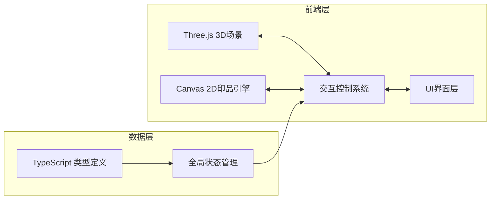

# 活字印韵 - 技术架构文档

## 1. 架构设计



## 2. 技术描述

- **前端框架**：原生 TypeScript + Three.js（不使用React框架，按用户要求使用原生TS）
- **构建工具**：Vite 5.x
- **3D引擎**：Three.js 0.160.x
- **类型支持**：@types/three
- **2D渲染**：Canvas 2D API
- **语言**：TypeScript 5.x（严格模式，target ES2020）

## 3. 项目结构

```
.
├── package.json
├── index.html
├── vite.config.js
├── tsconfig.json
├── src/
│   ├── types.ts          # 类型定义
│   ├── main.ts           # Three.js场景主入口
│   ├── interaction.ts    # 交互逻辑
│   └── printEngine.ts    # 印品生成引擎
└── .trae/
    └── documents/
        ├── PRD.md
        └── TECH_ARCH.md
```

## 4. 核心模块说明

### 4.1 类型定义 (types.ts)

定义所有数据类型与接口：

| 类型名称 | 描述 | 关键字段 |
|---------|------|---------|
| TypeChar | 活字数据 | id, char, font, row, col, position, inkLevel, status |
| TypePlate | 排版框数据 | rows, cols, pages, isHorizontal, characters |
| InkParams | 蘸墨参数 | inkLevel, inkQuality, bleed |
| PrintResult | 印品数据 | printId, content, inkQuality, bleed, timestamp, imageData |
| AppState | 应用全局状态 | selectedChar, currentMode, plateData, isPrinting |

### 4.2 场景主入口 (main.ts)

Three.js 场景初始化与渲染循环：
- 创建透视相机（fov: 45, near: 0.1, far: 10000）
- 场景灯光：环境光 + 平行光
- OrbitControls 相机控制
- 工作台平面（20x12单位，木纹材质）
- 活字盘网格（BoxGeometry 0.5x0.5x0.5）
- 排版框（透明边框高亮）
- 蘸墨台（圆形平面 + 动态涟漪 mesh）
- 宣纸平面（带透明度过渡动画）
- 动画系统：活字位置、墨迹粒子、卷轴展开

### 4.3 交互控制 (interaction.ts)

处理全流程交互逻辑：
- 鼠标点击选择活字（Raycaster 检测）
- 鼠标拖拽移动（基于相机平面夹紧）
- 蘸墨动作（拖拽路径长度 → 映射到 inkLevel）
- 压印动作（mousedown 时长 → 映射到 inkQuality 和 bleed）
- 删除按键响应
- 清空按钮响应
- 裁切线拖拽
- 导出图片请求
- 所有交互状态存储在全局状态中，触发 UI 更新和动画

### 4.4 印品引擎 (printEngine.ts)

印品生成与导出引擎：
- 接收排版活字数组、inkLevel、inkQuality、bleed 参数
- Canvas 2D 模拟压印效果
- 文字渲染（fillText，根据 font 类型设定字体）
- 墨色渐变模拟（alpha + shadowBlur 边缘羽化）
- 墨渍扩散算法（Perlin 噪声生成 2D 偏移）
- 卷轴展示图片生成
- PNG 导出（Blob 转换 + 下载链接）

## 5. 关键技术方案

### 5.1 活字阴刻效果

使用 Three.js 的 ShapeGeometry 或 CanvasTexture 在立方体顶面生成凹陷文字效果，通过法线贴图或位移贴图模拟雕刻感。

### 5.2 蘸墨动画系统

- 墨池涟漪：使用 ShaderMaterial 实现动态波浪效果
- 活字墨色：根据 inkLevel 动态调整材质颜色和金属度
- 渐变过渡：使用 lerp 实现颜色平滑过渡

### 5.3 压印墨色模拟

| 压印力度 | 墨色 | 边缘效果 | shadowBlur |
|---------|------|---------|------------|
| 轻压 | #888888 | 清晰 | 0 |
| 中压 | #444444 | 微羽化 | 2px |
| 重压 | #000000 | 墨渍扩散 | 6px |

### 5.4 性能优化

- 活字使用 InstancedMesh 批量渲染
- Canvas 印品生成使用离屏 Canvas
- 动画使用 requestAnimationFrame 和 tween 缓动
- 粒子系统使用 GPU 实例化

## 6. 文件清单

| 文件路径 | 职责 |
|---------|------|
| package.json | 项目依赖与脚本配置 |
| index.html | 入口页面，背景色 #EDE4D4，标题楷体 |
| vite.config.js | Vite 构建配置，端口 3000 |
| tsconfig.json | TypeScript 配置，严格模式，ES2020 |
| src/types.ts | 类型定义与接口 |
| src/main.ts | Three.js 场景主循环 |
| src/interaction.ts | 交互逻辑处理 |
| src/printEngine.ts | 印品生成与导出引擎 |
