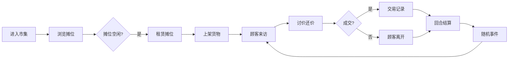

## 1. 产品概述
古代市集摊位租赁与在线交易模拟系统，让摊主和顾客在虚拟街市中进行讨价还价、摊位预订和即时结算，将传统纸质账本管理的市集数字化。

- 核心价值：沉浸式古代市集体验，回合制交易模拟，动态市场行情
- 目标用户：对古代经济模拟感兴趣的休闲玩家

## 2. 核心功能

### 2.1 用户角色
| 角色 | 进入方式 | 核心权限 |
|------|----------|----------|
| 摊主 | 直接进入 | 租赁摊位、管理货物、参与交易、查看记录 |

### 2.2 功能模块
1. **市集场景**：Canvas绘制环形20个摊位，顾客随机游走，实时状态渲染
2. **摊位租赁**：点击空闲摊位租赁，租期10回合，摊位显示姓氏旗
3. **交易系统**：讨价还价气泡，成交/抬价交互，金币结算
4. **货物管理**：最多3种货物上架，进货价与市场浮动价
5. **回合系统**：每15秒一回合，自动扣租，随机事件
6. **行情图表**：柱状图展示各货物当前价格对比
7. **交易记录**：表格展示成交历史

### 2.3 页面详情
| 页面名称 | 模块名称 | 功能描述 |
|---------|---------|----------|
| 主页面 | 市集场景Canvas | 绘制摊位、顾客、气泡动画、事件横幅 |
| 主页面 | 左侧信息面板 | 摊位详情、状态、货物、租金、金币余额 |
| 主页面 | 右侧操作面板 | 货物清单Tab、交易记录Tab、市场公告Tab |

## 3. 核心流程
摊主进入市集 → 浏览环形摊位 → 点击空闲摊位租赁 → 上架货物 → 顾客随机来访 → 讨价还价 → 成交/抬价 → 回合结算 → 随机事件 → 循环

## 4. 用户界面设计

### 4.1 设计风格
- 主色调：淡黄宣纸色 #F5E6CC，深褐色木框 #4A2C1A
- 点缀色：朱砂红 #DC143C，金色 #FFD700，米黄 #FFF8DC
- 按钮：圆形朱砂红底、金色描边，悬停放大1.1倍并发微光
- 字体：楷体风格，仿古韵味
- 布局：三栏布局，中间Canvas场景，左右信息面板

### 4.2 页面设计概览
| 页面名称 | 模块名称 | UI元素 |
|---------|---------|-------|
| 主页面 | 市集Canvas | 环形摊位、顾客角色、气泡动画、滚动横幅 |
| 主页面 | 左侧面板 | 深褐木框、浅棕内底、楷体文字、逐行信息 |
| 主页面 | 右侧面板 | 三Tab切换、货物列表、行情柱状图、交易表格 |

### 4.3 响应式
- Desktop-first设计
- 视口<1200px时：左右面板改为上下布局，场景高度缩至400px，字号相应减小

### 4.4 Canvas场景要点
- 摊位：棕色木架#8B4513 + 红布顶棚#DC143C，小旗标识状态（绿/红/黄）
- 顾客：浅灰人形#D3D3D3，随机游走
- 气泡：米黄底#FFF8DC、深褐文字#4A2C1A，2秒上移消失
- 旗帜：2秒周期，-5deg到+5deg平滑摆动
- 事件横幅：深黄底#FFD700、红字#8B0000，从左向右滚动
