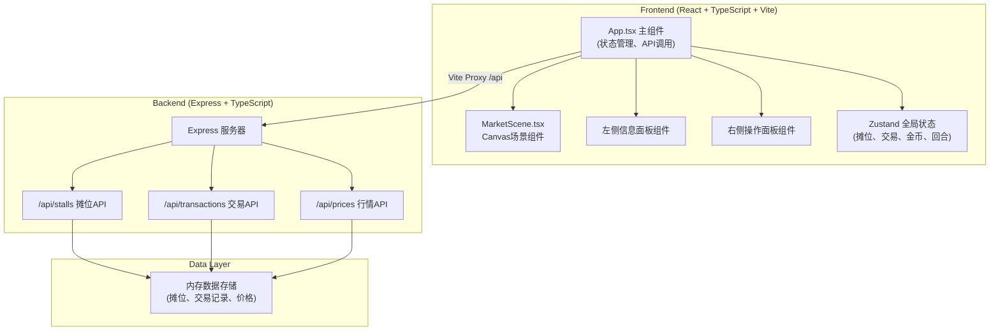

## 1. 架构设计



## 2. 技术描述
- **前端**：React@18 + TypeScript + Vite + Zustand状态管理
- **初始化工具**：vite-init (react-express-ts模板)
- **后端**：Express@4 + TypeScript (ESM格式)
- **数据库**：内存存储（无需数据库）
- **样式**：TailwindCSS + 自定义CSS变量（仿古配色）
- **图形**：原生Canvas 2D API
- **图标**：lucide-react

## 3. 目录结构
```
.
├── src/
│   ├── components/
│   │   ├── MarketScene.tsx      # Canvas市集场景
│   │   ├── StallInfoPanel.tsx   # 左侧摊位信息面板
│   │   ├── ControlPanel.tsx     # 右侧操作面板
│   │   ├── GoodsList.tsx        # 货物清单
│   │   ├── PriceChart.tsx       # 行情柱状图
│   │   ├── TransactionTable.tsx # 交易记录表格
│   │   └── EventLog.tsx         # 市场公告
│   ├── hooks/
│   │   ├── useGameLoop.ts       # 游戏循环/回合
│   │   └── useCanvasAnimation.ts # Canvas动画hook
│   ├── store/
│   │   └── useMarketStore.ts    # Zustand全局状态
│   ├── types/
│   │   └── index.ts             # TypeScript类型定义
│   ├── utils/
│   │   └── canvasUtils.ts       # Canvas绘制工具
│   ├── App.tsx
│   └── main.tsx
├── server/
│   └── index.ts                 # Express服务器
├── shared/
│   └── types.ts                 # 前后端共享类型
├── index.html
├── vite.config.ts
├── tsconfig.json
└── package.json
```

## 4. API定义

### 4.1 类型定义
```typescript
// 摊位状态
type StallStatus = 'idle' | 'rented' | 'trading';

// 摊位
interface Stall {
  id: number;
  status: StallStatus;
  ownerSurname?: string;
  rentTurnsLeft?: number;
  goods: GoodsItem[];
  position: { x: number; y: number };
}

// 货物
interface GoodsItem {
  type: GoodsType;
  costPrice: number;
  marketPrice: number;
  quantity: number;
}

// 货物类型
type GoodsType = 'cloth' | 'pottery' | 'spice' | 'tea';

// 交易记录
interface Transaction {
  id: string;
  stallId: number;
  goodsType: GoodsType;
  customerPrice: number;
  dealerPrice: number;
  finalPrice: number;
  turn: number;
  timestamp: number;
}

// 市场价格
interface MarketPrices {
  cloth: number;
  pottery: number;
  spice: number;
  tea: number;
}

// 随机事件
interface MarketEvent {
  id: string;
  message: string;
  effects: { goodsType: GoodsType; priceChange: number }[];
  turn: number;
}
```

### 4.2 接口列表
| 方法 | 路径 | 用途 |
|------|------|------|
| GET | /api/stalls | 获取所有摊位列表 |
| POST | /api/stalls/:id/rent | 租赁摊位 |
| PUT | /api/stalls/:id/goods | 更新摊位货物 |
| GET | /api/prices | 获取当前市场价格 |
| POST | /api/transactions | 记录交易 |
| GET | /api/transactions | 获取交易记录 |
| POST | /api/turn/end | 结束回合（结算+随机事件） |

## 5. 数据流向
1. **初始化**：App.tsx 调用 `/api/stalls` 和 `/api/prices` 加载初始数据，存入 Zustand store
2. **场景渲染**：MarketScene 组件从 store 读取摊位、顾客状态，Canvas 实时绘制
3. **用户交互**：点击摊位 → App.tsx 处理 → 调用后端 API → 更新 store → 触发重绘
4. **游戏循环**：useGameLoop hook 每15秒触发回合结束 → 调用 `/api/turn/end` → 更新价格/租金/事件 → store更新
5. **交易流程**：顾客停留摊位 → 弹出气泡 → 点击成交/抬价 → 调用 `/api/transactions` → 更新金币和记录
