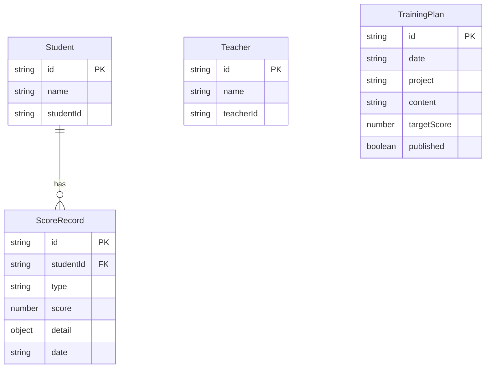

## 1. 架构设计

```mermaid
graph TB
    "前端 React + Vite" --> "Vite Dev Server :3000"
    "Vite Dev Server :3000" --> "代理 /api"
    "代理 /api" --> "后端 Express :3001"
    "后端 Express :3001" --> "teacher.ts 路由"
    "后端 Express :3001" --> "student.ts 路由"
    "teacher.ts 路由" --> "内存数据存储"
    "student.ts 路由" --> "内存数据存储"
```

## 2. 技术说明

- 前端：React@18 + TypeScript + Vite + Axios + React Router
- 构建工具：Vite（代理后端API到localhost:3001）
- 后端：Node.js + Express@4 + TypeScript
- 数据存储：内存数据（Map/数组），服务重启后重置
- 状态管理：Zustand
- 样式：Tailwind CSS + 自定义仿古样式

## 3. 路由定义

| 路由 | 用途 |
|------|------|
| / | 登录页 |
| /home | 学生首页（训练计划+排名趋势） |
| /archery | 骑射考核页 |
| /touhu | 投壶考核页 |
| /cuju | 蹴鞠考核页 |
| /leaderboard | 排行榜页 |
| /training-plan | 训练计划页（教师） |
| /teacher | 教师管理页（成绩管理） |

## 4. API定义

### 4.1 学生端API（/api/student）

| 方法 | 路径 | 描述 | 请求体 | 响应 |
|------|------|------|--------|------|
| POST | /api/student/login | 学生登录 | {name, studentId} | {success, student} |
| GET | /api/student/training-plans | 获取训练计划列表 | - | {plans: TrainingPlan[]} |
| GET | /api/student/ranking-trend/:id | 获取排名趋势 | - | {trends: MonthRank[]} |
| POST | /api/student/score | 提交考核成绩 | {studentId, type, score, detail} | {success, record} |

### 4.2 教师端API（/api/teacher）

| 方法 | 路径 | 描述 | 请求体 | 响应 |
|------|------|------|--------|------|
| POST | /api/teacher/login | 教师登录 | {teacherId, password} | {success, teacher} |
| GET | /api/teacher/scores | 获取所有成绩 | ?type=&period= | {scores: ScoreRecord[]} |
| PUT | /api/teacher/scores/:id | 修改成绩 | {score, detail} | {success, record} |
| DELETE | /api/teacher/scores/:id | 删除成绩 | - | {success} |
| GET | /api/teacher/leaderboard | 获取排行榜 | ?month= | {leaderboard: LeaderEntry[]} |
| POST | /api/teacher/training-plans | 创建训练计划 | {date, project, content, targetScore} | {success, plan} |
| PUT | /api/teacher/training-plans/:id | 修改训练计划 | {date, project, content, targetScore} | {success, plan} |
| DELETE | /api/teacher/training-plans/:id | 删除训练计划 | - | {success} |

### 4.3 TypeScript类型定义

```typescript
interface Student {
  id: string;
  name: string;
  studentId: string;
}

interface Teacher {
  id: string;
  name: string;
  teacherId: string;
}

interface ScoreRecord {
  id: string;
  studentId: string;
  studentName: string;
  type: 'archery' | 'touhu' | 'cuju';
  score: number;
  detail: ArcheryDetail | TouhuDetail | CujuDetail;
  date: string;
}

interface ArcheryDetail {
  rings: number[];
  totalScore: number;
}

interface TouhuDetail {
  hits: number;
  totalArrows: number;
}

interface CujuDetail {
  shots: { power: number; angle: number; score: number }[];
  totalScore: number;
}

interface LeaderEntry {
  studentId: string;
  studentName: string;
  archeryScore: number;
  touhuScore: number;
  cujuScore: number;
  totalScore: number;
  rank: number;
}

interface TrainingPlan {
  id: string;
  date: string;
  project: 'archery' | 'touhu' | 'cuju' | 'comprehensive';
  content: string;
  targetScore: number;
  published: boolean;
}

interface MonthRank {
  month: string;
  rank: number;
}
```

## 5. 服务端架构

```mermaid
graph LR
    "Express App" --> "studentRouter"
    "Express App" --> "teacherRouter"
    "studentRouter" --> "ScoreStore"
    "studentRouter" --> "PlanStore"
    "teacherRouter" --> "ScoreStore"
    "teacherRouter" --> "PlanStore"
    "teacherRouter" --> "RankCalculator"
    "RankCalculator" --> "ScoreStore"
```

## 6. 数据模型

### 6.1 数据模型定义



### 6.2 数据初始化

- 预设5名学生数据用于演示
- 预设1名教师数据
- 预设部分历史成绩数据用于排行榜展示
- 服务启动时初始化内存数据
