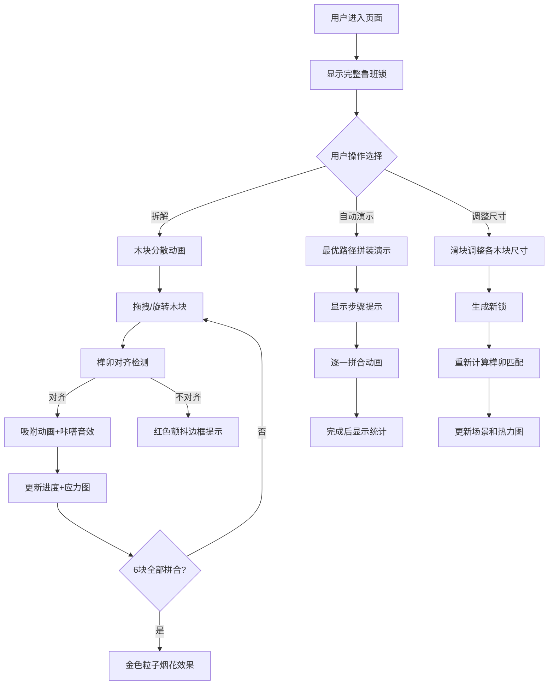

## 1. 产品概述

鲁班锁拼装模拟器是一个基于Web的交互式3D可视化应用，旨在解决传统鲁班锁教学中难以直观展示内部榫卯咬合关系、且无法动态模拟不同拼装路径对整体稳定性影响的问题。用户可以在浏览器中模拟古代木匠使用鲁班锁进行三维拼装，通过调整各个木块的旋转角度和拼接顺序实时检测结构完整性与应力分布。

- 主要用途：教育展示、工艺教学、结构力学模拟
- 目标用户：木工爱好者、学生、教师、传统文化研究者
- 市场价值：将传统工艺与现代3D可视化技术结合，提供沉浸式学习体验

## 2. 核心功能

### 2.1 用户角色
无需角色区分，所有用户拥有完整功能权限。

### 2.2 功能模块
1. **3D场景视图**：鲁班锁实时渲染、拖拽交互、旋转控制
2. **控制面板**：操作按钮、木块尺寸调整、拼装进度显示
3. **应力热力图**：6x6x6网格应力分布可视化
4. **自动求解模式**：最优拼装路径演示
5. **自定义木块**：尺寸调整、新锁生成

### 2.3 页面详情

| 页面名称 | 模块名称 | 功能描述 |
|---------|---------|---------|
| 主页面 | 3D场景视图 | 渲染6个木块组成的鲁班锁，支持鼠标拖拽、旋转、拆解/拼装动画 |
| 主页面 | 控制面板 | 拆解/拼装按钮、视角切换、自动演示、木块尺寸滑块、生成新锁 |
| 主页面 | 进度显示 | 木纹色渐变进度条，每块16.7%进度 |
| 主页面 | 应力热力图 | 6x6x6网格实时应力分布，蓝/绿/红三色渐变 |
| 主页面 | 状态提示 | 拼装步骤提示、成功/失败动画反馈 |

## 3. 核心流程

### 3.1 用户拼装流程
用户进入页面 → 看到完整鲁班锁 → 点击"拆解"按钮 → 木块分散 → 拖拽木块调整位置和旋转 → 榫卯对齐自动吸附 → 进度条更新 → 应力图实时变化 → 6块全部拼合 → 成功粒子动画

### 3.2 自动演示流程
用户点击"演示最优拼装" → 显示步骤提示 → 按预设路径逐一拼合 → 高亮榫卯对接点 → 每步间隔2秒 → 完成后显示总步数和耗时

### 3.3 自定义流程
用户调整木块尺寸滑块 → 点击"生成新锁" → 系统重新计算榫卯匹配 → 生成可拼装的新组合 → 更新应力热力图

## 4. 用户界面设计

### 4.1 设计风格
- **主色调**：浅木色#DEB887、深棕#6B4226、米白#FFF8DC、朱红#8B0000
- **辅助色**：金色#FFD700、绿色#00FF00、红色#FF0000、蓝色#0000FF
- **背景色**：浅淡黄#EDE4D4、旧宣纸#F5F0E1
- **按钮风格**：圆角矩形，深棕色背景，米白文字，悬停变朱红并显示阴影
- **字体**：楷体（标题）、系统无衬线（正文）
- **布局风格**：左右分栏（65%/35%），浮雕木框装饰，木工坊暖色系
- **特殊效果**：木纹纹理、纤维质感、金色粒子烟花、红色颤抖边框

### 4.2 页面设计概述

| 页面名称 | 模块名称 | UI元素 |
|---------|---------|---------|
| 主页面 | 3D场景视图 | 透视相机、环境光+方向光、网格工作台、木纹材质木块、榫卯结构、拖拽高亮、辅助线、吸附光晕 |
| 主页面 | 控制面板 | 旧宣纸背景、浮雕木框、圆角按钮、滑块控件、进度条、Canvas热力图、状态文本 |
| 主页面 | 动画效果 | 拆解1.5秒动画、旋转0.3秒过渡、吸附绿色脉冲、成功粒子烟花、失败颤抖边框 |

### 4.3 响应式
- 桌面优先设计，适配1280x720及以上分辨率
- 右侧面板可折叠以适应窄屏
- 触摸操作支持（移动设备拖拽和旋转）

### 4.4 3D场景指导
- **环境**：浅木色工作台背景，半透明灰色网格平面
- **灯光**：环境光#404060强度0.5，方向光#FFFFFF强度1.0从左上角照射
- **相机**：透视相机，视野60度，初始距离可完整观察120单位方块
- **材质**：木块使用浅黄木纹#F5DEB3，榫头深褐色#6B4226，细腻木纹纹理和微凸纤维感
- **交互**：拖拽时边缘金色高亮，显示半透明辅助线标示对接点
- **动画**：拆解沿对角线平移，旋转90度平滑过渡，吸附时榫头滑入卯眼
- **性能**：帧率稳定50FPS以上，拖拽响应延迟低于50ms，热力图更新≥1次/秒
