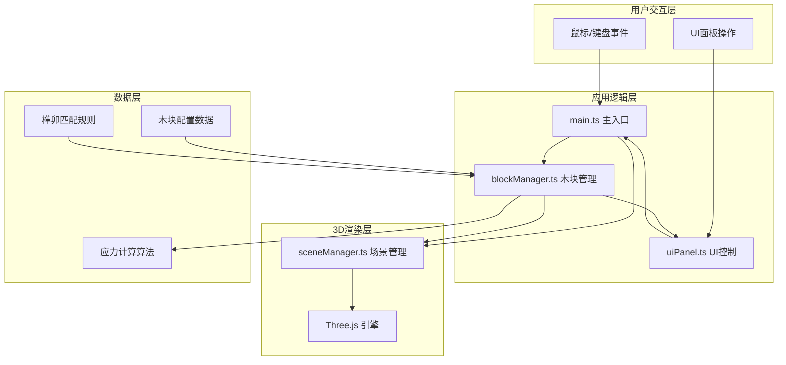

## 1. 架构设计

本项目采用模块化架构，将3D场景管理、木块逻辑、UI控制分离，确保关注点分离和代码可维护性。



## 2. 技术描述

- **前端框架**：原生TypeScript + Three.js（无React/Vue，按用户需求）
- **构建工具**：Vite 5.x
- **语言**：TypeScript 5.x（严格模式，target ES2020）
- **3D引擎**：Three.js 0.160.x + @types/three
- **UI渲染**：原生DOM + Canvas 2D（热力图）
- **音频**：Web Audio API（音效反馈）
- **动画**：Three.js AnimationSystem + CSS transitions

## 3. 文件结构

```
auto291/
├── package.json              # 项目依赖和脚本
├── index.html                # 入口HTML
├── vite.config.js            # Vite构建配置
├── tsconfig.json             # TypeScript配置
└── src/
    ├── main.ts               # 主入口，初始化和事件协调
    ├── sceneManager.ts       # Three.js场景管理
    ├── blockManager.ts       # 木块数据和逻辑管理
    └── uiPanel.ts            # UI面板DOM操作
```

## 4. 模块职责

### 4.1 main.ts
- 初始化场景、相机、灯光、轨道控制器
- 键盘快捷键处理（R复位、Z俯视图、X侧视图）
- 事件协调：接收用户交互 → 调用sceneManager和blockManager → 更新UI
- 数据流向：用户交互事件 → main.ts → blockManager/sceneManager → UI更新

### 4.2 sceneManager.ts
- 管理Three.js场景对象
- 透视相机配置（视野60度）
- 灯光设置（环境光#404060强度0.5，方向光#FFFFFF强度1.0）
- 工作台网格平面（灰色半透明网格）
- 提供添加/移除木块对象的方法
- 数据流向：接收main.ts指令 → 直接操作Three.js场景

### 4.3 blockManager.ts
- 管理6个鲁班锁木块的数组
- 每个木块：BoxGeometry + 自定义榫卯结构（差集运算）
- 木块属性：位置、旋转、尺寸、榫卯类型、相邻关系
- 核心方法：
  - `initBlocks()`：初始化6个木块并分散
  - `rotateBlock()`：旋转指定木块90度
  - `checkSnap()`：检测榫卯对齐并触发吸附动画
  - `calcStress()`：计算应力分布，返回热力图数据
- 数据流向：接收main.ts交互请求 → 访问sceneManager更新木块 → 向UI输出进度和应力数据

### 4.4 uiPanel.ts
- 右侧控制面板DOM操作
- HTML元素创建和事件绑定
- 进度条渲染（木纹色渐变）
- 应力热力图渲染（Canvas 2D，6x6x6网格）
- 拼装状态提示文本更新
- 数据流向：接收blockManager状态更新 → 渲染UI；接收用户输入 → 调用main.ts方法

## 5. 数据模型

### 5.1 木块数据结构
```typescript
interface BlockData {
  id: number;
  position: { x: number; y: number; z: number };
  rotation: { x: number; y: number; z: number };
  size: { width: number; height: number; depth: number };
  tenonType: 'cylinder' | 'square' | 'dovetail'; // 榫头类型
  mortiseType: 'cylinder' | 'square' | 'dovetail'; // 卯眼类型
  adjacentBlocks: number[]; // 相邻木块ID
  isAssembled: boolean;
}
```

### 5.2 应力数据结构
```typescript
interface StressData {
  grid: number[][][]; // 6x6x6网格应力值 0-1
  timestamp: number;
}
```

## 6. 核心算法

### 6.1 榫卯对齐检测算法
- 计算两个木块的距离阈值（< 5单位）
- 检查旋转角度是否匹配（90度倍数对齐）
- 验证榫卯类型匹配（圆柱对圆柱、方柱对方柱、燕尾对燕尾）
- 检测榫头和卯眼的位置偏差（< 3单位）

### 6.2 应力分布计算
- 将已拼装结构划分为6x6x6网格
- 对每个网格，计算相邻木块接触面的压力值
- 压力值 = 接触面积 × 相邻木块数量 × 结构深度系数
- 归一化到0-1范围，映射到蓝-绿-红颜色渐变

### 6.3 榫卯生成算法
- 根据木块尺寸计算榫卯的位置和大小
- 使用Three.js的CSG（构造实体几何）进行差集运算生成卯眼
- 确保生成的组合逻辑上可拼装
- 验证榫卯匹配关系的一致性

## 7. 性能优化

- **帧率控制**：使用requestAnimationFrame，目标50+ FPS
- **拖拽优化**：射线检测优化，仅检测可交互对象
- **热力图更新**：每0.5秒更新一次，使用Canvas离屏渲染
- **内存管理**：及时清理不再使用的Three.js对象
- **动画优化**：使用Three.js AnimationMixer进行平滑动画

## 8. 路由定义

| 路由 | 用途 |
|------|------|
| / | 主应用页面（单页应用，无路由跳转） |

## 9. 构建配置

### package.json 依赖
```json
{
  "dependencies": {
    "three": "^0.160.0"
  },
  "devDependencies": {
    "@types/three": "^0.160.0",
    "typescript": "^5.3.0",
    "vite": "^5.0.0"
  },
  "scripts": {
    "dev": "vite",
    "build": "tsc && vite build",
    "preview": "vite preview"
  }
}
```

### vite.config.js
- 入口：index.html
- 端口：3000
- 服务器开启CORS

### tsconfig.json
- 严格模式：true
- target：ES2020
- module：ESNext
- moduleResolution：bundler
