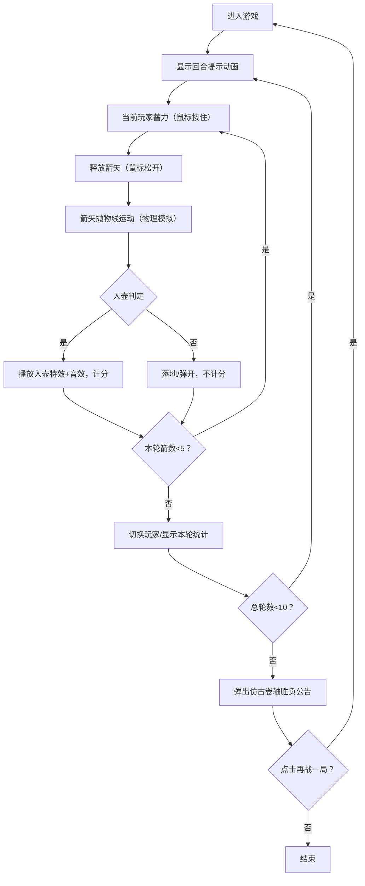

## 1. 产品概述

在浏览器中模拟中国古代投壶雅戏的交互式游戏应用，以双人回合制对战形式重现这一传统礼仪游戏，通过物理模拟还原投箭入壶的真实体验。

- 面向用户：对传统文化和休闲游戏感兴趣的玩家
- 核心价值：以精美的仿古UI和真实的物理引擎，让用户体验古代投壶游戏的乐趣

## 2. 核心功能

### 2.1 用户角色
| 角色 | 说明 | 核心权限 |
|------|------|----------|
| 甲方玩家 | 双人对战中的一方 | 投掷箭矢、查看得分 |
| 乙方玩家 | 双人对战中的另一方 | 投掷箭矢、查看得分 |

### 2.2 功能模块
1. **游戏主场景**：水墨山水背景、庭院地面、玩家角色、青铜壶
2. **物理引擎模块**：箭矢抛物线轨迹、重力与空气阻力、碰撞检测、入壶判定
3. **回合制对战系统**：双人轮流投掷、每回合5支箭、共10轮（双方合计）
4. **计分系统**：入壶判定得分、每轮得分统计、最终胜负判定
5. **视听特效模块**：箭矢拖尾轨迹、入壶金色涟漪、铜钟音效
6. **UI界面系统**：回合/玩家指示器、蓄力条、得分统计面板、仿古卷轴胜负公告

### 2.3 页面详情
| 页面名称 | 模块名称 | 功能描述 |
|-----------|-------------|---------------------|
| 游戏主页面 | 水墨背景层 | 横向滚动山水长卷，含远山、云霭、近树、围栏，以0.2px/帧速度左移 |
| 游戏主页面 | 游戏场景层 | 玩家角色（左侧150px高）、青铜壶（距玩家200px）、铺砖地面 |
| 游戏主页面 | 投掷交互层 | 鼠标按住蓄力（0-100力值）、松开发射、箭矢抛物线运动 |
| 游戏主页面 | 状态指示器 | 左上角：回合数+当前投手，带半透明米黄圆角框 |
| 游戏主页面 | 蓄力条 | 左下角：100x12px，从翠绿渐变至朱红（30%处快速变化） |
| 游戏主页面 | 提示动画 | 回合开始时中央出现"请X方投箭"，字号渐大渐小1.5秒后消失 |
| 游戏主页面 | 得分统计 | 底部旧纸黄圆角矩形，暗金描边，显示投中/未中/总得分 |
| 胜负公告 | 仿古卷轴弹窗 | 卷轴底纹淡米黄，棕褐卷轴杆，隶书标题显示获胜方和最终比分 |
| 胜负公告 | 再战一局按钮 | 朱红印章形方框，内嵌暗红文字，点击重置游戏 |

## 3. 核心流程

用户进入游戏 → 显示第一回合甲方提示动画 → 甲方按住鼠标蓄力 → 松开投掷箭矢 → 箭矢飞行并判定入壶或落地 → 重复5次 → 切换乙方回合 → 乙方投掷5次 → 显示本轮得分统计 → 循环至第10轮结束 → 弹出胜负公告 → 点击再战一局重新开始

## 4. 用户界面设计

### 4.1 设计风格
- **主色调**：旧纸黄 #EDE4D4、墨黑 #1A1A1A、朱红 #8B0000
- **配色方案**：青铜色 #2E4A62、暗金色 #D4AF37、翠青 #2E8B57、淡蓝山色 #A9C6D9
- **字体选择**：楷体（回合/玩家名称）、行楷（得分统计、提示文字）、隶书（胜负标题）
- **仿古风格**：圆角矩形配描边、卷轴样式弹窗、印章形按钮、水墨山水背景

### 4.2 页面设计概览
| 页面名称 | 模块名称 | UI元素 |
|-----------|-------------|-------------|
| 游戏主页面 | 背景层 | 水墨山水长卷（远山淡蓝、云霭半透、近树翠青、木色围栏），缓慢左移 |
| 游戏主页面 | 地面 | 灰砖与浅灰交替铺砖（宽30px高10px），上方暖灰地面 |
| 游戏主页面 | 玩家角色 | 左侧第三人称，月白衣袍+藏蓝束带，身高150px |
| 游戏主页面 | 青铜壶 | 距玩家200px，深青色+回纹浮雕，壶口内凹色深 |
| 游戏主页面 | 箭矢 | 80x4px竹木，青铜箭头#B8860B，尾端三片粉白#FFF0F5羽毛 |
| 游戏主页面 | 蓄力条 | 左下100x12px，深灰底，填充从#2E8B57→#8B0000渐变 |
| 游戏主页面 | 回合指示器 | 左上半透明米黄框，楷体深灰字显示回合数+投手 |
| 游戏主页面 | 提示动画 | 中央金色行楷字，缩放动画1.5秒 |
| 游戏主页面 | 得分面板 | 底部旧纸黄圆角，暗金描边，行楷墨黑字 |
| 胜负公告 | 卷轴弹窗 | 淡米黄底纹，棕褐卷轴杆，隶书标题，朱红印章按钮 |

### 4.3 响应式设计
- 采用 Desktop-first 策略，默认横版居中布局
- 窗口宽度 < 768px 时，所有尺寸缩小至 70%
- 角色和壶体保持相对比例，确保在小屏上可见
- 布局元素使用相对定位，适应不同画布尺寸

### 4.4 动效与交互细节
- **蓄力反馈**：30%力值处颜色快速从绿转红，增强视觉提示
- **箭矢拖尾**：20个淡蓝圆形尾迹，从#00BFFF渐变至透明，持续0.3秒
- **入壶特效**：壶口金色涟漪，最大半径60px，持续0.5秒
- **音效**：入壶时500Hz铜钟声（AudioContext生成），持续0.2秒渐弱
- **按钮悬停**：所有UI控件悬停时出现淡金色光晕（透明度0.3发光效果）

### 4.5 性能指标
- 游戏循环帧率：稳定 60fps
- 物理模拟更新频率：≥ 30次/秒
- 单次碰撞检测延迟：≤ 5ms
