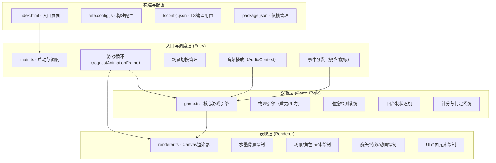

## 1. 架构设计



## 2. 技术说明

- **前端框架**：无框架，使用原生 TypeScript + HTML5 Canvas API
- **构建工具**：Vite 5.x（配置入口 index.html，端口 3000）
- **语言规范**：TypeScript 严格模式，target ES2020
- **音频处理**：Web Audio API (AudioContext) 合成音效
- **渲染方式**：Canvas 2D Context，分层绘制（背景层、场景层、特效层、UI层）

## 3. 模块职责与接口定义

### 3.1 main.ts - 启动与调度模块
**职责**：初始化游戏、管理游戏循环、处理用户输入、协调game与renderer、播放音频

**核心接口**：
```typescript
// 游戏状态
type GameScene = 'playing' | 'roundEnd' | 'gameEnd';

// 主游戏类
class GameApp {
  private canvas: HTMLCanvasElement;
  private ctx: CanvasRenderingContext2D;
  private game: GameEngine;
  private renderer: Renderer;
  private audioContext: AudioContext | null;
  private scene: GameScene;
  
  constructor(canvas: HTMLCanvasElement);
  start(): void;                    // 启动游戏循环
  resetGame(): void;                // 重置游戏
  playPotSound(): void;             // 播放入壶音效
  private loop(timestamp: number): void;  // 主循环 60fps
  private handleInput(): void;      // 处理鼠标事件
}
```

### 3.2 game.ts - 核心游戏逻辑模块
**职责**：物理模拟、碰撞检测、回合管理、计分系统

**核心数据结构**：
```typescript
// 箭矢状态
interface Arrow {
  id: number;
  x: number;              // 箭头x坐标
  y: number;              // 箭头y坐标
  vx: number;             // 水平速度
  vy: number;             // 垂直速度
  angle: number;          // 当前角度（弧度）
  landed: boolean;        // 是否落地
  potted: boolean;        // 是否入壶
  trail: TrailPoint[];    // 拖尾轨迹点
}

// 拖尾点
interface TrailPoint {
  x: number;
  y: number;
  life: number;           // 剩余生命值 0-1
}

// 涟漪特效
interface Ripple {
  x: number;
  y: number;
  radius: number;
  maxRadius: number;
  life: number;
  maxLife: number;
}

// 玩家数据
interface Player {
  name: '甲方' | '乙方';
  totalScore: number;
  roundHits: number;
  roundMisses: number;
}

// 壶体参数
interface Pot {
  x: number;          // 壶中心x
  groundY: number;    // 底部y坐标
  height: number;     // 高120px
  mouthDiameter: number;  // 壶口直径80px
  bodyDiameter: number;   // 壶身直径60px
}

// 核心游戏引擎类
class GameEngine {
  // 常量
  static readonly GRAVITY = 0.3;
  static readonly DRAG = 0.01;
  static readonly ARROW_LENGTH = 80;
  static readonly ARROW_THICKNESS = 4;
  static readonly POT_THRESHOLD_Y = 2;  // 入壶速度阈值 px/帧
  static readonly ARROWS_PER_ROUND = 5;
  static readonly TOTAL_ROUNDS = 10;    // 双方合计10轮
  
  // 状态
  currentRound: number;
  currentPlayerIndex: number;  // 0=甲方, 1=乙方
  players: [Player, Player];
  arrowsInRound: number;       // 当前回合已投掷箭数
  arrows: Arrow[];             // 飞行中/已落地的箭矢
  activeArrow: Arrow | null;   // 当前飞行的箭矢
  charging: boolean;           // 是否正在蓄力
  chargeValue: number;         // 蓄力值 0-100
  ripples: Ripple[];           // 涟漪特效列表
  pot: Pot;
  groundY: number;
  waitingArrowSettle: boolean; // 等待箭矢落地/入壶
  hintMessage: { text: string; life: number; maxLife: number } | null;
  roundEndPending: boolean;
  gameEnded: boolean;
  
  // 画布尺寸
  canvasWidth: number;
  canvasHeight: number;
  scale: number;  // 响应式缩放系数
  
  constructor(width: number, height: number);
  resize(width: number, height: number): void;
  
  // 蓄力与投掷
  startCharging(): void;
  updateCharging(delta: number): void;  // 每帧增加蓄力值
  releaseArrow(): Arrow | null;         // 释放箭矢
  
  // 物理更新（每帧调用）
  update(deltaTime: number): void;
  private updateArrow(arrow: Arrow, dt: number): void;
  private checkCollision(arrow: Arrow): void;
  private checkPotSuccess(arrow: Arrow): boolean;  // 入壶判定
  private handleLanding(arrow: Arrow): void;
  
  // 回合管理
  nextArrow(): void;        // 下一支箭
  endRound(): void;         // 结束当前回合，切换玩家
  nextRound(): void;        // 下一回合
  showHint(text: string): void;
  
  // 得分接口
  getCurrentPlayer(): Player;
  getRoundStats(): { hits: number; misses: number; score: number };
  getWinner(): Player | null;  // 游戏结束时返回胜者
  reset(): void;
}
```

### 3.3 renderer.ts - Canvas 渲染模块
**职责**：从GameEngine读取状态并绘制到Canvas，包含所有视觉元素

**核心接口**：
```typescript
class Renderer {
  private ctx: CanvasRenderingContext2D;
  private bgOffset: number;  // 背景滚动偏移量
  
  constructor(ctx: CanvasRenderingContext2D);
  render(game: GameEngine, timestamp: number): void;
  
  // 分层绘制方法
  private drawBackground(game: GameEngine): void;
  private drawMountains(offset: number): void;  // 远山层
  private drawClouds(offset: number): void;     // 云霭层
  private drawTrees(offset: number): void;      // 近树层
  private drawFence(offset: number): void;      // 围栏层
  private drawGround(game: GameEngine): void;   // 地面与铺砖
  
  private drawScene(game: GameEngine): void;
  private drawPlayer(game: GameEngine): void;   // 玩家角色
  private drawPot(game: GameEngine): void;      // 青铜壶
  private drawPotPattern(ctx: CanvasRenderingContext2D, x: number, y: number): void; // 回纹装饰
  
  private drawArrows(game: GameEngine): void;
  private drawArrow(ctx: CanvasRenderingContext2D, arrow: Arrow): void;
  private drawArrowTrail(ctx: CanvasRenderingContext2D, arrow: Arrow): void;
  
  private drawEffects(game: GameEngine): void;
  private drawRipples(ctx: CanvasRenderingContext2D, game: GameEngine): void;
  
  private drawUI(game: GameEngine): void;
  private drawRoundIndicator(game: GameEngine): void;  // 左上回合指示器
  private drawChargeBar(game: GameEngine): void;       // 左下蓄力条
  private drawScorePanel(game: GameEngine): void;      // 底部得分统计
  private drawHintMessage(game: GameEngine): void;     // 中央提示动画
  
  // 游戏结束弹窗
  drawGameEndDialog(game: GameEngine, onRestart: () => void): void;
  private drawScrollFrame(ctx: CanvasRenderingContext2D, x: number, y: number, w: number, h: number): void;
  private drawSealButton(ctx: CanvasRenderingContext2D, x: number, y: number, w: number, h: number, hover: boolean): void;
}
```

## 4. 配置文件说明

### 4.1 package.json
```json
{
  "name": "ancient-pot-throwing",
  "private": true,
  "version": "1.0.0",
  "type": "module",
  "scripts": {
    "dev": "vite",
    "build": "tsc && vite build",
    "preview": "vite preview"
  },
  "devDependencies": {
    "typescript": "^5.4.0",
    "vite": "^5.2.0"
  }
}
```

### 4.2 vite.config.js
```javascript
import { defineConfig } from 'vite';

export default defineConfig({
  root: '.',
  base: './',
  server: {
    port: 3000,
    host: true,
    open: false
  },
  build: {
    outDir: 'dist',
    sourcemap: true
  }
});
```

### 4.3 tsconfig.json
```json
{
  "compilerOptions": {
    "target": "ES2020",
    "module": "ESNext",
    "moduleResolution": "bundler",
    "strict": true,
    "noImplicitAny": true,
    "noImplicitThis": true,
    "alwaysStrict": true,
    "strictNullChecks": true,
    "strictFunctionTypes": true,
    "esModuleInterop": true,
    "skipLibCheck": true,
    "forceConsistentCasingInFileNames": true,
    "resolveJsonModule": true,
    "isolatedModules": true,
    "noEmit": true,
    "lib": ["ES2020", "DOM", "DOM.Iterable"]
  },
  "include": ["src/**/*.ts"],
  "exclude": ["node_modules", "dist"]
}
```

### 4.4 index.html
- 创建全屏Canvas容器
- 引入 src/main.ts 作为入口模块
- 设置中文标题与 viewport 响应式 meta

## 5. 物理与算法说明

### 5.1 箭矢物理模型
```
每帧更新：
  vx = vx * (1 - DRAG)        // 空气阻力减速
  vy = vy * (1 - DRAG) + GRAVITY  // 阻力+重力
  x = x + vx
  y = y + vy
  angle = atan2(vy, vx)       // 箭头朝向运动方向
```

### 5.2 蓄力到初速度映射
```
angle = π/4 - (chargeValue / 100) * (π/6)  // 45°~15°
speed = 3 + (chargeValue / 100) * 12       // 3~15 px/帧
vx = speed * cos(angle)
vy = -speed * sin(angle)
```

### 5.3 入壶判定条件
```
1. 箭头水平位置在壶口范围内：
   |arrow.x - pot.centerX| <= (pot.mouthDiameter/2 + 20)
2. 箭头垂直位置接近壶口平面：
   |arrow.y - pot.mouthY| <= 15
3. 向下运动的垂直速度足够低：
   vy > 0 且 vy < POT_THRESHOLD_Y (2 px/帧)
4. 未被判定过入壶
```

### 5.4 碰撞检测（壶身）
```
壶身碰撞：
  计算箭头到壶身中轴线的水平距离 dx
  若 dx < pot.bodyRadius 且 y 在壶身高度范围内
  → 水平反弹：vx = -vx * 0.3，vy *= 0.5
  
壶口边缘碰撞：
  若箭头接近壶口圆环（距离<10px）且不满足入壶条件
  → 弹开，vx *= -0.4，vy = -|vy| * 0.5
  
地面碰撞：
  y >= groundY 时 → y = groundY，vy = -vy * 0.2
  若 |vy| < 0.5 → 标记落地 landed=true
```

## 6. 性能优化策略
1. **固定时间步长物理**：使用固定 dt 进行物理更新，与帧率解耦
2. **对象池化**：拖尾点、涟漪等短暂对象复用，避免GC
3. **分层绘制**：背景层使用离屏Canvas缓存，仅在必要时重绘
4. **脏矩形优化**：UI层仅在状态变化时重绘（可选）
5. **碰撞检测简化**：箭矢-壶体使用矩形+圆近似，减少计算
6. **单步碰撞检测时间**：通过几何距离公式直接判断，避免迭代

## 7. 音频合成方案
入壶铜钟声使用 Web Audio API 合成：
```typescript
// 500Hz 正弦波，快速衰减，混响感
const osc = audioCtx.createOscillator();
const gain = audioCtx.createGain();
osc.type = 'sine';
osc.frequency.setValueAtTime(500, audioCtx.currentTime);
osc.frequency.exponentialRampToValueAtTime(200, audioCtx.currentTime + 0.2);
gain.gain.setValueAtTime(0.3, audioCtx.currentTime);
gain.gain.exponentialRampToValueAtTime(0.001, audioCtx.currentTime + 0.2);
osc.connect(gain).connect(audioCtx.destination);
osc.start();
osc.stop(audioCtx.currentTime + 0.2);
```
