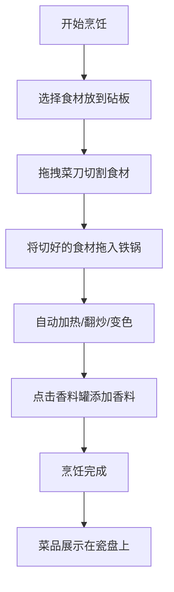

## 1. 产品概述
宋代庖厨烹饪模拟器是一款在浏览器中运行的交互式烹饪模拟应用。用户扮演宋代酒楼后厨的掌勺大厨，通过鼠标拖拽进行切菜、加香料、烹饪等操作，体验古代庖厨的完整烹饪流程。

- 主要用途：教育娱乐结合的文化体验类网页应用，让用户感受中国古代饮食文化
- 目标用户：对中国传统文化、烹饪文化感兴趣的普通网民
- 产品价值：以寓教于乐的方式传播中华饮食文化，提供沉浸式互动体验

## 2. 核心功能

### 2.1 功能模块
1. **主页面**：砧板操作区、灶台烹饪区、香料架、菜单栏、菜品展示盘

### 2.2 页面详情
| 页面名称 | 模块名称 | 功能描述 |
|---------|---------|----------|
| 主页面 | 砧板操作区 | 600x400px区域，显示砧板、菜刀、食材，支持拖拽切菜 |
| 主页面 | 灶台烹饪区 | 600x400px区域，显示铁锅、火苗动画、翻炒动画、蒸汽粒子 |
| 主页面 | 香料架 | 五种香料罐（八角、桂皮、花椒、姜、葱），点击撒入香料 |
| 主页面 | 菜单栏 | 仿古卷轴样式顶部菜单 |
| 主页面 | 菜品展示盘 | 底部白色瓷盘展示完成菜品 |

## 3. 核心流程
用户从选择食材开始，通过拖拽菜刀切割食材，将切好的食材拖入铁锅进行烹饪，期间可添加香料，最终完成一道宴席菜品。

## 4. 用户界面设计

### 4.1 设计风格
- **主色调**：宣纸黄#EDE4D4背景，灶台青砖灰#8B8B83，深木色#5D3A1A，暖橙火光#FF6347
- **辅助色**：砧板浅黄#F5DEB3，刀身银灰#C0C0C0，铁锅深灰#2F2F2F，火苗橙红渐变
- **字体**：标题用楷体，正文字体响应式 clamp(14px, 2vw, 18px)
- **布局风格**：CSS Flexbox弹性布局，桌面端左右并排，移动端上下叠放
- **动画风格**：平滑过渡动画（transition 0.3s ease），火光摇摆、蒸汽粒子、刀身银光闪烁

### 4.2 页面设计概述
| 页面名称 | 模块名称 | UI元素 |
|---------|---------|--------|
| 主页面 | 砧板操作区 | 圆形年轮纹理砧板、银灰红木菜刀、各色食材（萝卜白、白菜青、猪肉红、鱼鳞银灰） |
| 主页面 | 灶台烹饪区 | 深灰铁锅、橙色渐变火苗（30px高摇摆）、翻炒锅铲（1.5秒周期弧形）、白色半透明蒸汽粒子（3-6px） |
| 主页面 | 香料架 | 五种香料罐、八角棕色星形粒子、桂皮卷曲条状粒子、香气光环叠加 |
| 主页面 | 菜单栏 | 淡黄仿古卷轴#F5DEB3，墨色边缘#2F2F2F |
| 主页面 | 菜品展示盘 | 白色瓷盘320x200px，青花边纹 |

### 4.3 响应式设计
- 桌面优先（Desktop-first）：1200px以上左右并排布局
- 平板/手机适配：800px以下上下叠放
- 最小支持宽度：360px
- 字体自适应：clamp(14px, 2vw, 18px)
- 所有元素transition 0.3s ease平滑过渡

### 4.4 性能要求
- 切割和烹饪动画帧率 ≥ 50fps
- 食材交互后DOM更新延迟 ≤ 100ms
