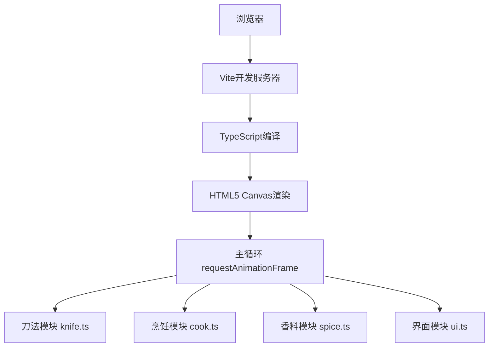

## 1. 架构设计



## 2. 技术说明
- **前端框架**：原生 JavaScript + TypeScript（严格模式）
- **构建工具**：Vite，端口3000
- **渲染技术**：HTML5 Canvas 2D API
- **事件处理**：原生DOM事件（mousedown/mousemove/mouseup）
- **动画循环**：requestAnimationFrame
- **目标版本**：ES2020

## 3. 项目文件结构
| 文件 | 用途 |
|------|------|
| package.json | 项目依赖（typescript, vite）及启动脚本 |
| index.html | 入口页面，宣纸黄背景，楷体标题 |
| vite.config.js | Vite配置，端口3000 |
| tsconfig.json | TypeScript严格模式配置，target ES2020 |
| src/main.ts | 应用入口，初始化Canvas、加载模块、启动事件循环 |
| src/knife.ts | 刀法切割模块：菜刀拖拽、碰撞检测、切割方向、纹理生成 |
| src/cook.ts | 烹饪模块：铁锅、火苗、翻炒、食材变色、蒸汽粒子 |
| src/spice.ts | 香料模块：五种香料粒子系统、光环绘制、颜色混合 |
| src/ui.ts | 界面模块：菜单栏、菜盘展示、响应式布局DOM管理 |

## 4. 核心数据类型定义

```typescript
// 食材类型
interface Ingredient {
  id: string;
  type: 'radish' | 'cabbage' | 'pork' | 'fish';
  x: number;
  y: number;
  width: number;
  height: number;
  color: string;
  cutPieces: CutPiece[];
  cookingProgress: number;
  inPot: boolean;
}

// 切割后的食材块
interface CutPiece {
  id: string;
  x: number;
  y: number;
  width: number;
  height: number;
  color: string;
  textureAngle: number;
}

// 香料类型
type SpiceType = 'starAnise' | 'cinnamon' | 'pepper' | 'ginger' | 'scallion';

// 粒子基础接口
interface Particle {
  x: number;
  y: number;
  vx: number;
  vy: number;
  life: number;
  maxLife: number;
  size: number;
  color: string;
}
```

## 5. 性能优化策略
- 使用对象池管理粒子系统，避免频繁GC
- Canvas分层渲染（静态背景层 + 动态粒子层）
- requestAnimationFrame统一驱动所有动画
- 食材状态变化时仅局部重绘
- 限制同屏粒子数量上限
