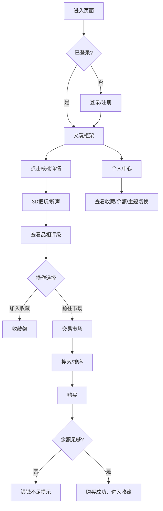

# 文玩核桃在线鉴别与交易模拟系统 - 产品需求文档

## 1. 产品概述

古代文玩核桃在线鉴别与交易模拟系统，让用户在浏览器中模拟把玩、鉴别和交易文玩核桃，解决传统实物交易中品相描述主观、仿品难辨、缺乏直观对比工具的问题。

- 目标用户：文玩爱好者、收藏家
- 核心价值：提供沉浸式虚拟文玩把玩体验，数字化品相评级与交易模拟

## 2. 核心功能

### 2.1 用户角色

| 角色 | 注册方式 | 核心权限 |
|------|----------|----------|
| 藏家 | 藏家名+密码注册 | 把玩核桃、收藏、交易、查看个人中心 |

### 2.2 功能模块

1. **登录/注册**：藏家身份认证，登录态持久化
2. **文玩柜架**：九宫格展示9对不同品种核桃
3. **核桃详情**：3D把玩（旋转、缩放）、听声、品相评级、参考估价
4. **收藏架**：右侧边栏，收藏心仪核桃
5. **交易市场**：在售核桃列表，搜索、购买功能
6. **个人中心**：收藏展示、交易统计、余额、主题切换

### 2.3 页面详情

| 页面名称 | 模块名称 | 功能描述 |
|----------|----------|----------|
| 登录/注册页 | 认证表单 | 藏家名+密码登录注册，自动保存登录态 |
| 文玩柜架页 | 九宫格展示 | 红木色柜架，9对核桃，点击查看详情 |
| 核桃详情模态框 | 3D把玩 | Canvas渲染核桃，拖拽旋转、滚轮缩放 |
| 核桃详情模态框 | 听声功能 | 播放敲击音效，波形动画 |
| 核桃详情模态框 | 品相评级 | 极品/上品/中品/下品四档，综合纹理/对称/音色计算 |
| 核桃详情模态框 | 参考估价 | 100-10000文钱，品相高者区间偏高 |
| 收藏架 | 侧边栏 | 右侧固定60px，展开显示缩略图列表 |
| 交易市场页 | 市场列表 | 在售核桃，按品相排序，关键词搜索 |
| 交易市场页 | 购买功能 | 扣除余额，余额不足提示，成功后进入收藏架 |
| 个人中心页 | 收藏展示 | 横向滑动列表展示所有收藏 |
| 个人中心页 | 交易统计 | 总交易笔数、余额显示 |
| 个人中心页 | 主题切换 | 竹青/檀木/墨灰三种主题，平滑过渡 |

## 3. 核心流程

用户进入页面 → 登录/注册 → 浏览文玩柜架 → 点击核桃查看详情 → 旋转把玩/听声/查看品相 → 加入收藏或前往市场购买 → 个人中心查看收藏与余额

## 4. 用户界面设计

### 4.1 设计风格

- 主色调：旧纸泛黄 #EDE4D4
- 辅助色：竹青 #D4E9D6、红木 #8B4513、朱红 #CC2936
- 字体：楷体（标题），宋体（正文）
- 按钮风格：毛笔笔触形状，圆角18px，边框2px实线，背景半透明
- 交互：hover时背景加深0.2倍并上浮3px，点击时下2px
- 布局：卡片式，gap 24px，响应式适配

### 4.2 页面设计概览

| 页面名称 | 模块名称 | UI元素 |
|----------|----------|--------|
| 登录页 | 中央卡片 | 400px宽，竹青底色，圆角16px，轻柔阴影 |
| 柜架页 | 九宫格 | 红木色柜架，核桃Canvas渲染，麻面纹理 |
| 详情模态框 | 3D画布 | Canvas核桃，光影效果，旋转缩放 |
| 详情模态框 | 品相面板 | 右侧实时显示评级和估价 |
| 收藏架 | 侧边栏 | 右侧固定60px，展开动画 |
| 市场页 | 卡片列表 | 缩略图、评级、售价（墨绿色） |
| 个人中心 | 横向滑动 | 收藏列表，主题切换按钮 |

### 4.3 响应式

- 桌面端：≥1024px，完整布局
- 平板：两列布局
- 手机：单列布局，隐藏侧边栏

### 4.4 动画效果

- 核桃旋转：requestAnimationFrame 60fps
- 听声按钮：波形同心圆扩散动画，0.6秒
- 主题切换：平滑过渡，0.5秒
- 按钮交互：hover上浮3px，active下沉2px

