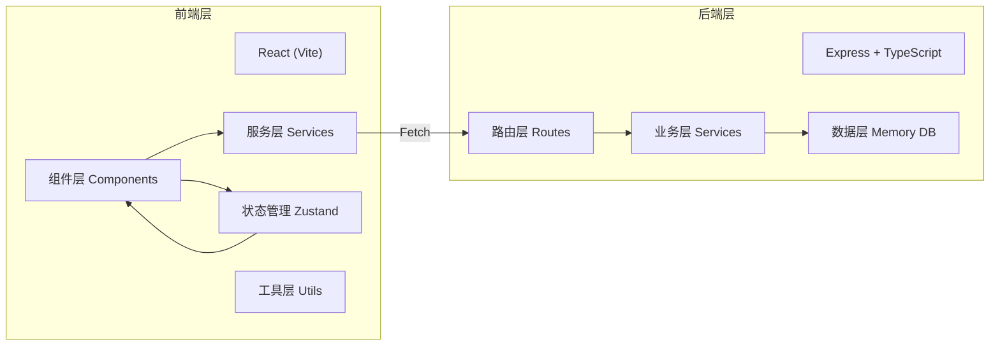
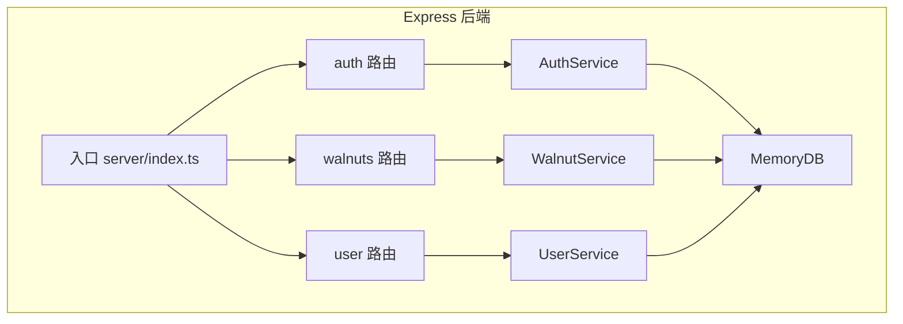
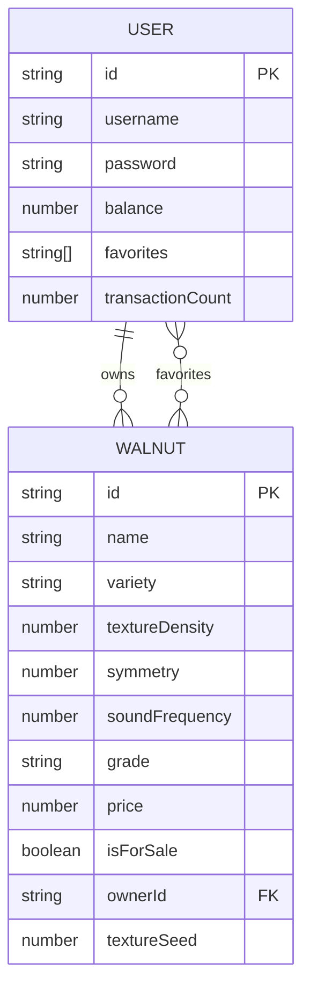

# 文玩核桃在线鉴别与交易模拟系统 - 技术架构文档

## 1. 架构设计



## 2. 技术说明

- 前端：React 18 + TypeScript + Vite
- 状态管理：Zustand
- 样式：CSS Modules + CSS Variables（全局变量实现主题切换）
- 后端：Express 4 + TypeScript
- 数据存储：内存Map（永久存储模拟）
- 构建工具：Vite（前端构建） + ts-node（后端运行）
- 3D渲染：Canvas 2D 模拟3D效果

## 3. 路由定义

| 路由 | 用途 |
|------|------|
| / | 文玩柜架首页 |
| /market | 交易市场 |
| /profile | 个人中心 |
| /login | 登录页（未登录时显示） |

## 4. API 定义

### 4.1 认证接口

```typescript
// POST /api/auth/register
interface RegisterRequest {
  username: string;
  password: string;
}

interface AuthResponse {
  token: string;
  user: {
    id: string;
    username: string;
    balance: number;
    favorites: string[];
  };
}

// POST /api/auth/login
interface LoginRequest {
  username: string;
  password: string;
}
```

### 4.2 核桃接口

```typescript
interface Walnut {
  id: string;
  name: string;
  variety: string;
  textureDensity: number;  // 纹理密集度 0-100
  symmetry: number;     // 对称性 0-100
  soundFrequency: number; // 音色频率 0-100
  grade: '极品' | '上品' | '中品' | '下品';
  price: number;
  isForSale: boolean;
  ownerId: string | null;
  textureSeed: number; // 纹理随机种子
}

// GET /api/walnuts
// 返回所有核桃列表

// GET /api/walnut/:id
// 返回单颗核桃详情

// GET /api/walnuts/market
// 返回在售核桃列表

// POST /api/walnuts/:id/buy
// 购买核桃
```

### 4.3 用户接口

```typescript
// GET /api/user/profile
// 获取用户信息

// POST /api/user/favorites/:id
// 添加收藏

// DELETE /api/user/favorites/:id
// 移除收藏

// GET /api/user/favorites
// 获取收藏列表
```

## 5. 服务器架构图



## 6. 数据模型

### 6.1 数据模型定义



### 6.2 初始数据

系统启动时初始化9对核桃（鸡心、狮子头、公子帽、虎头等经典品种），全部isForSale=true，ownerId=null

## 7. 文件结构

```
auto296/
├── package.json
├── index.html
├── vite.config.js
├── tsconfig.json
├── src/
│   ├── main.tsx
│   ├── App.tsx
│   ├── components/
│   │   ├── WalnutViewer.tsx
│   │   ├── AuthModal.tsx
│   │   ├── WalnutCard.tsx
│   │   ├── WalnutDetailModal.tsx
│   │   ├── FavoritesSidebar.tsx
│   │   ├── Navbar.tsx
│   │   └── ThemeToggle.tsx
│   ├── pages/
│   │   ├── CabinetPage.tsx
│   │   ├── MarketPage.tsx
│   │   └── ProfilePage.tsx
│   ├── services/
│   │   └── api.ts
│   ├── store/
│   │   └── useStore.ts
│   ├── utils/
│   │   ├── walnutRenderer.ts
│   │   └── gradeCalculator.ts
│   ├── types/
│   │   └── index.ts
│   └── styles/
│       └── global.css
└── server/
    ├── index.ts
    ├── routes/
    │   ├── auth.ts
    │   ├── walnuts.ts
    │   └── user.ts
    ├── services/
    │   ├── AuthService.ts
    │   ├── WalnutService.ts
    │   └── UserService.ts
    └── db/
        └── memoryDb.ts
```

## 8. 性能优化

- 核桃Canvas渲染使用requestAnimationFrame，目标60fps
- 缩略图预渲染缓存
- 组件按需加载（React.lazy + Suspense 用于非关键页面）
- CSS变量实现主题切换，无需重渲染
- 音频Base64内嵌，减少网络请求

