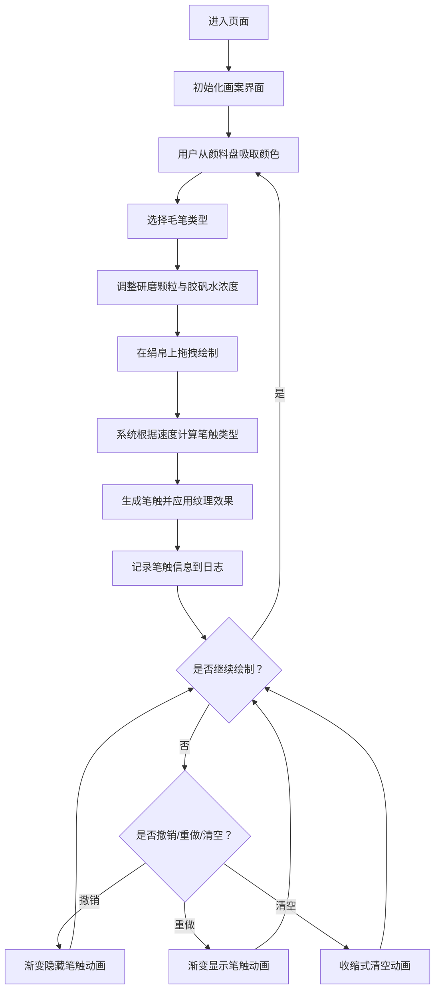

## 1. 产品概述

本产品是一个基于浏览器的交互式古代工笔花鸟画模拟应用，旨在解决传统中国画技法教学中难以直观呈现颜料浓淡变化与绢帛质感动态匹配的问题。用户可以模拟古代画师使用矿物颜料在绢帛上作画的全过程，体验不同研磨颗粒粗细、胶矾水浓度和笔触力度产生的丰富纹理效果。

- 核心价值：将传统国画技法数字化，提供沉浸式的颜料与绢帛交互体验
- 目标用户：国画学习者、艺术教师、文化爱好者

## 2. 核心功能

### 2.1 用户角色
| 角色 | 注册方式 | 核心权限 |
|------|----------|----------|
| 普通用户 | 无需注册，直接使用 | 绘画、调整参数、查看日志、撤销重做 |

### 2.2 功能模块
1. **画案主界面**：仿古绫绢背景画案，包含颜料盘、笔架、绢帛画布、控制面板
2. **颜料盘系统**：六色矿物颜料（朱砂、石绿、雄黄、赭石、花青、胭脂），点击吸取，颗粒粗细影响颜色呈现
3. **毛笔选择系统**：三种毛笔（狼毫硬笔、羊毫软笔、兼毫中笔），不同笔锋长度和硬度
4. **智能笔触系统**：根据绘制速度自动切换侧锋/中锋/细线，生成相应笔触形态
5. **参数调节系统**：研磨颗粒粗细滑块（5-80μm）、胶矾水浓度滑块（0-100%）
6. **历史记录系统**：撤销/重做功能，最多20步，带渐变动画
7. **绘画日志系统**：记录每次笔触详细信息，仿古卷轴样式展示
8. **清空画布功能**：收缩式清空动画

### 2.3 页面详情
| 页面名称 | 模块名称 | 功能描述 |
|----------|----------|----------|
| 主页面 | 标题区 | 宋代画卷风格标题，深红底色金色隶书 |
| 主页面 | 颜料盘区 | 六色不规则颗粒状颜料块，点击吸取 |
| 主页面 | 笔架区 | 三支毛笔选择，显示笔锋状态 |
| 主页面 | 绢帛画布 | 800x600px斜纹丝绸肌理画布，支持绘制 |
| 主页面 | 控制面板 | 研磨颗粒滑块、胶矾水浓度滑块 |
| 主页面 | 操作按钮区 | 撤销、重做、清空画布按钮 |
| 主页面 | 绘画日志区 | 仿古卷轴样式，显示笔触记录 |

## 3. 核心流程

## 4. 用户界面设计

### 4.1 设计风格
- **主色调**：仿古绫绢色#E8D5B7、浅黄#F5F0DC、淡褐#D2B48C、深褐#5D4037、深红#800000、金色#D4AF37
- **辅助色**：天青#83A6C4、粉青#A8D8B9、仿古铜#B87333
- **颜料色**：朱砂#C23B22、石绿#2E8B57、雄黄#FFD700、赭石#8B4513、花青#191970、胭脂#DC143C
- **字体**：标题用隶书，日志用行楷，正文用宋体/仿宋
- **控件风格**：圆角8px仿古造型，hover时金边动画（0.2秒）
- **边框装饰**：2px深褐边框，四角金色云纹装饰（24x24px）
- **布局风格**：仿宋代画卷竖版布局，居中对齐

### 4.2 页面设计概览
| 页面名称 | 模块名称 | UI元素 |
|----------|----------|--------|
| 主页面 | 标题区 | 宽800px高60px，深红#800000底色，金色#D4AF37隶书字体28px，居中 |
| 主页面 | 画案背景 | 中心浅黄#F5F0DC向边缘淡褐#D2B48C径向渐变 |
| 主页面 | 颜料盘 | 左侧，6个不规则颗粒状颜料块，间距均匀 |
| 主页面 | 笔架 | 右侧，3支毛笔竖向悬挂，显示笔锋长度和颜色 |
| 主页面 | 绢帛画布 | 中央800x600px，米白#F5F0DC斜纹丝绸肌理（经2px纬4px） |
| 主页面 | 控制面板 | 右上角，两个滑块带标签 |
| 主页面 | 操作按钮 | 画布右上角，撤销/重做/清空按钮 |
| 主页面 | 绘画日志 | 画布下方800x200px，旧纸黄#EDE4D4背景，深褐#3E2723行楷 |

### 4.3 响应式设计
- **桌面端（1440px+）**：完整竖版布局1000x900px，居中显示
- **平板端（768px）**：画布缩小为600x450px，控件调整为两列排列，整体宽度自适应

### 4.4 动画效果
- **笔触动画**：根据速度实时生成侧锋/中锋/细线形态
- **撤销动画**：0.5秒渐变白色消失
- **重做动画**：0.5秒从白色渐变回原色
- **清空动画**：1秒从边缘向中心收缩式清空
- **Hover动画**：控件金边渐显0.2秒
- **颗粒变化**：颜色明度/饱和度实时调整，噪点动态生成
- **胶矾水变化**：颜色边缘锐利度/晕开效果实时更新

## 5. 性能要求
- 绘制帧率：不低于50fps
- 参数调整重绘延迟：不超过200ms
- 日志生成更新：不超过500ms
- 历史记录：最多20步
