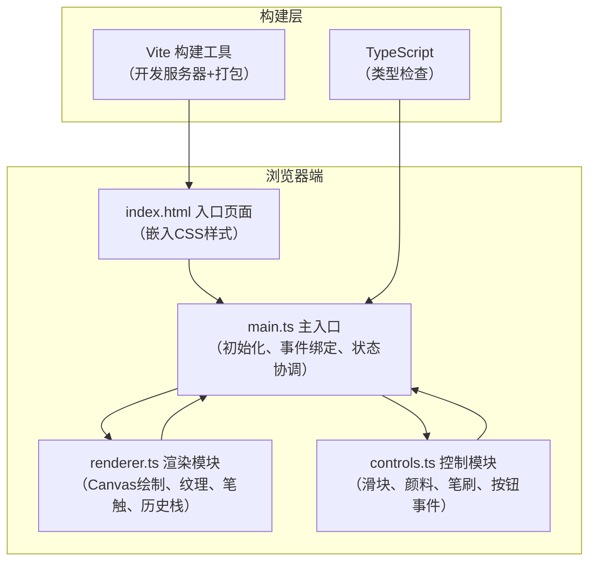

## 1. 架构设计



## 2. 技术描述

- **前端框架**：原生JavaScript + TypeScript（无框架依赖，纯Canvas实现）
- **构建工具**：Vite@5
- **语言**：TypeScript@5，严格模式，target ES2020
- **开发服务器端口**：3000
- **渲染技术**：HTML5 Canvas 2D API
- **样式方案**：内联CSS（嵌入index.html的style标签）

## 3. 项目文件结构

```
.
├── package.json              # 项目依赖与脚本配置
├── index.html                # 入口页面（内联CSS样式）
├── vite.config.js            # Vite构建配置
├── tsconfig.json             # TypeScript配置
└── src/
    ├── main.ts               # 应用入口，初始化与状态协调
    ├── renderer.ts           # Canvas渲染模块（笔触、纹理、历史）
    └── controls.ts           # 控件事件处理模块
```

## 4. 数据模型与类型定义

### 4.1 核心类型定义

```typescript
// 颜料类型
interface Paint {
  name: string;
  baseColor: string;      // 基础色值
  currentColor: string;   // 当前调整后的颜色
  rgb: { r: number; g: number; b: number };
}

// 毛笔类型
interface Brush {
  name: string;
  tipLength: number;      // 笔锋长度(px)
  handleColor: string;    // 笔杆颜色
  hardness: 'hard' | 'soft' | 'medium';
}

// 笔触类型
type StrokeType = 'side' | 'center' | 'thin';  // 侧锋/中锋/细线

// 笔触记录
interface StrokeRecord {
  id: string;
  points: Point[];
  color: string;
  brush: Brush;
  strokeType: StrokeType;
  avgSpeed: number;       // 平均速度(px/s)
  grainSize: number;      // 研磨颗粒(μm)
  alumConcentration: number;  // 胶矾水浓度(%)
  startTime: number;
  endTime: number;
}

// 坐标点
interface Point {
  x: number;
  y: number;
  timestamp: number;
  pressure?: number;
}

// 绘画日志条目
interface LogEntry {
  timestamp: number;
  startPoint: { x: number; y: number };
  paintName: string;
  grainSize: number;
  alumConcentration: number;
  strokeType: string;
  avgSpeed: number;
}

// 应用状态
interface AppState {
  currentPaint: Paint | null;
  currentBrush: Brush;
  grainSize: number;          // 5-80μm
  alumConcentration: number;  // 0-100%
  isDrawing: boolean;
  currentStroke: StrokeRecord | null;
  history: StrokeRecord[];
  undoneStack: StrokeRecord[];
  logs: LogEntry[];
}
```

## 5. 核心模块职责

### 5.1 renderer.ts 渲染模块

| 函数名 | 功能描述 |
|--------|----------|
| `initCanvas()` | 初始化Canvas，绘制绢帛纹理背景 |
| `renderSilkTexture()` | 渲染细密斜纹丝绸肌理 |
| `drawStroke()` | 绘制单条笔触，根据速度选择笔触类型 |
| `drawSideStroke()` | 绘制侧锋笔触（宽15-20px，飞白毛刺） |
| `drawCenterStroke()` | 绘制中锋笔触（宽8-12px，边缘平滑） |
| `drawThinStroke()` | 绘制细线笔触（宽3-5px，轻微抖动） |
| `applyGrainEffect()` | 应用研磨颗粒效果（明度、饱和度、噪点） |
| `applyAlumEffect()` | 应用胶矾水浓度效果（晕开/锐利边缘） |
| `renderAllStrokes()` | 重绘所有历史笔触 |
| `pushHistory()` | 将笔触压入历史栈 |
| `undo()` | 撤销上一笔，带渐变动画 |
| `redo()` | 重做上一笔，带渐变动画 |
| `clearCanvas()` | 清空画布，收缩式动画 |
| `getCanvasState()` | 获取当前Canvas图像数据用于恢复 |

### 5.2 controls.ts 控制模块

| 函数名 | 功能描述 |
|--------|----------|
| `initPaintPalette()` | 初始化颜料盘，绑定点击事件 |
| `initBrushRack()` | 初始化笔架，绑定选择事件 |
| `initSliders()` | 初始化颗粒和浓度滑块，绑定change事件 |
| `initActionButtons()` | 初始化撤销/重做/清空按钮 |
| `updatePaintDisplay()` | 根据颗粒粗细更新颜料显示 |
| `onGrainSizeChange()` | 颗粒大小变化处理，通知renderer重绘 |
| `onAlumConcentrationChange()` | 胶矾水浓度变化处理，通知renderer |
| `onPaintSelect()` | 颜料选择处理 |
| `onBrushSelect()` | 毛笔选择处理 |

### 5.3 main.ts 主入口

| 函数名 | 功能描述 |
|--------|----------|
| `initApp()` | 初始化整个应用 |
| `initCanvasEvents()` | 绑定Canvas鼠标事件（mousedown/move/up/leave） |
| `handleMouseDown()` | 落笔处理，开始记录笔触 |
| `handleMouseMove()` | 绘制中处理，计算速度生成笔触 |
| `handleMouseUp()` | 抬笔处理，完成笔触并入历史栈 |
| `calculateSpeed()` | 计算鼠标移动速度(px/s) |
| `determineStrokeType()` | 根据速度判断笔触类型 |
| `addLogEntry()` | 添加绘画日志记录 |
| `renderLogArea()` | 渲染日志区域 |

## 6. 性能优化策略

1. **双缓冲机制**：使用离屏Canvas预渲染绢帛纹理和静态元素
2. **增量绘制**：只重绘新增笔触，不清空整个画布（除撤销/重做/参数调整外）
3. **节流优化**：滑块事件使用requestAnimationFrame节流，确保重绘≤200ms
4. **历史快照**：使用ImageData保存画布状态而非逐笔重绘，加速撤销/重做
5. **噪点缓存**：预生成不同颗粒度的噪点图案，避免实时计算
6. **requestAnimationFrame**：所有绘制操作使用RAF调度，保证≥50fps
7. **日志批量渲染**：日志更新使用requestIdleCallback，确保≤500ms

## 7. 响应式适配方案

```typescript
// 断点定义
const BREAKPOINTS = {
  desktop: 1440,
  tablet: 768
};

// 缩放系数
const SCALE = {
  desktop: { canvas: [800, 600], log: [800, 200] },
  tablet:  { canvas: [600, 450], log: [600, 150] }
};

// 监听窗口大小，动态调整Canvas尺寸和控件布局
```
