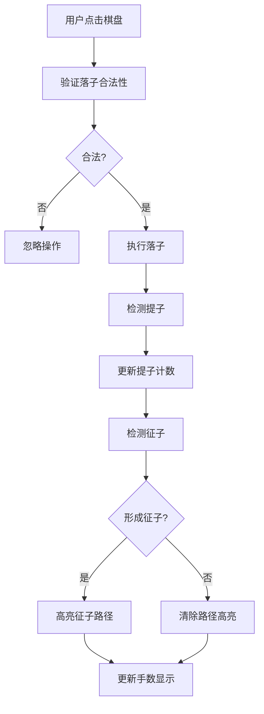

## 1. 产品概述

围棋征子推演模拟器是一款基于Canvas的交互式围棋教学工具，帮助棋师和学习者直观理解"征子"（连续紧气吃子技巧）的变化过程。通过可视化的路径高亮和自动推演功能，解决静态棋谱难以展示多次提子和反提循环的问题。

- 目标用户：围棋教师、学生及爱好者
- 核心价值：将抽象的征子逻辑转化为直观的动态演示，提升学习效率

## 2. 核心功能

### 2.1 功能模块
1. **棋盘交互模块**：19x19围棋棋盘，点击交叉点落子（黑先白后）
2. **征子检测模块**：自动识别征子形态，红色虚线高亮显示征子路径
3. **自动推演模块**：一键自动完成完整征子过程（0.5秒/步）
4. **回退功能模块**：撤销上一步落子，恢复被提棋子
5. **信息显示模块**：当前手数、黑白双方提子数量

### 2.2 页面详情
| 页面名称 | 模块名称 | 功能描述 |
|-----------|-------------|---------------------|
| 主页面 | 棋盘区域 | 19x19木质棋盘，点击落子，征子路径高亮动画 |
| 主页面 | 控制面板 | 自动推演按钮、回退一步按钮 |
| 主页面 | 信息面板 | 当前手数、黑白提子数显示 |

## 3. 核心流程

用户点击棋盘交叉点落子 → 系统验证落子合法性（禁入点、打劫）→ 执行提子逻辑 → 检测是否形成征子 → 高亮征子路径 → 更新手数和提子计数

用户点击"自动推演" → 按0.5秒/步速度自动落子 → 每步播放落子音效 → 持续到征子结束（提子或逃脱）

用户点击"回退一步" → 撤销上一步落子 → 恢复被提棋子 → 路径回退到前一步

## 4. 用户界面设计

### 4.1 设计风格
- **主色调**：木质暖色 #C18A44（棋盘背景）、深棕色 #5D3A1A（控制面板）
- **辅助色**：黑色 #1A1A1A（黑子、网格线）、白色 #F5F5F5（白子、文字）、红棕色 #8B4513（按钮）
- **高亮色**：红色虚线（征子路径）
- **布局风格**：左侧棋盘 + 右侧控制面板，桌面端横向布局，移动端纵向布局
- **按钮样式**：圆角矩形，悬停变色，点击缩放弹性动画

### 4.2 页面设计概述
| 页面名称 | 模块名称 | UI元素 |
|-----------|-------------|-------------|
| 主页面 | 棋盘区域 | 木质纹理背景、19x19网格线、9个星位标记、黑白棋子带光影效果、红色虚线路径动画 |
| 主页面 | 控制面板 | 深棕底色、白色文字、两个功能按钮、悬停/点击动画 |
| 主页面 | 信息显示 | 右下角手数和提子数、圆盘图标配数字 |

### 4.3 响应式
- 桌面端（≥768px）：每格48px，棋盘居左，控制面板在右侧
- 移动端（<768px）：每格36px，控制面板移到棋盘下方，整体垂直布局
- 触控优化：确保点击区域足够大

### 4.4 动效设计
- 棋子落下：Y轴位移8px，0.15秒缓出动画
- 征子路径：虚线strokeDasharray='8,4'，0.5秒周期闪烁（不透明↔半透明）
- 按钮交互：悬停变色，点击缩放0.95 + 0.1秒弹性动画
- 性能要求：落子到界面更新≤16ms，动画稳定60FPS
