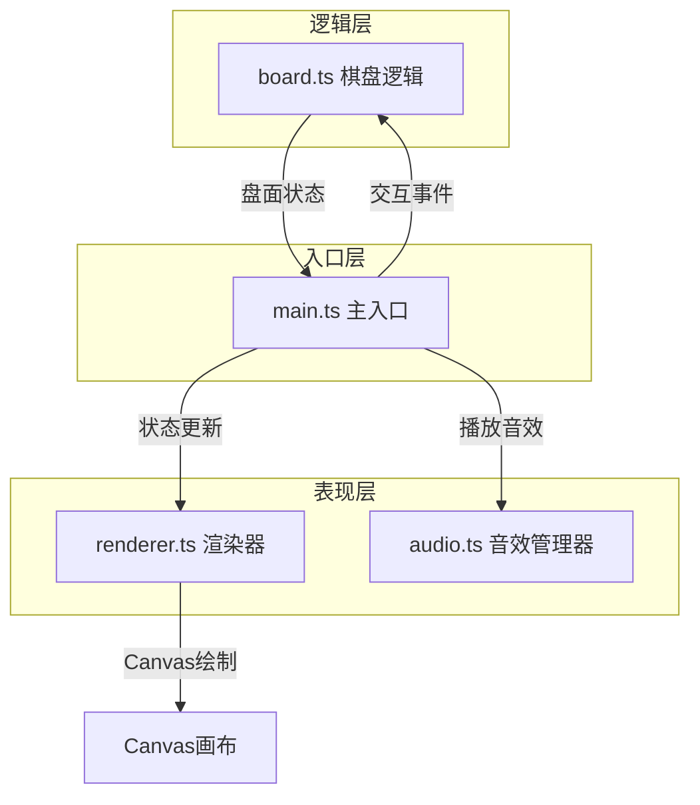

## 1. 架构设计



## 2. 技术描述

- **前端技术**：TypeScript + 原生JavaScript + Canvas API
- **构建工具**：Vite（热更新、快速构建）
- **音频技术**：Web Audio API（生成落子音效）
- **无后端**：纯前端应用，所有逻辑在浏览器端运行
- **初始化方式**：使用vite vanilla-ts模板

## 3. 文件结构

```
├── index.html              # 入口页面
├── package.json            # 依赖配置
├── vite.config.js          # Vite配置（端口3000）
├── tsconfig.json           # TypeScript配置（严格模式，ES2020）
└── src/
    ├── main.ts             # 主入口：游戏循环、Canvas初始化、事件注册
    ├── board.ts            # 棋盘逻辑：网格、落子规则、征子检测
    ├── renderer.ts         # 渲染器：棋盘、棋子、路径高亮绘制
    └── audio.ts            # 音效管理：Web Audio API落子音效
```

### 模块职责与调用关系

| 文件 | 职责 | 输入 | 输出 | 被谁调用 |
|------|------|------|------|----------|
| main.ts | 游戏主控、事件分发、状态管理 | 鼠标事件、按钮事件 | 调用board/renderer/audio | 浏览器入口 |
| board.ts | 棋盘状态、落子规则、提子逻辑、征子检测 | 落子坐标 | 新盘面状态、提子列表、征子路径 | main.ts |
| renderer.ts | Canvas绘制、动画效果 | 盘面数据、征子路径 | 视觉输出 | main.ts |
| audio.ts | 音效生成与播放 | 播放指令 | 声音输出 | main.ts |

### 数据流向

```
用户点击 → main.ts捕获坐标 → board.ts处理落子 → 返回新状态
                                      ↓
                                main.ts更新状态
                                      ↓
                            ┌───────┴───────┐
                            ↓               ↓
                        renderer.ts      audio.ts
                        绘制更新        播放音效
```

## 4. 核心数据模型

### 4.1 棋子类型
```typescript
enum Stone {
  Empty = 0,
  Black = 1,
  White = 2
}
```

### 4.2 棋盘状态
```typescript
interface BoardState {
  grid: Stone[][];      // 19x19 网格
  currentPlayer: Stone; // 当前玩家
  moveCount: number;    // 手数
  captures: {           // 提子数
    black: number;
    white: number;
  };
  lastMove: [number, number] | null; // 最后一手
  koPoint: [number, number] | null;  // 打劫禁入点
}
```

### 4.3 征子路径
```typescript
interface LadderPath {
  points: [number, number][]; // 路径点序列
  isComplete: boolean;        // 是否完成（提子/逃脱）
}
```

### 4.4 历史记录（用于回退）
```typescript
interface MoveRecord {
  position: [number, number]; // 落子位置
  stone: Stone;               // 棋子颜色
  captured: [number, number][]; // 被提棋子列表
  previousKo: [number, number] | null; // 之前的劫点
}
```

## 5. 核心算法

### 5.1 气的计算
- 使用BFS/DFS遍历连通棋子块
- 统计周围空点数量（气数）

### 5.2 提子检测
- 落子后检查对方相邻棋子的气
- 气为0的棋子块被提走

### 5.3 禁入点判断
- 落子后己方无气且不能提对方子 → 禁入
- 打劫规则：不能立即提回刚被提的单子

### 5.4 征子检测
- 定义：连续追吃对方孤棋，每步使对方气数严格为1
- 从打吃位置开始模拟后续走法
- 检测循环（避免无限递归）
- 返回完整的征子路径点序列

## 6. 渲染策略

- 使用requestAnimationFrame实现60FPS动画
- 分层渲染：棋盘背景层 → 网格线层 → 棋子层 → 路径层
- 征子路径动画：通过时间戳计算虚线偏移和透明度
- 棋子落下动画：基于时间的Y轴位移插值（缓出函数）

## 7. 性能优化

- 脏矩形渲染：只重绘变化区域
- 对象池复用：避免频繁创建/销毁绘制对象
- 离屏Canvas缓存静态元素（棋盘背景、网格）
- 征子路径计算使用记忆化，避免重复计算
