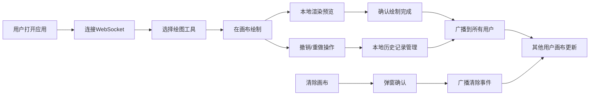

## 1. 产品概述

在线协作白板应用，支持多用户实时绘制图形和文字标注，为远程团队提供可视化协作工具。

- 主要用途：远程协作、头脑风暴、技术方案讨论、教学演示
- 解决问题：传统白板无法跨地域共享，协作效率低下
- 目标用户：远程团队、教育工作者、产品经理、设计师
- 产品价值：提供低延迟、高流畅度的实时协作体验

## 2. 核心功能

### 2.1 用户角色
| 角色 | 注册方式 | 核心权限 |
|------|----------|----------|
| 普通用户 | 匿名访问 | 绘制图形、添加文字、撤销/重做、清除画布、实时同步 |

### 2.2 功能模块
1. **工具栏**：工具切换、颜色选择、粗细调节、撤销/重做、清除画布
2. **画布区域**：SVG绘制、鼠标事件处理、图形渲染、文字输入
3. **实时同步**：WebSocket连接管理、消息广播、状态同步

### 2.3 页面详情
| 页面名称 | 模块名称 | 功能描述 |
|---------|----------|----------|
| 主页面 | 工具栏 | 画笔/矩形/圆形/文字工具切换，6种预设颜色选择，1-10px粗细调节 |
| 主页面 | 画布区域 | 支持自由绘制、矩形、圆形、文字标注，显示预览图形，支持撤销重做 |
| 主页面 | 实时同步 | WebSocket实时同步所有绘图操作，自动重连机制 |

## 3. 核心流程

用户打开应用 → 自动连接WebSocket → 选择绘图工具 → 在画布上绘制 → 实时广播到所有用户 → 支持撤销/重做 → 可清除画布

## 4. 用户界面设计

### 4.1 设计风格
- 主色调：蓝色 #1890ff
- 背景色：浅灰色 #f5f5f5（工具栏），纯白 #ffffff（画布）
- 文字色：黑色 #333333
- 按钮风格：扁平化设计，圆角4px，选中时蓝色高亮
- 字体：Arial，标注文字16px
- 布局：顶部固定工具栏（高度60px），下方画布区域自适应
- 图标风格：简洁线性图标，与文字标签并排

### 4.2 页面设计概述
| 页面名称 | 模块名称 | UI元素 |
|---------|----------|--------|
| 主页面 | 工具栏 | 工具按钮组（画笔、矩形、圆形、文字）、颜色选择器（6色）、粗细滑块（1-10px）、撤销/重做按钮、清除按钮 |
| 主页面 | 画布区域 | SVG画布、十字光标、半透明预览图形、文字输入框、确认后的实心描边图形 |
| 主页面 | 确认弹窗 | 居中模态框、确认/取消按钮、提示文字 |

### 4.3 响应式设计
- 桌面端（≥768px）：顶部固定工具栏，工具横向排列
- 移动端（<768px）：可折叠侧边栏，点击展开/收起，工具纵向排列
- 触摸优化：增大按钮点击区域，支持触摸绘制

### 4.4 动效设计
- 工具按钮悬停：背景色过渡动画（0.2s）
- 工具选中：边框高亮，背景色变为淡蓝色
- 绘制预览：半透明填充，实时跟随鼠标
- 弹窗出现：淡入+缩放动画（0.2s）
- 撤销/重做：画布内容平滑更新
