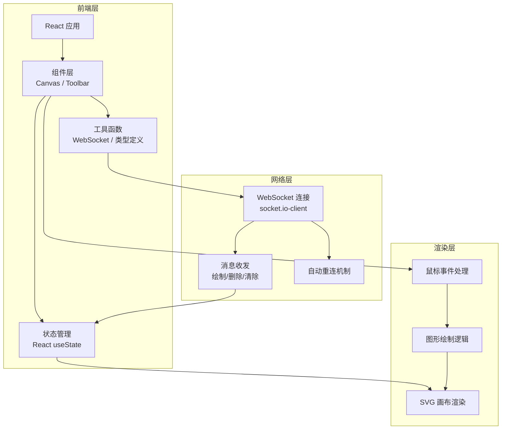

## 1. 架构设计



## 2. 技术描述

- 前端框架：React 18 + TypeScript
- 构建工具：Vite
- 实时通信：socket.io-client
- 唯一标识：uuid
- 状态管理：React useState / useRef
- 样式方案：CSS + CSS Variables
- 项目初始化：vite-init react-ts 模板

## 3. 文件结构定义

| 文件路径 | 用途说明 |
|---------|----------|
| `package.json` | 项目依赖配置，启动脚本 |
| `index.html` | 入口HTML页面 |
| `vite.config.js` | Vite构建配置 |
| `tsconfig.json` | TypeScript严格模式配置 |
| `src/main.tsx` | React根组件，初始化App和WebSocket连接 |
| `src/App.tsx` | 主应用组件，管理画布状态和工具切换 |
| `src/components/Canvas.tsx` | SVG画布渲染，鼠标事件处理，WebSocket数据更新 |
| `src/components/Toolbar.tsx` | 工具栏组件，工具切换、颜色选择、粗细调节 |
| `src/utils/websocket.ts` | WebSocket连接管理，消息收发与重连逻辑 |
| `src/types/index.ts` | TypeScript类型定义 |

## 4. 核心数据模型

### 4.1 图形类型定义

```typescript
type ToolType = 'pen' | 'rectangle' | 'circle' | 'text';

interface Point {
  x: number;
  y: number;
}

interface BaseShape {
  id: string;
  type: ToolType;
  color: string;
  strokeWidth: number;
  userId: string;
  timestamp: number;
}

interface PenShape extends BaseShape {
  type: 'pen';
  points: Point[];
}

interface RectangleShape extends BaseShape {
  type: 'rectangle';
  x: number;
  y: number;
  width: number;
  height: number;
}

interface CircleShape extends BaseShape {
  type: 'circle';
  cx: number;
  cy: number;
  r: number;
}

interface TextShape extends BaseShape {
  type: 'text';
  x: number;
  y: number;
  text: string;
}

type Shape = PenShape | RectangleShape | CircleShape | TextShape;

interface DrawingState {
  shapes: Shape[];
  history: Shape[][];
  historyIndex: number;
}
```

### 4.2 WebSocket消息类型

```typescript
type MessageType = 'draw' | 'delete' | 'clear' | 'undo' | 'redo' | 'sync';

interface BaseMessage {
  type: MessageType;
  userId: string;
  timestamp: number;
}

interface DrawMessage extends BaseMessage {
  type: 'draw';
  shape: Shape;
}

interface ClearMessage extends BaseMessage {
  type: 'clear';
}

interface SyncMessage extends BaseMessage {
  type: 'sync';
  shapes: Shape[];
}

type WebSocketMessage = DrawMessage | ClearMessage | SyncMessage;
```

## 5. 性能优化策略

### 5.1 渲染性能
- 使用SVG而非Canvas，便于事件处理和元素操作
- 图形更新时仅重绘变化的元素
- 使用React.memo优化组件重渲染
- 鼠标事件节流，避免频繁重绘

### 5.2 网络性能
- WebSocket消息压缩
- 批量消息发送（自由绘制路径点聚合）
- 本地操作优先渲染，网络消息异步同步
- 消息队列处理，避免丢包

### 5.3 内存管理
- 历史记录限制为最近5步
- 大型画布时考虑虚拟滚动
- 及时清理无用的事件监听器

## 6. 开发规范

- TypeScript严格模式（strict: true）
- 组件使用函数式组件 + Hooks
- 类型定义集中管理
- WebSocket连接逻辑封装独立
- 绘图逻辑与UI渲染分离
- 错误边界处理
