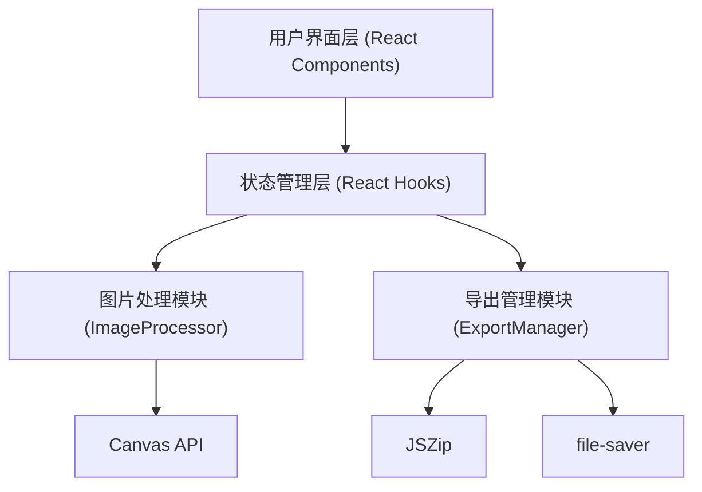

## 1. 架构设计

纯前端应用，基于React + TypeScript + Vite构建，所有图片处理在浏览器端通过Canvas API完成，无需后端服务。



## 2. 技术描述

- **前端框架**：React 18 + TypeScript
- **构建工具**：Vite
- **图片处理**：Canvas API (toBlob, createObjectURL)
- **打包下载**：JSZip + file-saver
- **样式方案**：纯CSS（不使用Tailwind CSS，按需求自定义样式）

## 3. 文件结构

```
/
├── package.json          # 项目依赖和脚本
├── index.html            # 入口HTML
├── vite.config.js        # Vite构建配置
├── tsconfig.json         # TypeScript配置
└── src/
    ├── main.tsx          # React入口
    ├── App.tsx           # 主应用组件
    ├── ImageProcessor.ts # 图片处理模块
    ├── ExportManager.ts  # 导出管理模块
    └── styles.css        # 全局样式
```

## 4. 核心模块定义

### 4.1 ImageProcessor 模块

**导出函数**：
```typescript
compressImage(file: File, quality: number): Promise<{
  blob: Blob;
  sizeBefore: number;
  sizeAfter: number;
}>
```

**功能**：
- 图片加载（URL.createObjectURL）
- Canvas重采样压缩（toBlob，质量参数）
- WebP转换（Canvas toBlob with image/webp）
- 大小对比计算

### 4.2 ExportManager 模块

**导出函数**：
```typescript
exportAsZip(images: {name: string, blob: Blob}[]): Promise<void>
```

**功能**：
- 使用JSZip将选中图片的Blob打包为ZIP
- 通过file-saver触发下载
- ZIP内文件名保持原名但后缀改为.webp

### 4.3 质量等级映射

| 等级 | 质量值 |
|------|--------|
| 低 | 0.5 (50%) |
| 中 | 0.7 (70%) |
| 高 | 0.85 (85%) |
| 无损 | 1.0 (100%) |

## 5. 状态管理

使用React Hooks (useState, useCallback, useRef) 管理以下状态：
- 图片列表（包含原始文件、压缩结果、选中状态、预览URL等）
- 压缩质量等级
- 压缩进度
- 是否正在压缩
- 预览弹窗状态

## 6. 性能优化

- 压缩操作使用异步处理，避免阻塞UI
- ZIP打包在异步中进行
- 使用createObjectURL优化图片展示性能
- 及时释放URL对象避免内存泄漏
