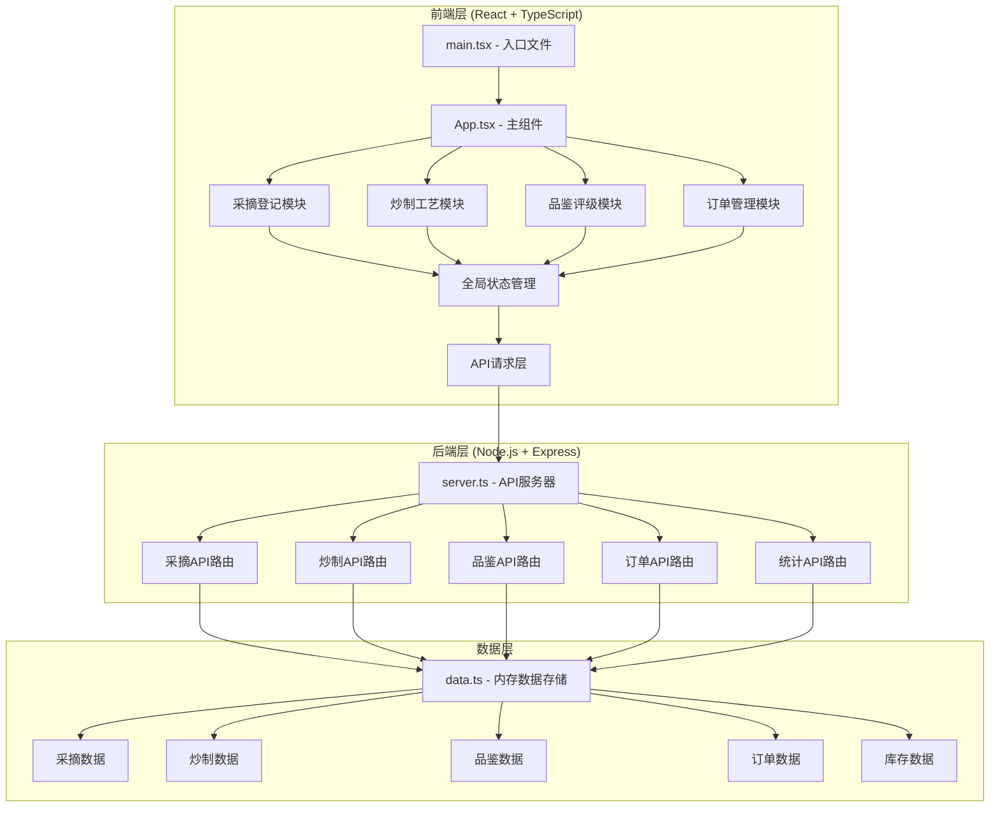
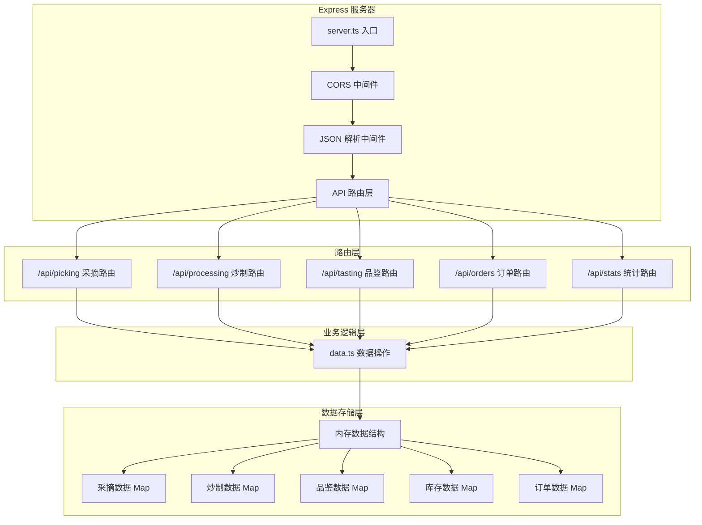

## 1. 架构设计



## 2. 技术描述

### 2.1 技术栈

| 层级 | 技术选型 | 版本 | 说明 |
|------|----------|------|------|
| 前端框架 | React | 18.x | 用户界面构建 |
| 前端语言 | TypeScript | 5.x | 类型安全 |
| 构建工具 | Vite | 5.x | 开发构建 |
| 后端框架 | Express | 4.x | API服务 |
| 后端语言 | TypeScript | 5.x | 类型安全 |
| 工具库 | uuid | 9.x | ID生成 |
| 跨域 | cors | 2.x | 跨域资源共享 |

### 2.2 项目初始化

- **初始化方式**：使用 Vite 官方模板创建 React + TypeScript 项目
- **包管理器**：npm
- **后端配置**：使用 ts-node + nodemon 运行 TypeScript 后端

## 3. 文件结构

```
├── package.json                 # 项目依赖和脚本
├── index.html                   # 入口HTML
├── vite.config.js              # Vite配置（代理设置）
├── tsconfig.json               # TypeScript配置
├── src/
│   ├── client/                 # 前端代码
│   │   ├── main.tsx           # React入口
│   │   ├── App.tsx            # 主应用组件
│   │   ├── components/        # UI组件
│   │   │   ├── Picking.tsx   # 采摘登记模块
│   │   │   ├── Processing.tsx # 炒制工艺模块
│   │   │   ├── Tasting.tsx   # 品鉴评级模块
│   │   │   ├── Orders.tsx    # 订单管理模块
│   │   │   ├── Stats.tsx     # 全局统计模块
│   │   │   └── TeaIcon.tsx   # CSS茶叶图标
│   │   ├── hooks/             # 自定义Hooks
│   │   │   ├── useApi.ts     # API请求Hook
│   │   │   └── useTimer.ts   # 计时器Hook
│   │   ├── types/             # 类型定义
│   │   │   └── index.ts
│   │   └── utils/             # 工具函数
│   │       └── api.ts
│   └── server/                 # 后端代码
│       ├── server.ts          # Express服务器入口
│       ├── data.ts            # 内存数据存储
│       └── types.ts           # 后端类型
```

## 4. 类型定义

```typescript
// 茶叶品种
type TeaVariety = '龙井' | '碧螺春' | '铁观音' | '普洱' | '大红袍';

// 采摘区域
type PickingArea = '东区' | '西区' | '南区' | '北区';

// 炒制状态
type ProcessingStatus = '待炒' | '炒制中' | '已完成';

// 香气类型
type AromaType = '豆香' | '栗香' | '花香' | '蜜香';

// 茶叶等级
type TeaGrade = '特级' | '一级' | '二级' | '次级';

// 订单状态
type OrderStatus = '待处理' | '已发货' | '已签收' | '超时';

// 发货方式
type ShippingMethod = '陆运' | '海运' | '空运';

// 采摘记录
interface PickingRecord {
  id: string;
  variety: TeaVariety;
  pickTime: string;
  picker: string;
  weight: number;
  area: PickingArea;
  createdAt: string;
}

// 炒制记录
interface ProcessingRecord {
  id: string;
  pickingId: string;
  variety: TeaVariety;
  temperature: number;
  duration: number;
  stirCount: number;
  status: ProcessingStatus;
  color: string;
  aroma: AromaType;
  startTime: string;
  endTime?: string;
}

// 品鉴记录
interface TastingRecord {
  id: string;
  processingId: string;
  variety: TeaVariety;
  appearance: number;
  liquor: number;
  aroma: number;
  taste: number;
  leaf: number;
  totalScore: number;
  grade: TeaGrade;
  comment: string;
  createdAt: string;
}

// 库存
interface Inventory {
  variety: TeaVariety;
  grade: TeaGrade;
  quantity: number;
}

// 订单
interface Order {
  id: string;
  variety: TeaVariety;
  quantity: number;
  shippingMethod: ShippingMethod;
  status: OrderStatus;
  createdAt: string;
  deadline: string;
}

// 全局统计
interface GlobalStats {
  totalPickingWeight: number;
  totalProcessingBatches: number;
  averageTastingScore: number;
  pendingOrders: number;
}
```

## 5. API 定义

### 5.1 采摘 API

| 方法 | 路径 | 说明 |
|------|------|------|
| GET | `/api/picking` | 获取所有采摘记录 |
| GET | `/api/picking/recent` | 获取最近7天采摘记录 |
| POST | `/api/picking` | 创建采摘记录 |
| PUT | `/api/picking/:id` | 更新采摘记录 |
| DELETE | `/api/picking/:id` | 删除采摘记录 |

### 5.2 炒制 API

| 方法 | 路径 | 说明 |
|------|------|------|
| GET | `/api/processing` | 获取所有炒制记录 |
| GET | `/api/processing/queue` | 获取待炒制队列 |
| POST | `/api/processing` | 创建炒制记录 |
| PUT | `/api/processing/:id` | 更新炒制记录 |
| PUT | `/api/processing/:id/stir` | 增加翻炒次数 |
| PUT | `/api/processing/:id/complete` | 完成炒制 |

### 5.3 品鉴 API

| 方法 | 路径 | 说明 |
|------|------|------|
| GET | `/api/tasting` | 获取所有品鉴记录 |
| POST | `/api/tasting` | 创建品鉴记录（自动更新库存） |
| PUT | `/api/tasting/:id` | 更新品鉴记录 |

### 5.4 订单 API

| 方法 | 路径 | 说明 |
|------|------|------|
| GET | `/api/orders` | 获取所有订单 |
| POST | `/api/orders` | 创建订单（自动扣减库存） |
| PUT | `/api/orders/:id/status` | 更新订单状态 |

### 5.5 统计 API

| 方法 | 路径 | 说明 |
|------|------|------|
| GET | `/api/stats` | 获取全局统计数据 |
| GET | `/api/inventory` | 获取库存数据 |

## 6. 数据模型

```mermaid
erDiagram
    PICKING_RECORD ||--o{ PROCESSING_RECORD : "进入炒制"
    PROCESSING_RECORD ||--o| TASTING_RECORD : "品鉴"
    TASTING_RECORD }o--|| INVENTORY : "更新库存"
    INVENTORY ||--o{ ORDER : "订单扣减"
    
    PICKING_RECORD {
        string id PK
        string variety
        string pickTime
        string picker
        number weight
        string area
        string createdAt
    }
    
    PROCESSING_RECORD {
        string id PK
        string pickingId FK
        string variety
        number temperature
        number duration
        number stirCount
        string status
        string color
        string aroma
        string startTime
        string endTime
    }
    
    TASTING_RECORD {
        string id PK
        string processingId FK
        string variety
        number appearance
        number liquor
        number aroma
        number taste
        number leaf
        number totalScore
        string grade
        string comment
        string createdAt
    }
    
    INVENTORY {
        string variety PK
        string grade PK
        number quantity
    }
    
    ORDER {
        string id PK
        string variety
        number quantity
        string shippingMethod
        string status
        string createdAt
        string deadline
    }
```



## 7. 服务器架构



## 8. 性能与质量保障

### 8.1 性能指标

- API响应时间：模拟数据延迟控制在 30-50ms
- 首屏渲染：< 1秒（Vite冷启动优化）
- 数据刷新：每5秒轮询一次统计数据
- 包体积：前端代码压缩后 < 200KB

### 8.2 代码质量

- TypeScript 严格模式：`strict: true`
- 组件大小：单文件 < 300行
- 类型覆盖率：100% API 和数据结构
- 错误处理：所有异步操作包含 try/catch
- 输入验证：所有用户输入前端+后端双重校验

### 8.3 数据初始化

应用启动时自动初始化示例数据：
- 10条采摘记录（覆盖5个品种、4个区域）
- 5条炒制记录（不同状态）
- 3条品鉴记录（不同等级）
- 2条订单记录
- 初始化各品种库存
