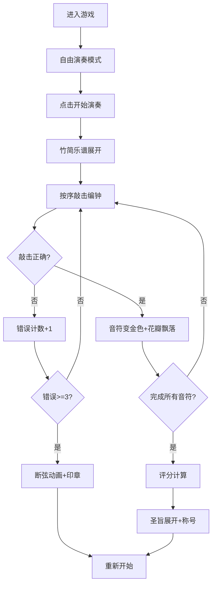

## 1. 产品概述
宫廷编钟雅乐演奏游戏——用户扮演古代乐师，在宫殿中敲击编钟演奏五声音阶，跟随乐谱完成演奏并获得皇帝御赐称号。
- 核心目的：通过交互式演奏体验，让用户感受中国古代雅乐文化魅力
- 目标用户：对中国传统文化、音乐游戏感兴趣的用户
- 市场价值：融合文化传承与游戏娱乐的创新型互动体验

## 2. 核心功能

### 2.1 用户角色
| 角色 | 注册方式 | 核心权限 |
|------|----------|----------|
| 乐师 | 无需注册 | 敲击编钟、演奏乐曲、查看评分 |

### 2.2 功能模块
1. **主演奏界面**：大殿场景、编钟钟架、宫灯装饰、青铜鼎
2. **编钟交互系统**：点击编钟产生摆动动画、Web Audio音效、金色涟漪
3. **乐谱演奏系统**：竹简乐谱展开、音符标记、按序敲击判定
4. **评分系统**：准确率计算、节奏偏差检测、等级评定、圣旨展示
5. **视觉特效系统**：桃花瓣飘落、断弦动画、印章效果、宫灯浮动

### 2.3 页面详情
| 页面名称 | 模块名称 | 功能描述 |
|----------|----------|----------|
| 主演奏页面 | 大殿场景 | 深色木纹地板、暗红地毯、朱红漆柱、青绿斗拱、云纹屏风 |
| 主演奏页面 | 编钟钟架 | 两层16枚编钟（下层8大、上层8小）、悬挂灯笼、蟠螭纹装饰 |
| 主演奏页面 | 交互控制 | 鼠标点击编钟发声、摆动动画、涟漪效果 |
| 主演奏页面 | 演奏模式 | "开始演奏"按钮触发乐谱模式、限时敲击判定 |
| 主演奏页面 | 反馈系统 | 正确音符变金色闪烁、桃花瓣飘落、失败断弦动画 |
| 主演奏页面 | 评分展示 | 圣旨展开、隶书显示得分、皇帝御赐称号 |

## 3. 核心流程
用户进入游戏→观赏大殿场景→点击任意编钟自由演奏→点击"开始演奏"→竹简展开显示乐谱→按提示顺序敲击编钟→正确时音符变金+花瓣飘落→连续3次错误→断弦动画+"乐师失仪"印章→完成演奏→圣旨展开显示评分和称号

## 4. 用户界面设计

### 4.1 设计风格
- **主色调**：深青#1A3A5C、翠绿#2E8B57、朱红#8B2500、明黄#FFD700、暖黄#FFB300
- **辅色调**：铜绿#4A7C59、麻色#D2B48C、紫檀#4A2C1A、粉红#FFB7C5、银灰#C0C0C0
- **字体**：隶书（标题）、楷体（正文），体现古风韵味
- **按钮样式**：古典卷轴风格，紫檀边框，明黄底，隶书文字
- **布局风格**：居中对称式布局，体现宫廷庄重感
- **装饰元素**：蟠螭纹、云纹、饕餮纹、篆书铭文

### 4.2 页面设计概述
| 页面名称 | 模块名称 | UI元素 |
|----------|----------|--------|
| 主演奏页面 | 背景大殿 | 纵深透视、朱红漆柱、青绿斗拱、云纹屏风、两侧青铜鼎 |
| 主演奏页面 | 编钟钟架 | 60%宽度居中、上下两层、16枚渐变编钟、钟上灯笼、摆动动画 |
| 主演奏页面 | 交互反馈 | 金色涟漪扩散、hover放大(scale 1.05, 0.3s缓动) |
| 主演奏页面 | 乐谱系统 | 麻色竹简、减字谱符号、金色高亮闪烁 |
| 主演奏页面 | 特效系统 | 桃花瓣飘落(15x15px, 1.5s)、宫灯浮动(5px, 4s周期) |
| 主演奏页面 | 评分界面 | 明黄圣旨、紫檀边框、隶书文字、红色印章 |

### 4.3 响应式
- 桌面端优先，全屏适配
- Canvas自适应窗口大小
- 编钟尺寸按比例缩放
- 触摸设备支持点击交互

### 4.4 性能要求
- 整体帧率稳定60fps
- 点击到声音延迟≤50ms
- 动画采用requestAnimationFrame
- 音频采用Web Audio API预生成
