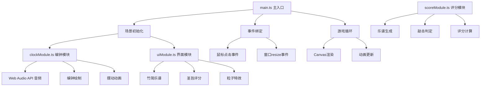

## 1. 架构设计



## 2. 技术描述
- **前端**：TypeScript + 原生JavaScript + Canvas 2D + Web Audio API
- **构建工具**：Vite@5
- **语言**：TypeScript@5（严格模式，target ES2020）
- **无后端**，纯前端实现

## 3. 目录结构
```
auto301/
├── package.json
├── index.html
├── vite.config.js
├── tsconfig.json
└── src/
    ├── main.ts          # 主入口：初始化、事件、游戏循环
    ├── clockModule.ts   # 编钟模块：创建、绘制、摆动、音频
    ├── scoreModule.ts   # 评分模块：乐谱生成、判定、计算
    └── uiModule.ts      # 界面模块：竹简、圣旨、特效
```

## 4. 模块接口定义

### 4.1 clockModule.ts
```typescript
export interface Bell {
  id: number;
  x: number;
  y: number;
  size: number;
  frequency: number;
  noteName: string;  // 宫商角徵羽
  layer: 'upper' | 'lower';
  swingAngle: number;
  swingVelocity: number;
  isSwinging: boolean;
  rippleRadius: number;
  rippleAlpha: number;
}

export function initClocks(ctx: CanvasRenderingContext2D, width: number, height: number): Bell[];
export function playBell(audioCtx: AudioContext, bell: Bell): void;
export function drawBell(ctx: CanvasRenderingContext2D, bell: Bell): void;
export function updateBellAnimation(bell: Bell, deltaTime: number): void;
```

### 4.2 scoreModule.ts
```typescript
export interface ScoreNote {
  bellId: number;
  symbol: string;  // 勾剔抹挑
  hitTime: number;
  isHit: boolean;
  isCorrect: boolean;
}

export interface PerformanceResult {
  accuracy: number;
  avgRhythmDeviation: number;
  grade: '甲' | '乙' | '丙';
  title: string;
  score: number;
}

export function generateScore(bellCount: number, noteCount: number): ScoreNote[];
export function evaluatePerformance(notes: ScoreNote[]): PerformanceResult;
export function checkNoteHit(notes: ScoreNote[], currentIndex: number, bellId: number, hitTime: number): boolean;
```

### 4.3 uiModule.ts
```typescript
export interface Particle {
  x: number;
  y: number;
  vx: number;
  vy: number;
  rotation: number;
  rotationSpeed: number;
  alpha: number;
  life: number;
  maxLife: number;
}

export interface UiState {
  showScoreSheet: boolean;
  showEdict: boolean;
  showFailure: boolean;
  currentNoteIndex: number;
  scoreNotes: ScoreNote[];
  result: PerformanceResult | null;
}

export function showScore(ctx: CanvasRenderingContext2D, width: number, height: number, notes: ScoreNote[], currentIndex: number): void;
export function showFailure(ctx: CanvasRenderingContext2D, width: number, height: number): void;
export function showEdict(ctx: CanvasRenderingContext2D, width: number, height: number, result: PerformanceResult): void;
export function createPetalParticles(x: number, y: number, count: number): Particle[];
export function updateParticles(particles: Particle[], deltaTime: number): void;
export function drawParticles(ctx: CanvasRenderingContext2D, particles: Particle[]): void;
```

## 5. 核心技术实现

### 5.1 Web Audio API 音频生成
- 使用OscillatorNode生成五声音阶
- 频率范围：130Hz ~ 1047Hz
- 应用GainNode实现音量包络（ADSR）
- 预创建振荡器节点池，减少延迟

### 5.2 Canvas 绘制优化
- 分层绘制：背景层、编钟层、特效层、UI层
- 使用requestAnimationFrame实现60fps动画
- 离屏Canvas预渲染静态背景
- 脏矩形局部重绘优化

### 5.3 动画系统
- 编钟摆动：阻尼简谐运动公式
- 涟漪效果：径向渐变+透明度衰减
- 粒子系统：桃花瓣物理运动模拟
- 宫灯浮动：正弦曲线缓动

### 5.4 判定系统
- 时间窗口：±100ms为合格
- 连续错误计数：3次触发失败
- 准确率计算：正确数/总数
- 节奏偏差：平均绝对误差

## 6. 配置文件

### 6.1 package.json
```json
{
  "name": "ancient-bell-game",
  "version": "1.0.0",
  "type": "module",
  "scripts": {
    "dev": "vite",
    "build": "tsc && vite build",
    "preview": "vite preview"
  },
  "devDependencies": {
    "typescript": "^5.0.0",
    "vite": "^5.0.0"
  }
}
```

### 6.2 vite.config.js
```javascript
export default {
  root: '.',
  base: './',
  server: {
    port: 3000,
    open: true
  },
  build: {
    outDir: 'dist'
  }
}
```

### 6.3 tsconfig.json
```json
{
  "compilerOptions": {
    "target": "ES2020",
    "module": "ESNext",
    "moduleResolution": "Bundler",
    "strict": true,
    "noImplicitAny": true,
    "strictNullChecks": true,
    "esModuleInterop": true,
    "skipLibCheck": true,
    "forceConsistentCasingInFileNames": true,
    "isolatedModules": true,
    "resolveJsonModule": true
  },
  "include": ["src"]
}
```
