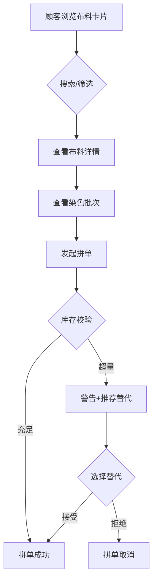

## 1. 产品概述
古代布庄在线管理系统，用于管理布匹从染坊到成衣铺的完整流通环节，解决传统手工记账难以应对频繁拼单与调货操作的问题。
- 目标用户：古代布庄掌柜与采购顾客
- 核心价值：数字化染色批次追踪、拼单预约与库存预警，提升布庄运营效率

## 2. 核心功能

### 2.1 用户角色
| 角色 | 注册方式 | 核心权限 |
|------|----------|----------|
| 顾客 | 模拟身份 | 浏览布料、发起拼单预约 |
| 掌柜 | 模拟身份 | 管理批次、修改拼单状态、查看统计仪表 |

### 2.2 功能模块
1. **布料展示页**：布料卡片列表、搜索过滤、库存预警徽章、替代推荐浮层
2. **布料详情抽屉**：染色批次列表、色阶区分、预约量标注、拼单发起表单
3. **管理面板**：添加新批次、修改拼单状态、数据统计仪表（折线图）

### 2.3 页面详情
| 页面名称 | 模块名称 | 功能描述 |
|----------|----------|----------|
| 布料展示页 | 搜索栏 | 按颜色或名称模糊搜索，米色背景棕褐木质感边框 |
| 布料展示页 | 布料卡片列表 | 展示布料名称、颜色色块、库存余量，低库存红色徽章脉冲动画 |
| 布料展示页 | 替代推荐浮层 | 从卡片右下角飞出，渐变透明度，推荐同类别替代布料 |
| 布料详情抽屉 | 染色批次列表 | 批次号、染色日期、数量、剩余匹数，色阶区分，标注已预约量 |
| 布料详情抽屉 | 拼单表单 | 输入需求匹数与期望到货日期，超库存100%警告并建议替代 |
| 管理面板 | 批次管理表单 | 手动输入批次号、数量、染色日期，添加新批次 |
| 管理面板 | 拼单状态管理 | 修改拼单状态（待处理/已发货/取消），实时更新库存 |
| 管理面板 | 统计仪表 | Canvas折线图展示本周预约量、库存量、发货量趋势 |

## 3. 核心流程

### 3.1 顾客拼单流程
顾客浏览布料卡片 → 点击查看详情 → 查看染色批次 → 发起拼单 → 系统校验库存 → 若超量则警告并推荐替代 → 提交拼单

### 3.2 掌柜管理流程
掌柜进入管理面板 → 添加新染色批次 / 修改拼单状态 → 库存实时更新 → 统计仪表刷新

## 4. 用户界面设计

### 4.1 设计风格
- 主色调：靛蓝#1B3A4B → 旧棉白#F5F0E8 渐变背景
- 辅助色：本白#FAF0E6（卡片底色）、米色#FFFDD0（搜索框）、棕褐#8B4513（边框）、朱红#CC2936（预警徽章）
- 按钮风格：圆角仿古铜扣质感
- 字体：仿宋体（标题），衬线体（正文）
- 布局：卡片网格，顶部居中搜索栏
- 纹理：CSS repeating-linear-gradient 模拟细麻布经纬线

### 4.2 页面设计概览
| 页面名称 | 模块名称 | UI元素 |
|----------|----------|--------|
| 布料展示页 | 搜索栏 | 米色背景、棕褐凹陷box-shadow、居中放置 |
| 布料展示页 | 布料卡片 | 本白底色、麻布纹理、靛蓝描边、颜色色块、库存数字、预警徽章 |
| 布料详情抽屉 | 抽屉面板 | 右侧滑出、缓动动画0.3s ease-out、半透明黑色遮罩 |
| 管理面板 | 表单区域 | 仿古卷轴风格表单、仿铜扣提交按钮 |
| 管理面板 | 统计仪表 | Canvas折线图、靛蓝线条、三条趋势线 |

### 4.3 响应式设计
- 桌面优先设计，卡片多列网格布局
- 移动端（<768px）：卡片单列布局，搜索框宽度自适应
- 抽屉面板移动端全屏展开

### 4.4 动效设计
- 卡片点击：缩放微反馈
- 抽屉弹出：transform translateX缓动0.3s
- 库存预警徽章：朱红色脉冲缩放动画1次
- 替代推荐浮层：右下角飞出+渐变透明度
- 页面加载：卡片交错淡入
