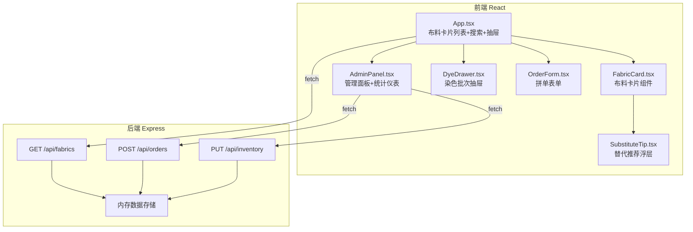
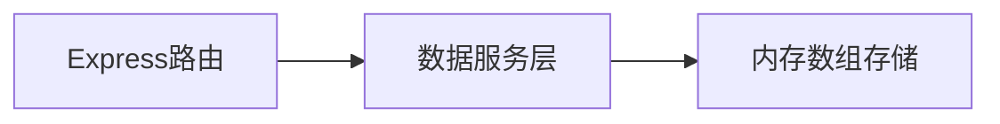
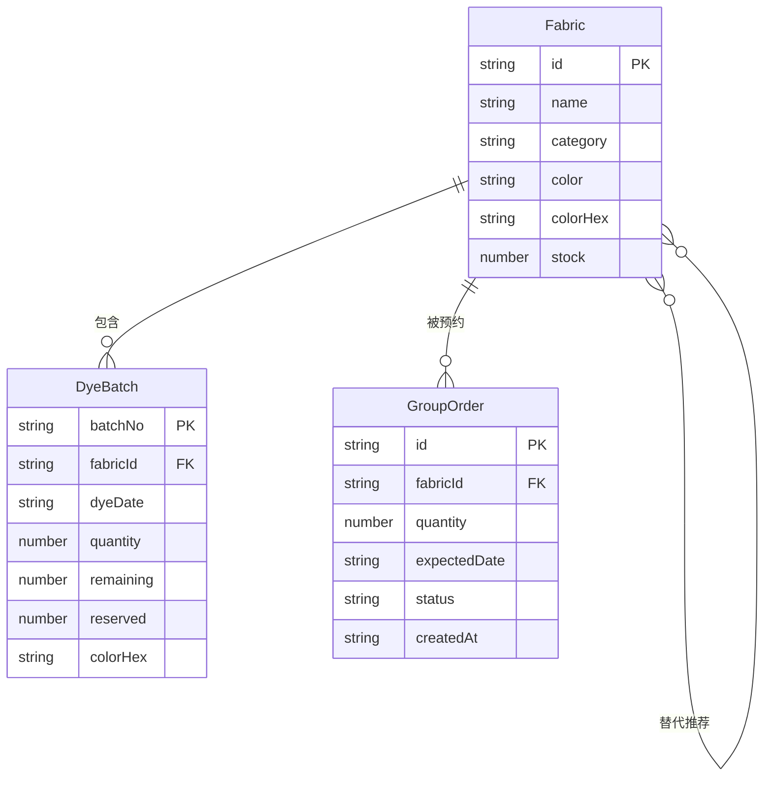

## 1. 架构设计



## 2. 技术说明
- 前端：React@18 + TypeScript + Vite + Tailwind CSS
- 后端：Express@4 + TypeScript + CORS
- 初始化工具：vite-init (react-express-ts 模板)
- 数据存储：内存数组模拟
- 状态管理：Zustand
- 图标：lucide-react

## 3. 路由定义
| 路由 | 用途 |
|------|------|
| / | 布料展示主页（卡片列表+搜索+抽屉+管理面板） |

## 4. API 定义

### 4.1 TypeScript 类型定义

```typescript
interface Fabric {
  id: string;
  name: string;
  category: string;
  color: string;
  colorHex: string;
  stock: number;
  batches: DyeBatch[];
  substitutes: string[];
}

interface DyeBatch {
  batchNo: string;
  dyeDate: string;
  quantity: number;
  remaining: number;
  reserved: number;
  colorHex: string;
}

interface GroupOrder {
  id: string;
  fabricId: string;
  quantity: number;
  expectedDate: string;
  status: '待处理' | '已发货' | '取消';
  createdAt: string;
}

interface DailyStat {
  date: string;
  orders: number;
  stock: number;
  shipped: number;
}
```

### 4.2 请求/响应

**GET /api/fabrics**
- 响应：`{ fabrics: Fabric[]; orders: GroupOrder[]; stats: DailyStat[] }`

**POST /api/orders**
- 请求：`{ fabricId: string; quantity: number; expectedDate: string }`
- 响应：`{ order: GroupOrder; warning?: string; substitutes?: Fabric[] }`

**PUT /api/inventory**
- 请求：`{ type: 'addBatch' | 'updateOrderStatus'; payload: AddBatchPayload | UpdateOrderPayload }`
- 响应：`{ fabrics: Fabric[]; orders: GroupOrder[]; stats: DailyStat[] }`

## 5. 服务端架构



单文件架构：server.ts 包含路由处理与内存数据操作，无独立Controller/Service/Repository分层。

## 6. 数据模型

### 6.1 数据模型定义



### 6.2 初始数据

内存数组预置6种布料（松江棉、苏州缎、杭州绡、蜀锦、云纱、湖丝），每种布料2-3个染色批次，若干拼单记录，7天统计数据。

## 7. 文件结构与调用关系

```
├── package.json          # 依赖与启动脚本
├── index.html            # 入口页面
├── vite.config.ts        # 构建配置，代理后端API
├── tsconfig.json         # TypeScript配置
├── src/
│   ├── client/
│   │   ├── App.tsx       # 主组件，调用fetch获取数据，渲染卡片列表与抽屉
│   │   ├── AdminPanel.tsx # 管理面板，接收App数据，提交表单后刷新父组件
│   │   ├── FabricCard.tsx # 布料卡片组件，含预警徽章与替代浮层
│   │   ├── DyeDrawer.tsx  # 染色批次抽屉，含拼单表单
│   │   └── types.ts      # 共享类型定义
│   ├── server/
│   │   └── server.ts     # Express服务端，内存存储，三个API端点
│   └── shared/
│       └── types.ts      # 前后端共享类型
└── api/                  # 后端入口（vite-init模板约定）
```

数据流向：
1. App.tsx → fetch GET /api/fabrics → 获取布料、订单、统计数据
2. AdminPanel.tsx → fetch POST /api/orders → 创建拼单 → 刷新App数据
3. AdminPanel.tsx → fetch PUT /api/inventory → 添加批次/修改状态 → 刷新App数据
4. App.tsx 将数据作为props传递给 FabricCard、DyeDrawer、AdminPanel
