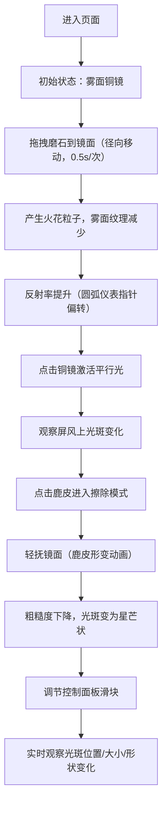

## 1. 产品概述

本应用是一个古代铜镜磨制工艺的3D交互式可视化教学工具，通过Canvas 2D API模拟铜镜从粗坯到精磨的全过程，直观展示镜面曲率、表面粗糙度对反射光斑形状与清晰度的影响，解决传统教学中无法动态呈现物理光学现象的难题。

- 主要面向文物保护、工艺史教学以及传统文化科普场景
- 通过沉浸式交互让学习者理解古代铜镜制作工艺的科学原理

## 2. 核心功能

### 2.1 功能模块

1. **铜镜磨制工作区**：核心交互区域，包含铜镜、磨石、鹿皮等工艺元素
2. **光学反射校验区**：通过平行光照射铜镜，在屏风上展示反射光斑的演变
3. **控制面板区**：调节光源角度、光源强度、镜面曲率等物理参数
4. **状态指示仪表**：实时显示镜面反射率（圆弧仪表）和表面粗糙度数值

### 2.2 页面详情

| 页面名称 | 模块名称 | 功能描述 |
|---------|---------|---------|
| 主工作页 | 铜镜磨制模块 | 磨石拖拽产生火花粒子，降低雾面纹理，提升反射率（30%→95%） |
| 主工作页 | 鹿皮抛光模块 | 点击后进入擦除模式，轻抚镜面使粗糙度下降（500nm→10nm），镜背浮雕隐约可见 |
| 主工作页 | 光学反射模块 | 45度入射角平行光经镜面反射，在屏风上形成光斑，随反射率提升从模糊→锐利→星芒状 |
| 主工作页 | 参数控制面板 | 三个滑块分别控制光源角度（15°-75°）、光源强度（100-1000lux）、曲率半径（50-150mm） |
| 主工作页 | 状态显示模块 | 右上角圆弧仪表显示反射率，屏风旁显示光斑照度（lux），镜左下方显示粗糙度（nm） |

## 3. 核心流程

用户进入页面后看到工作台布局，依次完成以下流程：

## 4. 用户界面设计

### 4.1 设计风格

- **主色调**：深木色 #4E342E（工作台背景）、古铜色 #B87333 渐变至深褐 #5D3A1A（铜镜）
- **辅助色**：鎏金 #FFD700（镜边）、暖白 #FFFAF0（光束/高光）、米白 #F5F5DC（屏风）
- **青灰 #708090（磨石）、浅黄 #EDCBA0（鹿皮）、橙黄 #FF8C00（火花粒子）
- **字体**：衬线字体 Noto Serif SC，营造古典庄重氛围
- **圆角**：控制面板采用圆角矩形，透明度60%
- **交互反馈**：所有可交互元素悬停时放大1.05倍，阴影加深（偏移3px）

### 4.2 页面布局

| 区域 | 占比 | 内容 |
|-----|-----|-----|
| 左侧磨石区 | 20%宽 | 磨石（80x20x30长方体，青灰色，磨痕纹理） |
| 中央铜镜工作区 | 55%宽 | 铜镜（直径150px圆形）、工作台、鹿皮 |
| 右侧屏风+控制面板区 | 25%宽 | 屏风（200x150米白色）、控制面板（三滑块） |

### 4.3 响应式设计

- **桌面端**（≥800px）：横向三段式布局
- **移动端**（<800px）：上下两栏布局，磨石与铜镜合并在上，屏风与控制面板下移

### 4.4 动画与过渡

- 磨石沿镜面径向直线移动，每次持续0.5秒
- 鹿皮轻抚时有轻微形变动画
- 反射率变化和光斑演变采用0.3s ease-out平滑过渡
- 粒子系统：火花粒子2-4px，橙黄色，喷射方向垂直磨痕，最大每秒40粒，总粒子不超过100个
- 光斑演变：模糊圆形→锐利圆形→6条星芒射线（每条长10px）

### 4.5 性能要求

- 帧率保持60FPS
- 粒子系统最多100个粒子时无卡顿
- 光斑渲染使用预计算纹理，避免每帧重绘
