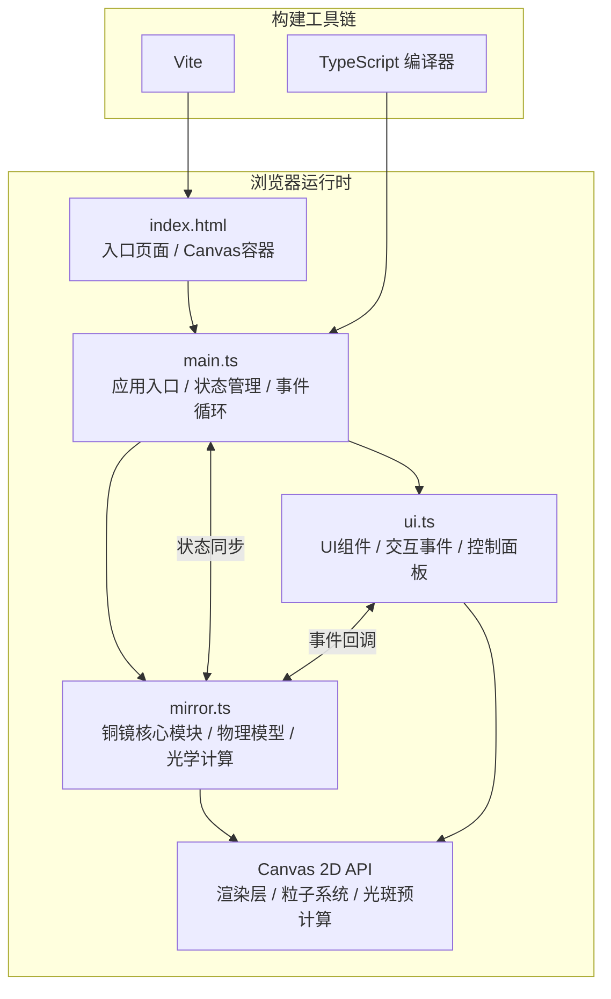

## 1. 架构设计



## 2. 技术描述

- **前端框架**：纯原生 TypeScript + Canvas 2D API，不引入任何 3D 库（不使用 Three.js）
- **构建工具**：Vite 作为开发服务器和构建工具，端口 3000
- **语言标准**：TypeScript 严格模式，编译目标 ES2020
- **渲染方案**：
  - 静态元素（工作台、屏风、磨石底座）直接 Canvas 绘制
  - 光斑使用离屏 Canvas 预计算纹理缓存，避免每帧重绘
  - 粒子系统采用对象池模式管理，上限 100 个粒子
- **动画系统**：基于 requestAnimationFrame 的事件循环，帧率计时与状态插值

## 3. 模块划分与职责

| 模块 | 文件 | 职责 |
|-----|------|-----|
| 应用入口 | [src/main.ts](file:///c:/Users/Administrator/Desktop/VersionFast/VersionFast/tasks/auto304/src/main.ts) | Canvas 初始化、窗口尺寸适配、主循环（requestAnimationFrame）、全局状态机、帧率监控、模块协调 |
| 铜镜核心 | [src/mirror.ts](file:///c:/Users/Administrator/Desktop/VersionFast/VersionFast/tasks/auto304/src/mirror.ts) | 铜镜物理属性（曲率半径、反射率、粗糙度）、磨镜逻辑、抛光逻辑、光学反射计算（斯涅尔定律简化模型）、光斑形状算法、镜面纹理生成（雾面/光滑/星芒）、镜背浮雕渲染 |
| UI 组件 | [src/ui.ts](file:///c:/Users/Administrator/Desktop/VersionFast/VersionFast/tasks/auto304/src/ui.ts) | 磨石、鹿皮、控制面板（三滑块）、圆弧反射率仪表、光斑屏风、粗糙度/lux 数值显示、鼠标事件监听（hover/click/drag）、悬停反馈（放大/阴影） |

## 4. 核心数据模型

### 4.1 铜镜状态 (MirrorState)

```typescript
interface MirrorState {
  reflectivity: number;        // 反射率 0.30 ~ 0.95
  roughness: number;           // 表面粗糙度 10 ~ 500 (nm)
  fogOpacity: number;          // 雾面纹理透明度 0.1 ~ 0.5
  curvatureRadius: number;     // 曲率半径 50 ~ 150 (mm)
  isActivated: boolean;        // 是否已点击激活光学模式
  reliefVisibility: number;    // 镜背浮雕可见度 0.1 ~ 0.3
}
```

### 4.2 光源状态 (LightState)

```typescript
interface LightState {
  angle: number;               // 入射角 15° ~ 75°
  intensity: number;           // 光源强度 100 ~ 1000 (lux)
}
```

### 4.3 粒子对象 (SparkParticle)

```typescript
interface SparkParticle {
  x: number;
  y: number;
  vx: number;
  vy: number;
  size: number;                // 2 ~ 4 px
  life: number;                // 生命周期 0 ~ 1
  color: string;               // #FF8C00
}
```

### 4.4 光斑状态 (SpotState)

```typescript
interface SpotState {
  x: number;                   // 屏风上 X 位置
  y: number;                   // 屏风上 Y 位置
  radius: number;              // 光斑半径
  sharpness: number;           // 锐利度 0 ~ 1
  brightness: number;          // 亮度 (lux) 50 ~ 500
  starburst: boolean;          // 是否星芒状
  color: string;               // #D3D3D3 ~ #FFFFFF
}
```

## 5. 关键算法说明

### 5.1 光学反射计算
- 简化为 2D 平面内的镜面反射：反射角 = 入射角（相对于法线）
- 曲率半径影响光斑偏移：ΔX ∝ (1/R)，曲率越大（R越小）偏移越明显
- 光源角度变化对应屏风垂直偏移：ΔY = 2px / 1°

### 5.2 磨镜进程插值
- 每次磨石拖拽完成，反射率进度 += 0.05，雾面 -= 0.04
- 使用 easeOutCubic 插值函数实现平滑过渡：f(t) = 1 - (1-t)³

### 5.3 光斑预渲染
- 首次使用时生成 4 张离屏 Canvas 纹理（模糊/锐利/星芒/渐变过渡）
- 每帧根据当前 sharpness 值选择纹理或混合绘制

## 6. 文件结构

```
auto304/
├── package.json
├── index.html
├── vite.config.js
├── tsconfig.json
└── src/
    ├── main.ts
    ├── mirror.ts
    └── ui.ts
```

## 7. 性能保障策略

| 策略 | 说明 |
|-----|------|
| 对象池 | 粒子系统预分配 100 个对象，避免频繁 GC |
| 离屏缓存 | 光斑、镜面纹理使用离屏 Canvas 缓存，脏标记更新 |
| 事件节流 | mousemove 使用 requestAnimationFrame 节流 |
| 脏矩形 | 仅重绘动态变化区域（粒子、光斑、磨石位置） |
| 帧率自适应 | 当 FPS < 45 时降低粒子发射密度至 20/s |
