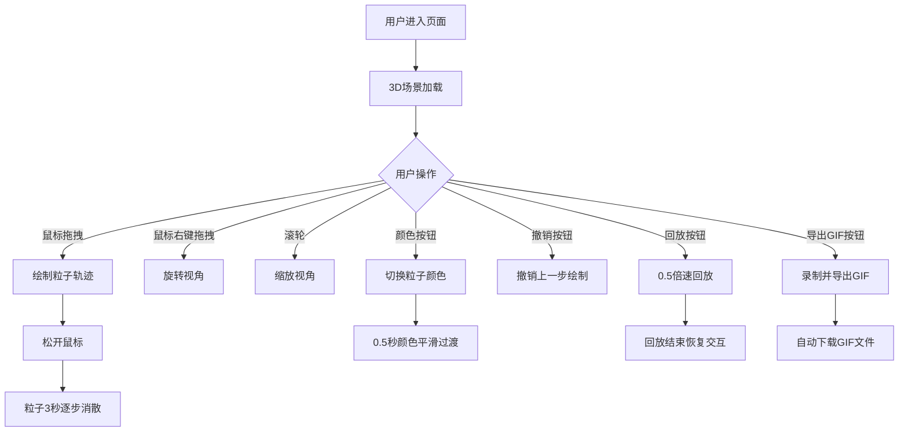

## 1. 产品概述

3D粒子沙画表演应用——一款基于Web的沉浸式互动艺术创作工具，用户通过鼠标在3D空间中拖拽绘制动态粒子轨迹，轨迹如沙画般缓缓消散，配合深空背景与多色主题，打造视觉震撼的沙画表演体验。

- 目标用户：创意艺术家、交互设计爱好者、沙画表演者
- 核心价值：将传统沙画艺术数字化，赋予3D空间维度与实时交互能力

## 2. 核心功能

### 2.1 功能模块

1. **3D粒子绘制画布**：全屏3D场景，鼠标拖拽绘制粒子轨迹
2. **粒子消散系统**：轨迹从起始端到末端逐步淡出，模拟沙画被风吹散
3. **5色主题切换**：暖金、星空蓝、火焰红、极光绿、幻彩紫，平滑过渡
4. **视角交互控制**：OrbitControls旋转/缩放，绘制时自动锁定
5. **绘制回放与GIF导出**：0.5倍速回放 + gif.js录制导出
6. **撤销功能**：支持撤销最近10步绘制
7. **深空背景与星星**：径向渐变背景 + 200颗闪烁星星

### 2.2 页面详情

| 页面名称 | 模块名称 | 功能描述 |
|----------|----------|----------|
| 主画布 | 3D场景容器 | 全屏Canvas，承载粒子系统、星空背景、交互逻辑 |
| 主画布 | 浮动控制面板 | 毛玻璃效果面板，包含颜色主题按钮、撤销/回放/导出按钮 |
| 主画布 | 移动端适配面板 | 视口<768px时面板移至底部居中，纵向两行排列 |

## 3. 核心流程

**绘制流程**：用户按住鼠标左键 → 视角锁定 → 粒子沿轨迹发射（每帧≥30个） → 松开鼠标 → 视角解锁 → 粒子3秒内逐步淡出消散

**颜色切换流程**：点击颜色按钮 → 已有粒子颜色0.5秒平滑插值过渡 → 新粒子使用新颜色

**回放流程**：点击回放 → 0.5倍速重放最近绘制过程（含消散动画） → 回放期间禁止新绘制 → 回放结束恢复交互

**导出流程**：点击导出GIF → 执行回放 → gif.js录制800x600@15fps最多200帧 → 自动下载

## 4. 用户界面设计

### 4.1 设计风格

- **主色调**：深空渐变背景（#0a0a2e → #1a1a3e），粒子默认暖金色（#FFD700）
- **按钮风格**：颜色按钮圆形40px，功能按钮长方形圆角12px深色背景白色文字
- **字体**：系统无衬线字体，控制面板文字14px
- **布局风格**：全屏3D场景 + 右下角浮动毛玻璃面板
- **动效**：按钮点击缩放0.95→1.0（0.15秒），hover背景透明度0.7→0.9，粒子消散闪烁

### 4.2 页面设计概览

| 页面名称 | 模块名称 | UI元素 |
|----------|----------|--------|
| 主画布 | 3D场景 | 全屏Canvas，深空径向渐变，200颗闪烁星星 |
| 主画布 | 颜色按钮组 | 5个圆形按钮（40px），暖金/星空蓝/火焰红/极光绿/幻彩紫 |
| 主画布 | 功能按钮组 | 撤销/回放/导出GIF，深色背景圆角12px，hover透明度变化 |
| 主画布 | 浮动面板 | 毛玻璃效果，backdrop-filter: blur(8px)，alpha 0.85，flex横向布局间距12px |

### 4.3 响应式设计

- 桌面端优先：浮动面板在右下角，flex横向排列
- 移动端适配（<768px）：面板移至底部居中，纵向两行排列，按钮缩小至32px
- 触摸优化：绘制操作适配触摸事件

### 4.4 3D场景指引

- **环境**：深空径向渐变背景，静谧宇宙氛围
- **相机**：透视相机，OrbitControls旋转速度0.8、阻尼0.1、缩放范围0.5-5倍
- **粒子**：5000+粒子池，初始0.08单位直径，暖金色，运动速度0.5单位/秒，随机横向漂移0.02单位/秒
- **星星**：200颗静态星星，大小0.01-0.03单位，闪烁周期2-4秒随机
- **消散效果**：3秒内alpha线性1→0，最后0.5秒尺寸缩至0.02并亮度×1.2
- **性能预算**：5000粒子时≥45fps，鼠标响应延迟≤50ms
