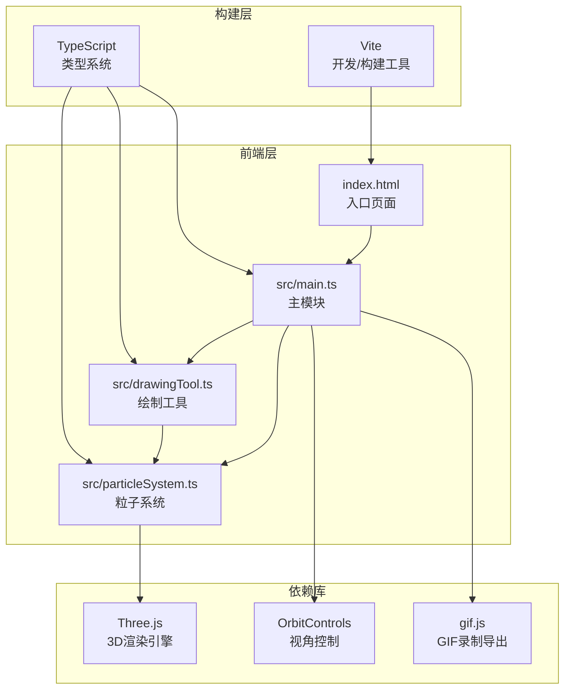

## 1. 架构设计



## 2. 技术说明

- **前端**：TypeScript + Three.js + Vite（纯前端，无后端）
- **构建工具**：Vite，以index.html为入口
- **3D引擎**：Three.js + OrbitControls
- **GIF导出**：gif.js
- **无框架**：不使用React/Vue，使用原生TypeScript模块化开发

## 3. 文件结构

| 文件路径 | 用途 |
|----------|------|
| package.json | 依赖管理：three, typescript, vite, @types/three, gif.js |
| index.html | 入口页面，全屏Canvas容器 |
| vite.config.js | 构建配置，index.html作为入口 |
| tsconfig.json | TypeScript配置，严格模式，target ES2020 |
| src/main.ts | 场景初始化（Renderer/Scene/Camera），动画循环，粒子系统管理，交互逻辑 |
| src/particleSystem.ts | 粒子属性定义，粒子池管理（5000+），粒子发射/运动/消散生命周期 |
| src/drawingTool.ts | 鼠标事件处理，2D→3D坐标转换，绘制路径生成，撤销逻辑（最多10步） |

## 4. 模块间接口

### 4.1 particleSystem.ts 导出接口

```typescript
interface ParticleAttributes {
  position: Float32Array;
  color: Float32Array;
  alpha: Float32Array;
  size: Float32Array;
  velocity: Float32Array;
  life: Float32Array;
  maxLife: Float32Array;
  drift: Float32Array;
}

class ParticleSystem {
  constructor(scene: THREE.Scene, maxParticles: number);
  emit(position: THREE.Vector3, color: THREE.Color, count: number): void;
  update(delta: number): void;
  setThemeColor(color: THREE.Color, transitionDuration: number): void;
  getParticleCount(): number;
  dispose(): void;
}
```

### 4.2 drawingTool.ts 导出接口

```typescript
interface DrawStroke {
  points: THREE.Vector3[];
  color: THREE.Color;
  timestamp: number;
}

class DrawingTool {
  constructor(camera: THREE.Camera, domElement: HTMLElement, onDraw: (point: THREE.Vector3) => void);
  setEnabled(enabled: boolean): void;
  undo(): DrawStroke | null;
  getLastStroke(): DrawStroke | null;
  getStrokes(): DrawStroke[];
  clearStrokes(): void;
  dispose(): void;
}
```

### 4.3 main.ts 核心流程

```typescript
- 初始化Renderer / Scene / Camera / OrbitControls
- 创建ParticleSystem实例
- 创建DrawingTool实例
- 管理颜色主题切换状态
- 管理回放状态与GIF录制
- 动画循环：update粒子系统 → 渲染场景
```

## 5. 性能策略

- **粒子池预分配**：初始化时预分配5000个粒子的BufferGeometry，避免运行时内存分配
- **GPU批渲染**：使用THREE.Points + ShaderMaterial，单次draw call渲染所有粒子
- **自定义Shader**：顶点shader处理粒子大小/位置，片段shader处理颜色/alpha/亮度
- **对象池模式**：死亡粒子标记为可复用，新粒子直接覆盖已死亡粒子的buffer区域
- **帧率监控**：requestAnimationFrame + delta时间计算，确保45fps+
