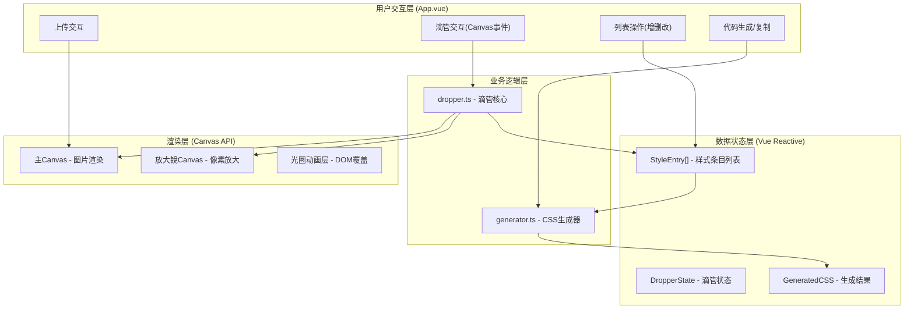
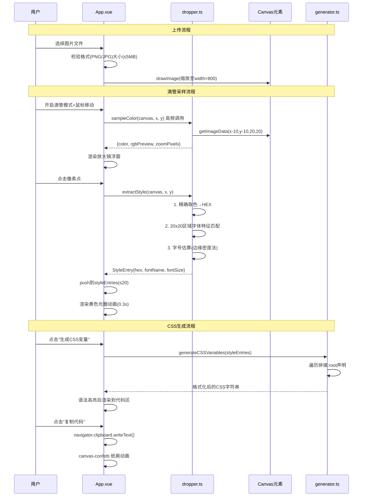

## 1. 架构设计



**数据流向说明**：
1. 用户上传图片 → App.vue 校验 → Canvas渲染
2. Canvas鼠标事件 → 坐标传入dropper.ts → 像素采样+字体分析 → 返回StyleEntry对象 → 存入响应式列表
3. 触发生成按钮 → 列表传入generator.ts → 输出CSS字符串 → 代码编辑器展示

---

## 2. 技术描述

- **前端框架**：Vue@3.4 + TypeScript@5.3（Composition API + `<script setup>`）
- **构建工具**：Vite@5.0（Vue插件，HMR热更新）
- **核心API**：原生 Canvas 2D API（getImageData / putImageData / drawImage）
- **动画库**：canvas-confetti@1.9（成功复制纸屑动画）
- **后端**：无（纯前端单页应用，零服务器依赖）
- **数据库**：无（内存状态管理，刷新即重置）

### 文件结构与职责

| 文件路径 | 职责 | 输入/输出 |
|----------|------|-----------|
| `package.json` | 依赖声明 + 脚本配置 | 依赖：vue, typescript, vite, canvas-confetti |
| `vite.config.js` | Vite构建配置（Vue插件+入口） | 入口：index.html |
| `tsconfig.json` | TypeScript严格模式配置 | target: ES2020, strict: true |
| `index.html` | SPA入口页面 | #app容器 + 加载提示 |
| `src/App.vue` | 主应用组件（状态中枢） | 输入：用户DOM事件 → 输出：渲染视图 |
| `src/dropper.ts` | 滴管核心逻辑（无状态纯函数模块） | 输入：Canvas坐标 → 输出：颜色+字体信息 |
| `src/generator.ts` | CSS变量格式化模块（纯函数） | 输入：StyleEntry[] → 输出：CSS代码字符串 |

### 调用关系图



---

## 3. 核心数据类型定义

```typescript
// src/dropper.ts 共享类型
export interface RGB {
  r: number;
  g: number;
  b: number;
}

export interface StyleEntry {
  id: string;           // 唯一标识 uuid
  hex: string;          // #RRGGBB 格式
  rgb: RGB;             // 原始RGB值
  fontName: string;     // 识别出的字体名(Arial/Helvetica/Source Han Sans/Noto Sans SC)
  fontSize: number;     // 估算字号(px)
  timestamp: number;    // 采样时间戳
  pixelX: number;       // 采样点Canvas坐标X
  pixelY: number;       // 采样点Canvas坐标Y
}

export interface ZoomData {
  pixels: ImageData;    // 放大区域像素
  centerColor: RGB;     // 中心点颜色
  sourceX: number;      // 原始坐标X
  sourceY: number;      // 原始坐标Y
}

export type SupportedFont = 'Arial' | 'Helvetica' | 'Source Han Sans' | 'Noto Sans SC';
```

---

## 4. 模块实现关键算法

### 4.1 dropper.ts 核心算法

| 算法 | 描述 | 性能目标 |
|------|------|----------|
| **像素取色** | `ctx.getImageData(x, y, 1, 1).data` → RGB转HEX | <1ms |
| **放大镜** | 取鼠标周围20x20区域 → 放大2倍绘制到离屏Canvas | <16ms 60fps |
| **字体识别** | 预设字体渲染"aA永"到离屏Canvas，计算20x20采样区的直方图余弦相似度，取最高匹配 | <50ms |
| **字号估算** | 20x20区域边缘检测(Sobel算子)→统计垂直边缘间距中位数→映射到字号 | <30ms |

### 4.2 generator.ts 输出格式

```css
:root {
  --color-1: #abc123;
  --color-2: #def456;
  --font-1: 'Arial';
  --font-2: 'Source Han Sans';
  --size-1: 16px;
  --size-2: 24px;
}
```

**生成规则**：
- 颜色变量：`--color-{n}` 按采样顺序编号
- 字体变量：`--font-{n}` 去重后编号，字体名单引号包裹
- 字号变量：`--size-{n}` 按升序编号，单位px

---

## 5. 性能保障策略

| 约束目标 | 实现方案 |
|----------|----------|
| 滴管点击响应<100ms | 1. 同步执行取色，字体识别使用`requestIdleCallback`降级为异步<br>2. 字体特征值预计算缓存到模块级常量 |
| 放大镜延迟<50ms | 1. `mousemove`使用`requestAnimationFrame`节流<br>2. 离屏Canvas复用，避免频繁创建DOM |
| CSS生成<50ms(20条) | 纯字符串拼接 + `StringBuilder`式数组join，时间复杂度O(n) |
| 内存占用 | 上传后原始File对象立即释放，仅保留Canvas像素数据 |

---

## 6. 初始化命令

```bash
# 进入项目目录
cd auto33

# 安装依赖
npm install

# 启动开发服务器
npm run dev
```

开发服务器默认端口：`http://localhost:5173`
