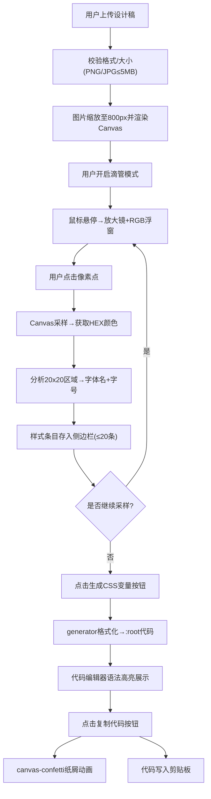

## 1. 产品概述

基于Canvas的样式滴管与CSS变量生成工具，帮助设计师快速从设计稿截图中提取颜色、字体、字号等样式参数，并生成可复用的CSS变量代码，避免手动抄录的繁琐与错误。

- **目标用户**：网页设计师、前端开发工程师
- **核心价值**：提升设计到开发的协作效率，减少样式参数传递误差

---

## 2. 核心功能

### 2.1 功能模块

1. **图片上传与预览模块**：支持PNG/JPG上传（≤5MB），自动缩放至800px宽度居中显示
2. **滴管采样模块**：放大镜效果、像素颜色精确提取、字体样式分析（字体名+字号）
3. **样式列表管理模块**：最多20条条目，支持删除、重新提取、色值复制
4. **CSS变量生成模块**：一键生成标准:root声明代码，语法高亮展示，一键复制

### 2.2 功能详情

| 页面/模块 | 子模块 | 功能描述 |
|-----------|--------|----------|
| 主应用 | 图片上传区 | 拖拽/点击上传PNG/JPG，单张≤5MB，自动校验格式与大小 |
| 主应用 | 图片预览Canvas | 宽度800px居中，下方"滴管模式"开关按钮 |
| 主应用 | 放大镜浮窗 | 2倍放大，像素网格显示，实时RGB值，延迟≤50ms |
| 主应用 | 滴管交互 | 十字准星光标，点击提取颜色，黄色光圈闪烁动画0.3s |
| 侧边栏 | 样式条目列表 | 色块(30x30圆角)+HEX色值+字体名+字号，可滚动 |
| 侧边栏 | 条目操作 | 删除按钮、重新提取按钮、点击色块复制色值到剪贴板 |
| 侧边栏 | CSS代码编辑器 | 深色背景，语法高亮，展示:root变量声明 |
| 侧边栏 | 生成与复制 | "生成CSS变量"按钮，"复制代码"按钮+五彩纸屑成功动画 |

---

## 3. 核心流程

**主流程描述**：
用户上传设计稿截图 → 开启滴管模式 → 鼠标悬停查看放大像素 → 点击目标像素点 → 系统提取颜色(HEX)并分析周围20x20区域的字体名与字号 → 样式条目存入侧边栏列表 → 重复采样直至获取全部所需样式 → 点击"生成CSS变量" → 系统将所有条目转换为标准CSS代码并展示 → 点击"复制代码"触发纸屑动画并复制到剪贴板。

---

## 4. 用户界面设计

### 4.1 设计风格

- **色彩体系**：深色主题科技风
  - 背景色：`#1a1a2e`（深蓝紫夜空）
  - 卡片色：`#16213e`（深海蓝）
  - 文字色：`#e0e0e0`（浅灰白）
  - 按钮渐变色：`#0f3460 → #533483`（深海蓝到紫罗兰渐变）
  - 强调色：黄色光圈 `#ffd700`

- **按钮风格**：圆角矩形渐变按钮，悬停亮度+20%，点击缩放0.95倍（过渡0.15s）

- **字体**：
  - 标题/正文：现代无衬线字体，优先 `JetBrains Mono` + `SF Mono` 代码友好字体组合
  - 代码编辑器：等宽字体族

- **布局风格**：双栏卡片式布局，左侧主工作区，右侧固定侧边栏

### 4.2 页面设计概述

| 区域 | 模块 | UI元素与动效 |
|------|------|--------------|
| 左侧(60%宽度) | 上传区 | 虚线边框拖放区，悬停边框发光动画 |
| 左侧(60%宽度) | Canvas预览 | 居中800px卡片，阴影层次，底部固定操作栏 |
| 左侧(60%宽度) | 放大镜 | 2倍缩放圆形窗口，像素网格线，实时RGB文字 |
| 左侧(60%宽度) | 采样光圈 | 点击位置黄色圆形脉冲动画，0.3s淡出 |
| 右侧(350px固定) | 样式列表 | 卡片条目堆叠，色块悬停缩放，进入上滑渐入动画 |
| 右侧(350px固定) | 代码编辑器 | 深色代码块，行号区，语法高亮着色 |
| 全局 | 按钮 | 渐变背景，圆角8px，悬停filter:brightness(1.2)，active:scale(0.95) |

### 4.3 响应式适配

- **桌面端（≥768px）**：双栏布局，左侧图片区60%宽度，右侧侧边栏固定350px
- **移动端（<768px）**：单栏堆叠布局，侧边栏移至下方，图片区占满宽度，所有交互区域增大以便触控

### 4.4 动画与过渡

- 所有状态切换：`transition: all 0.2-0.3s cubic-bezier(0.4, 0, 0.2, 1)`
- 条目新增：`translateY(-10px) → translateY(0)` 配合 `opacity: 0 → 1`
- 按钮交互：`brightness(1) → 1.2`（悬停），`scale(1) → 0.95`（点击）
- 采样成功：光圈元素 `scale(0.5) → 2`，`opacity: 1 → 0`，时长0.3s
