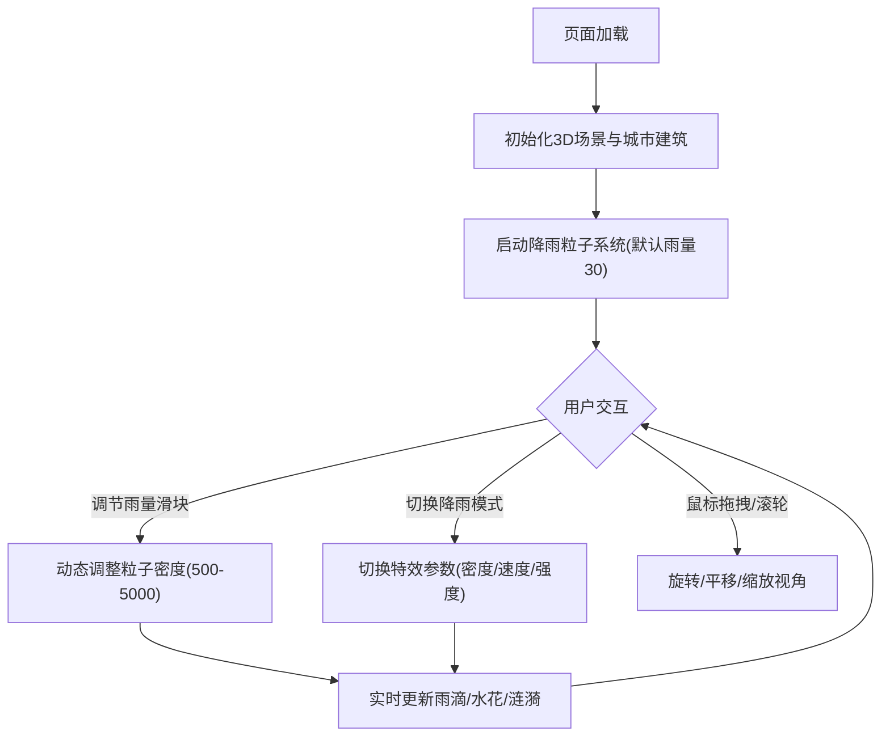

## 1. 产品概述

基于雨滴物理模拟的3D城市夜景交互沙盘，用户可在俯视3D城市场景中通过控制面板调节降雨参数，体验沉浸式赛博朋克风格雨夜氛围。项目以Three.js为核心渲染引擎，通过粒子系统实现实时降雨效果，配合水花溅射、涟漪扩散和灯光光晕反射等特效，打造高性能、高视觉冲击力的交互体验。

- 目标用户：3D视觉爱好者、交互艺术体验者、赛博朋克风格爱好者
- 核心价值：通过实时物理模拟和视觉特效，提供沉浸式雨夜城市沙盘交互体验

## 2. 核心功能

### 2.1 功能模块

1. **3D城市沙盘**：由30+栋高低错落建筑组成的城市景观，建筑带发光边缘和窗户灯光
2. **降雨粒子系统**：动态粒子密度(500-5000)的雨滴下落效果，含落地水花和涟漪特效
3. **交互控制面板**：雨量滑块和降雨模式切换，实时调节场景效果
4. **视角控制**：鼠标左键旋转、右键平移、滚轮缩放

### 2.2 页面详情

| 页面名称 | 模块名称 | 功能描述 |
|---------|---------|---------|
| 雨夜都市(单页) | 3D城市沙盘 | 30+栋随机高度建筑，屋顶发光边缘，外立面随机色彩窗户灯光，雾效与低亮度环境光 |
| 雨夜都市(单页) | 降雨系统 | 雨滴粒子下落，落地水花溅射(15粒子/0.4s消散)，涟漪环扩散(5→30单位/0.8s)，灯光光晕 |
| 雨夜都市(单页) | 控制面板 | 雨量滑块(0-100，默认30)，模式切换(普通雨/暴雨/暴风雨)，毛玻璃效果UI |
| 雨夜都市(单页) | 视角交互 | 左键拖拽旋转(Y轴360°)，右键平移，滚轮缩放(10-200单位) |

## 3. 核心流程

用户打开页面 → 3D城市场景加载 → 默认雨量30的降雨动画开始播放 → 用户通过控制面板调节雨量/切换模式 → 粒子密度与特效实时变化 → 用户拖拽旋转/平移/缩放观察城市 → 沉浸式雨夜体验

## 4. 用户界面设计

### 4.1 设计风格

- 主背景色：深蓝色 `#0a0e27`
- 建筑灯光主色：暖橙色 `#ffaa33`，冰蓝色 `#66ccff`
- 雨滴线色：淡蓝色半透明
- 按钮风格：圆角毛玻璃，悬停上浮+发光动画
- 字体：科技感无衬线字体
- 布局风格：全屏3D场景，右上角悬浮控制面板

### 4.2 页面设计概览

| 页面名称 | 模块名称 | UI元素 |
|---------|---------|--------|
| 雨夜都市 | 3D场景 | 全屏Canvas，深蓝背景，雾效，低亮度环境光 |
| 雨夜都市 | 标题 | 左上角居中"雨夜都市"，发光文字效果 |
| 雨夜都市 | 控制面板 | 右上角悬浮，毛玻璃背景(backdrop-filter: blur(10px))，圆角12px |
| 雨夜都市 | 雨量滑块 | 0-100范围，实时数值显示，赛博朋克风格滑轨 |
| 雨夜都市 | 模式按钮 | 三种模式切换，悬停translateY(-2px)+box-shadow发光 |

### 4.3 响应式适配

- 桌面优先，支持 1920×1080 和 1366×768 分辨率
- 3D场景自动填满视口(width: 100vw, height: 100vh)
- 控制面板自适应定位，小分辨率下缩小间距

### 4.4 3D场景指引

- 环境：深蓝夜空，雾效(FogExp2)，低亮度环境光(AmbientLight 0x111133)
- 光照：每栋建筑自带点光源模拟窗户灯光，城市整体暗调+局部亮光
- 相机：透视相机，俯视角度，OrbitControls控制
- 构图：城市建筑群居中，高低错落形成天际线轮廓
- 交互：OrbitControls(左键旋转/右键平移/滚轮缩放)，控制面板交互
- 后处理：雾效营造雨夜朦胧感，灯光在湿润表面反射光晕
- 性能预算：45FPS以上，BufferGeometry+PointsMaterial，特效粒子即时回收

## 5. 性能要求

| 指标 | 目标值 |
|------|--------|
| 帧率 | ≥ 45FPS |
| 雨滴粒子数量 | 500-5000(动态) |
| 水花粒子 | 每组15个，0.4秒回收 |
| 涟漪环 | 半径5→30，0.8秒回收 |
| 内存 | 无泄漏，粒子池即时回收 |
| 渲染 | BufferGeometry + PointsMaterial，禁用阴影 |
