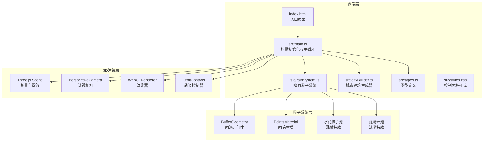

## 1. 架构设计



## 2. 技术选型

- 前端框架：纯 TypeScript + Three.js（无React/Vue）
- 构建工具：Vite
- 3D引擎：Three.js
- 语言：TypeScript(严格模式，ES2020)
- 包管理器：npm

## 3. 文件结构与职责

| 文件路径 | 职责描述 |
|---------|---------|
| `package.json` | 依赖管理(three, typescript, vite, @types/three)，启动脚本 |
| `index.html` | 入口页面，全屏Canvas容器，标题"雨夜都市" |
| `vite.config.js` | Vite构建配置，index.html作为入口 |
| `tsconfig.json` | TypeScript配置，严格模式，target ES2020，moduleResolution bundler |
| `src/main.ts` | 场景初始化，创建Scene/Camera/Renderer/OrbitControls，控制面板DOM绑定与事件监听，渲染循环 |
| `src/rainSystem.ts` | 降雨粒子系统，管理粒子池创建/更新/回收，雨滴下落动画，水花/涟漪特效生成与动画 |
| `src/cityBuilder.ts` | 城市建筑生成器，随机生成30+栋建筑，添加窗户灯光效果，屋顶发光边缘 |
| `src/types.ts` | 所有接口类型定义：RainMode, BuildingConfig, 特效粒子数据结构 |
| `src/styles.css` | 控制面板样式，毛玻璃效果，响应式布局，按钮动画 |

## 4. 核心数据结构

```typescript
type RainMode = 'normal' | 'heavy' | 'storm';

interface BuildingConfig {
  width: number;
  depth: number;
  height: number;
  position: [number, number, number];
  windowColor: number;
  edgeColor: number;
}

interface RainParticle {
  position: Float32Array;
  velocity: Float32Array;
  active: boolean;
}

interface SplashEffect {
  particles: Float32Array;
  velocities: Float32Array;
  life: number;
  maxLife: number;
  active: boolean;
}

interface RippleEffect {
  position: [number, number, number];
  radius: number;
  maxRadius: number;
  opacity: number;
  life: number;
  maxLife: number;
  active: boolean;
}

interface RainModeConfig {
  densityMultiplier: number;
  speedMultiplier: number;
  splashIntensity: number;
}
```

## 5. 核心算法设计

### 5.1 降雨粒子系统

- 使用 `BufferGeometry` + `PointsMaterial` 渲染雨滴线
- 粒子池预分配最大数量(5000)，通过 `drawRange` 动态控制可见数量
- 每帧更新粒子位置：`y -= speed * delta`，超出地面范围重置到顶部
- 雨量滑块值(0-100)映射到粒子数量(500-5000)

### 5.2 水花溅射特效

- 雨滴触地时从粒子池分配15个水花粒子
- 水花粒子以随机方向向外扩散，速度衰减
- 0.4秒后回收粒子到池中

### 5.3 涟漪环特效

- 使用 `RingGeometry` + `MeshBasicMaterial` 实现涟漪
- 每帧扩大半径(5→30)，降低透明度(0.8→0)
- 0.8秒后移除Mesh并回收

### 5.4 降雨模式配置

| 模式 | 密度倍率 | 速度倍率 | 特效强度 |
|------|---------|---------|---------|
| 普通雨 | 1.0x | 1.0x | 1.0x |
| 暴雨 | 2.5x | 1.5x | 1.8x |
| 暴风雨 | 4.0x | 2.0x | 2.5x |

## 6. 性能优化策略

1. **BufferGeometry + drawRange**：预分配粒子，动态控制渲染范围，避免每帧创建/销毁
2. **禁用阴影**：所有雨滴、水花、涟漪不投射/接收阴影
3. **粒子池回收**：水花和涟漪生命周期结束后立即回收到对象池
4. **对象池模式**：预创建水花和涟漪对象，复用而非新建
5. **PointsMaterial**：雨滴使用点精灵而非独立Mesh，大幅降低DrawCall
6. **雾效裁剪**：远距离粒子自动被雾效隐藏，减少视觉负载

## 7. 构建与运行

```bash
npm install && npm run dev
```

Vite开发服务器启动后，浏览器访问 localhost 地址即可查看效果。
