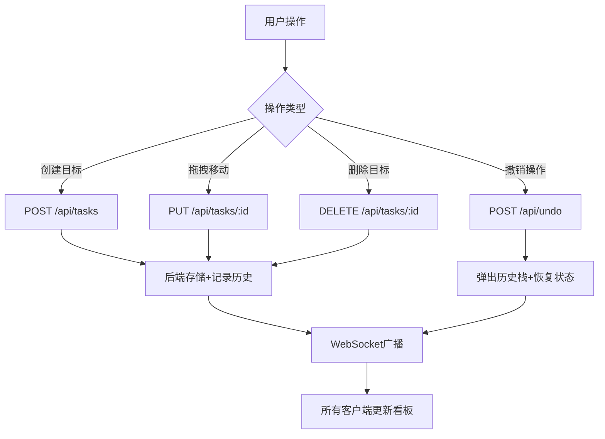

## 1. 产品概述
在线团队目标管理与进度追踪看板应用，帮助团队成员创建、分配、追踪和完成项目目标。通过直观的拖拽看板界面和实时WebSocket同步，让团队协作更加高效透明。

## 2. 核心功能

### 2.1 用户角色
| 角色 | 注册方式 | 核心权限 |
|------|----------|----------|
| 团队成员 | 预设成员 | 创建、编辑、拖拽、评论目标 |
| 观察者 | — | 查看看板和目标详情 |

### 2.2 功能模块
1. **看板主页**：三列看板（待办/进行中/已完成）、目标卡片拖拽排序、添加新目标、撤销操作
2. **目标卡片**：标题、负责人、进度条、截止日期、展开详情面板
3. **详情面板**：富文本描述编辑、评论列表与实时推送
4. **模态框**：添加新目标、编辑目标信息

### 2.3 页面详情
| 页面名称 | 模块名称 | 功能描述 |
|----------|----------|----------|
| 看板主页 | 三列看板 | 待办/进行中/已完成三列展示，支持拖拽跨列移动，列高亮反馈 |
| 看板主页 | 添加新目标按钮 | 右上角按钮，点击弹出模态框 |
| 看板主页 | 撤销按钮 | 顶部工具栏，撤销最近一次操作 |
| 目标卡片 | 卡片信息 | 显示标题、负责人下拉选择（5个预设成员）、进度百分比条、截止日期选择器 |
| 目标卡片 | 展开详情 | 点击卡片展开详情面板，显示富文本描述、评论列表 |
| 详情面板 | 富文本编辑 | 支持加粗和列表的描述文本编辑 |
| 详情面板 | 评论系统 | 评论列表（作者+时间戳），可删除自己的评论，WebSocket实时推送 |
| 模态框 | 添加目标 | 标题、描述、负责人、截止日期输入项，提交POST到后端 |
| 模态框 | 编辑目标 | 同添加目标，PUT更新到后端 |

## 3. 核心流程

### 3.1 目标创建流程
用户点击"添加新目标"→ 弹出模态框 → 填写标题、描述、负责人、截止日期 → 提交POST请求 → 后端创建目标并存入操作历史栈 → WebSocket广播 → 新卡片出现在待办列顶部 → 模态框关闭

### 3.2 拖拽移动流程
用户拖拽卡片 → 卡片半透明阴影跟随鼠标、放大1.05倍旋转1度 → 移至目标列时列高亮 → 释放 → PUT请求更新状态 → 后端记录操作历史 → WebSocket广播 → 所有客户端更新看板

### 3.3 撤销流程
用户点击"撤销" → 前端发送撤销请求 → 后端从历史栈弹出最近操作 → 恢复之前状态 → WebSocket推送更新 → 所有客户端刷新看板

### 3.4 评论实时同步流程
用户添加评论 → POST到后端 → 后端存储评论并通过WebSocket广播 → 其他在线用户实时收到新评论

## 4. 用户界面设计

### 4.1 设计风格
- **主色调**：暗色主题，背景#1a1a2e，卡片#16213e，标题文字#e0e0e0
- **强调色**：进度条渐变#e94560→#0f3460，列高亮#0f3460
- **按钮风格**：圆角8px，带2px边框阴影
- **字体**：标题20px（桌面）/16px（移动），正文14px
- **布局风格**：三列看板布局，卡片间距16px
- **动效**：模态框从顶部滑入（translateY(-20px)→0，0.3s ease-out），拖拽放大1.05倍旋转1度，列高亮0.3s动画

### 4.2 页面设计概览
| 页面名称 | 模块名称 | UI元素 |
|----------|----------|--------|
| 看板主页 | 三列看板 | 暗色背景#1a1a2e，列标题20px，列宽1/3，列间8px间距，列高亮2px #0f3460边框 |
| 看板主页 | 目标卡片 | 背景#16213e，8px圆角，2px边框阴影，16px间距，标题#e0e0e0，进度条渐变#e94560→#0f3460 |
| 看板主页 | 顶部工具栏 | 撤销按钮+添加新目标按钮，右上角放置 |
| 看板主页 | 拖拽状态 | 卡片半透明阴影跟随，放大1.05倍旋转1度 |
| 模态框 | 添加/编辑表单 | 居中显示，遮罩0.6透明度，从顶部滑入动画，表单输入项带label |
| 详情面板 | 评论列表 | 每条评论显示作者+时间戳，删除按钮，新评论实时出现 |

### 4.3 响应式适配
- **桌面（>1024px）**：三列并排，列标题20px
- **平板（768px-1024px）**：两列布局，可横向滚动查看第三列
- **手机（<768px）**：单列全宽，列标题16px，纵向滚动查看

### 4.4 交互反馈
- 拖拽：卡片放大+旋转+阴影，目标列高亮边框
- 点击：颜色变化、阴影加深
- 提交：loading旋转图标
- 所有交互即时视觉反馈

## 5. 性能要求
- 初始加载从后端获取所有目标数据
- 渲染50个卡片时首屏加载≤1.5秒（虚拟滚动/懒加载优化）
- 拖拽响应延迟≤50ms
- WebSocket消息广播到所有客户端延迟≤200ms
