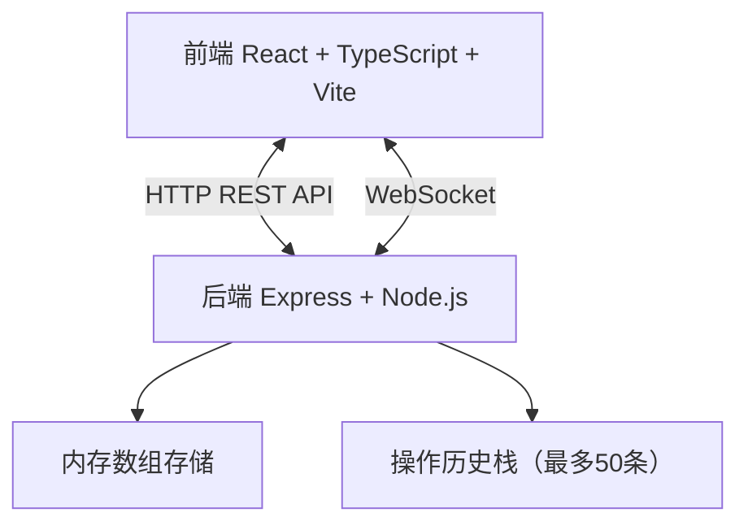
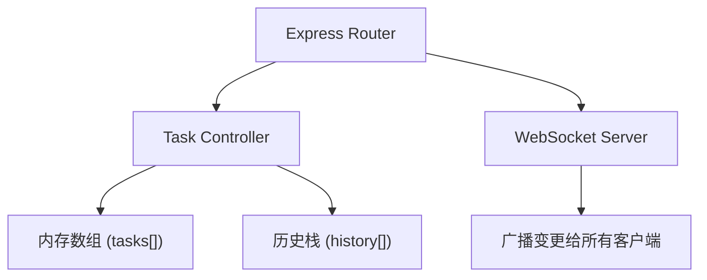
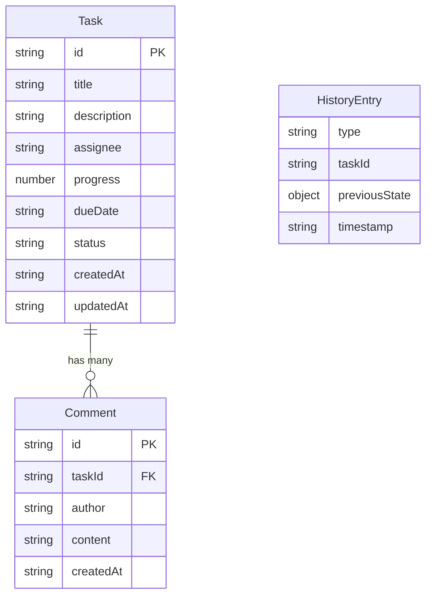

## 1. 架构设计



## 2. 技术说明
- **前端**：React@18 + TypeScript + Vite（端口5173）
- **状态管理**：Zustand
- **样式方案**：CSS Modules + CSS变量（暗色主题）
- **后端**：Express@4 + ws（WebSocket）
- **数据库**：内存数组存储（无持久化）
- **构建工具**：Vite

## 3. 路由定义
| 路由 | 用途 |
|------|------|
| / | 看板主页（三列看板+工具栏） |

## 4. API定义

### 4.1 数据模型
```typescript
interface Task {
  id: string;
  title: string;
  description: string;
  assignee: string;
  progress: number;
  dueDate: string;
  status: 'pending' | 'in-progress' | 'done';
  comments: Comment[];
  createdAt: string;
  updatedAt: string;
}

interface Comment {
  id: string;
  author: string;
  content: string;
  createdAt: string;
}

interface HistoryEntry {
  type: 'create' | 'delete' | 'update' | 'move';
  taskId: string;
  previousState: Task | null;
  timestamp: string;
}
```

### 4.2 REST接口
| 方法 | 路径 | 请求体 | 响应 | 用途 |
|------|------|--------|------|------|
| GET | /api/tasks | — | Task[] | 获取所有目标 |
| POST | /api/tasks | Omit<Task, 'id'|'comments'|'createdAt'|'updatedAt'> | Task | 创建新目标 |
| PUT | /api/tasks/:id | Partial<Task> | Task | 更新目标 |
| DELETE | /api/tasks/:id | — | { success: boolean } | 删除目标 |
| POST | /api/undo | — | { task: Task } | 撤销最近操作 |

### 4.3 WebSocket消息
| 类型 | 方向 | 数据 | 用途 |
|------|------|------|------|
| task_updated | 服务端→客户端 | { type: string, task: Task } | 目标变更通知 |
| comment_added | 服务端→客户端 | { taskId: string, comment: Comment } | 新评论通知 |

## 5. 服务器架构



## 6. 数据模型

### 6.1 数据模型定义


### 6.2 初始数据
预设5个团队成员：张伟、李娜、王磊、刘芳、陈明
初始状态包含3-5个示例目标，分布在不同状态列中

## 7. 项目文件结构
```
├── package.json
├── index.html
├── vite.config.js
├── tsconfig.json
├── src/
│   ├── main.tsx
│   ├── App.tsx
│   ├── store/
│   │   └── useTaskStore.ts
│   ├── components/
│   │   ├── TaskCard.tsx
│   │   ├── KanbanColumn.tsx
│   │   ├── TaskModal.tsx
│   │   ├── DetailPanel.tsx
│   │   └── Toolbar.tsx
│   ├── hooks/
│   │   └── useWebSocket.ts
│   ├── types/
│   │   └── index.ts
│   └── styles/
│       └── global.css
├── server/
│   └── server.js
```
