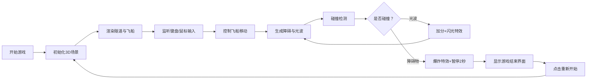

## 1. 产品概述

一款基于Web的3D太空探险飞行游戏，玩家驾驶飞船穿越不断旋转的星环隧道，躲避障碍物并收集能量光波，随着游戏进行速度逐渐加快，考验玩家的反应与操控技巧。

- **核心玩法**：第一人称视角飞船驾驶，穿越旋转隧道，躲避红色障碍，收集绿色光波
- **目标用户**：休闲游戏爱好者，喜欢反应类和太空题材游戏的玩家
- **市场价值**：轻量化Web 3D游戏，无需下载即可体验，适合碎片时间娱乐

## 2. 核心特性

### 2.1 用户角色

| 角色 | 注册方式 | 核心权限 |
|------|----------|----------|
| 玩家 | 无需注册，直接游戏 | 开始游戏、控制飞船、查看分数、重新开始 |

### 2.2 功能模块

1. **游戏主场景**：3D隧道渲染、飞船控制、碰撞检测
2. **隧道系统**：动态生成隧道段、旋转动画、速度递增
3. **障碍与光波系统**：随机生成障碍物和能量光波、碰撞逻辑
4. **粒子特效系统**：飞船尾迹、爆炸效果、收集闪光
5. **计分与UI系统**：实时计时、分数统计、游戏结束界面

### 2.3 页面详情

| 页面名称 | 模块名称 | 功能描述 |
|----------|----------|----------|
| 游戏主界面 | 3D场景渲染 | 全屏Canvas渲染隧道、飞船、障碍物和光波 |
| 游戏主界面 | 实时UI | 左上角显示游戏时间，白色半透明文字 |
| 游戏结束界面 | 结果展示 | 半透明黑色遮罩，居中显示总时间、收集数、总分 |
| 游戏结束界面 | 重新开始按钮 | 圆角渐变按钮，点击重置游戏状态 |

## 3. 核心流程

玩家通过鼠标控制飞船左右移动，键盘W/S控制上下移动，躲避红色障碍物，收集绿色能量光波获得分数。随着时间推移，飞行速度逐渐加快，增加游戏难度。

## 4. 用户界面设计

### 4.1 设计风格

- **主色调**：深邃黑色背景，搭配蓝紫渐变隧道纹理
- **强调色**：亮蓝色飞船、鲜红色障碍物、亮绿色能量光波
- **UI文字**：白色半透明，monospace等宽字体
- **按钮风格**：圆角矩形（半径10px），蓝紫渐变背景，悬浮放大1.1倍，点击缩小0.9倍
- **整体风格**：科幻霓虹风，强烈的赛博朋克太空感

### 4.2 页面设计概述

| 页面名称 | 模块名称 | UI元素 |
|----------|----------|--------|
| 游戏主界面 | 3D场景 | 全屏黑色背景，蓝紫渐变隧道内壁，飞船尾部蓝色点光源，能量光波绿色辉光效果 |
| 游戏主界面 | 计时UI | 左上角，bold 24px monospace，白色半透明 |
| 游戏结束界面 | 遮罩层 | 半透明黑色rgba(0,0,0,0.8)，全屏覆盖 |
| 游戏结束界面 | 分数面板 | 居中显示，包含总时间、收集光波数、总分，白色文字 |
| 游戏结束界面 | 重新开始按钮 | 蓝紫渐变，圆角10px，hover:scale(1.1)，active:scale(0.9) |

### 4.3 响应式

- 桌面端优先设计，全屏Canvas自适应窗口大小
- 游戏结束界面使用固定定位，确保在各种屏幕尺寸下居中显示
- 支持窗口大小改变时自动调整渲染分辨率

### 4.4 3D场景指引

- **环境**：纯黑背景营造太空感，无额外光照以突出发光元素
- **光照**：飞船尾部蓝色点光源，能量光波自身发光效果
- **相机**：透视相机，位于隧道中心前方5单位，跟随飞船移动
- **构图**：隧道占据视野主体，飞船位于屏幕中下位置，营造速度感
- **交互**：鼠标移动平滑控制飞船左右，键盘W/S控制上下，0.1秒延迟Lerp插值
- **后处理**：能量光波使用AdditiveBlending实现发光效果，粒子系统使用透明度渐变
- **性能**：隧道几何体复用，粒子总数控制在300以内，帧率不低于40FPS
